**HỌC VIỆN CÔNG NGHỆ BƯU CHÍNH VIỄN THÔNG**

**KHOA CÔNG NGHỆ THÔNG TIN 1**

**[Logo Học viện] — *TODO: chèn ảnh thủ công khi nộp Word***

**BÁO CÁO THỰC TẬP CƠ SỞ**

**ĐỀ TÀI: Xây dựng nền tảng hỗ trợ làm việc nhóm từ xa tương tác trực quan với bảng trắng EvoDraw**

| Giảng viên hướng dẫn: | TS. ĐỖ THỊ LIÊN |
| :---- | :---- |
| **Sinh viên thực hiện     :** | **ĐÀO VĂN KHANG — VŨ MINH SÁNG** |
| **Mã sinh viên                :** | **B23DCVT218 — B23DCCE082** |

**Hà Nội — 2026**

# LỜI CẢM ƠN

Lời đầu tiên, chúng em xin gửi lời cảm ơn chân thành và sâu sắc nhất tới TS. Đỗ Thị Liên — người đã trực tiếp hướng dẫn chúng em thực hiện đề tài này trong học phần Thực tập cơ sở. Trong suốt quá trình thực hiện đề tài, cô không chỉ định hướng cho chúng em một đề tài nghiên cứu có ý nghĩa thực tiễn, mà còn dành nhiều thời gian, tâm huyết để tận tình hướng dẫn, đồng hành và tạo điều kiện thuận lợi để chúng em hoàn thành đề tài này.

Thông qua đề tài, chúng em đã vận dụng những kiến thức lý thuyết đã học về phân tích thiết kế hướng đối tượng (OOAD), mô hình hóa UML, mô hình Boundary–Control–Entity (BCE) theo phương pháp luận của Craig Larman, kiến trúc Client–Server cùng các công nghệ web hiện đại để phân tích, thiết kế và xây dựng một hệ thống cộng tác thời gian thực sát với thực tế triển khai trong doanh nghiệp. Đề tài tập trung giải quyết các bài toán cốt lõi như quản lý phòng họp, đồng bộ bảng trắng đa người dùng, chia sẻ màn hình kết hợp ghi chú trực tiếp, gọi thoại qua máy chủ định tuyến chọn lọc (SFU – LiveKit) và truyền tải tin nhắn tức thời.

Trong quá trình thực hiện, chúng em đã làm việc nghiêm túc, vận dụng tối đa các kiến thức đã học để hoàn thành đề tài. Tuy nhiên, do thời gian thực hiện có hạn và kinh nghiệm thực tiễn chưa nhiều, bài báo cáo chắc chắn không tránh khỏi những thiếu sót.

Chúng em rất mong nhận được sự đánh giá, góp ý của cô để bài làm được hoàn thiện hơn, đồng thời giúp chúng em đúc kết thêm những kinh nghiệm quý báu cho công việc sau này.

Chúng em xin chân thành cảm ơn!

# MỤC LỤC

- **LỜI CẢM ƠN**
- **MỤC LỤC**
- **DANH MỤC CÁC KÝ HIỆU VÀ CHỮ VIẾT TẮT**
- **DANH MỤC CÁC BẢNG**
- **DANH MỤC CÁC HÌNH VẼ**
- **ĐẶT VẤN ĐỀ**

- **CHƯƠNG 1 — XÁC ĐỊNH BÀI TOÁN VÀ YÊU CẦU HỆ THỐNG**
  - 1.1. Bối cảnh và động cơ
  - 1.2. Khảo sát các nền tảng cộng tác trực quan hiện có
  - 1.3. Mô hình nghiệp vụ bằng ngôn ngữ tự nhiên
    - 1.3.1. Phạm vi và tác nhân
    - 1.3.2. Yêu cầu chức năng
    - 1.3.3. Yêu cầu phi chức năng
    - 1.3.4. Đối tượng dữ liệu và mối quan hệ
  - 1.4. Mô hình Use Case
    - 1.4.1. Sơ đồ Use Case tổng quan
    - 1.4.2. Phân rã Use Case
  - 1.5. Thiết kế tương tác cho sản phẩm
  - 1.6. Kết luận Chương 1

- **CHƯƠNG 2 — NGHIÊN CỨU PHƯƠNG PHÁP TIẾP CẬN VÀ GIẢI QUYẾT VẤN ĐỀ**
  - 2.1. Mô hình tổng quát hệ thống
    - 2.1.1. Tổng quan hệ thống
    - 2.1.2. Sơ đồ kiến trúc tổng quát
    - 2.1.3. Các luồng luân chuyển dữ liệu chính
    - 2.1.4. Cơ chế đồng bộ và chiến lược giải quyết xung đột
  - 2.2. Phương pháp OOAD áp dụng cho hệ thống functional
    - 2.2.1. Phương pháp luận BCE (Larman)
    - 2.2.2. Mô hình thiết kế hỗn hợp Analysis OOP → Implementation Functional
  - 2.3. Mô hình phát triển phần mềm (Scrum)
  - 2.4. Kiến trúc phần mềm triển khai
    - 2.4.1. Cấu trúc kho mã tập trung (Monorepo)
    - 2.4.2. Kiến trúc phân lớp tại Backend
    - 2.4.3. Kiến trúc hướng thành phần + Custom Hooks tại Frontend
  - 2.5. Lựa chọn công nghệ
    - 2.5.1. Công nghệ cho Module Desktop App
    - 2.5.2. Công nghệ cho Module Web App
    - 2.5.3. Công nghệ cho Module Backend Service
  - 2.6. Kết luận Chương 2

- **CHƯƠNG 3 — PHÂN TÍCH, THIẾT KẾ VÀ THỰC NGHIỆM HỆ THỐNG**
  - 3.1. Phân tích thiết kế hệ thống
    - 3.1.1. Các kịch bản Use Case (15 kịch bản a–o)
    - 3.1.2. Trích các lớp phân tích
    - 3.1.3. Phân tích chi tiết từng module (BCE: class + sequence)
    - 3.1.4. Thiết kế chi tiết hệ thống
      - a. Hoàn thiện cấu trúc các thành phần thiết kế
      - b. Thiết kế chi tiết các mô-đun (Bảng đặc tả)
      - c. Định hướng hiện thực hóa
  - 3.2. Thiết kế cơ sở dữ liệu
    - 3.2.1. Mô hình dữ liệu (Document Model)
    - 3.2.2. Thiết kế vật lý (Physical Design)
  - 3.3. Thực nghiệm và đo lường
    - 3.3.1. Ánh xạ thiết kế sang mã nguồn (Hiện thực hóa)
    - 3.3.2. Môi trường và kết quả đo
    - 3.3.3. Kiểm thử tình huống ngoại lệ
  - 3.4. Kết luận Chương 3

- **KẾT LUẬN, KIẾN NGHỊ**
- **TÀI LIỆU THAM KHẢO**
- **PHỤ LỤC CÀI ĐẶT VÀ TRIỂN KHAI**

# DANH MỤC CÁC KÝ HIỆU VÀ CHỮ VIẾT TẮT

| Ký hiệu, viết tắt | Tiếng Anh | Tiếng Việt |
| :---- | :---- | :---- |
| API | Application Programming Interface | Giao diện lập trình ứng dụng |
| BCE | Boundary – Control – Entity | Biên – Điều khiển – Thực thể |
| Base64 | — | Mã hóa nhị phân sang văn bản |
| BSON | Binary JSON | Định dạng JSON nhị phân |
| CDN | Content Delivery Network | Mạng phân phối nội dung |
| CSDL | — | Cơ sở dữ liệu |
| DOM | Document Object Model | Mô hình đối tượng tài liệu |
| GIF | Graphics Interchange Format | Định dạng trao đổi hình ảnh |
| ICE | Interactive Connectivity Establishment | Thiết lập kết nối tương tác |
| IPC | Inter-Process Communication | Giao tiếp giữa các tiến trình |
| JSON | JavaScript Object Notation | Định dạng đối tượng JavaScript |
| JWT | JSON Web Token | Mã thông báo web JSON |
| LWW | Last-Writer-Wins | Bản ghi cuối cùng thắng |
| MIME | Multipurpose Internet Mail Extensions | Chuẩn mở rộng nội dung Internet |
| MVP | Minimum Viable Product | Sản phẩm khả dụng tối thiểu |
| NoSQL | Not Only SQL | Cơ sở dữ liệu phi quan hệ |
| NSD | — | Người sử dụng |
| ODM | Object-Document Mapper | Ánh xạ đối tượng – tài liệu |
| OOAD | Object-Oriented Analysis and Design | Phân tích và thiết kế hướng đối tượng |
| OOP | Object-Oriented Programming | Lập trình hướng đối tượng |
| P2P | Peer-to-Peer | Mạng ngang hàng |
| PDF | Portable Document Format | Định dạng tài liệu di động |
| PIN | Personal Identification Number | Mã số nhận dạng cá nhân |
| PNG | Portable Network Graphics | Đồ họa mạng di động |
| RAM | Random Access Memory | Bộ nhớ truy cập ngẫu nhiên |
| REST | Representational State Transfer | Chuyển đổi trạng thái đại diện |
| SDK | Software Development Kit | Bộ công cụ phát triển phần mềm |
| SDP | Session Description Protocol | Giao thức mô tả phiên |
| SFU | Selective Forwarding Unit | Đơn vị định tuyến chọn lọc luồng |
| SVG | Scalable Vector Graphics | Đồ họa vector có thể thu phóng |
| TTL | Time-To-Live | Thời gian tồn tại |
| URL | Uniform Resource Locator | Trình định vị tài nguyên thống nhất |
| UUID | Universally Unique Identifier | Định danh duy nhất toàn cầu |
| UML | Unified Modeling Language | Ngôn ngữ mô hình hóa thống nhất |
| WebRTC | Web Real-Time Communication | Truyền thông thời gian thực trên Web |
| WebSocket | — | Giao thức truyền thông hai chiều |

# DANH MỤC CÁC BẢNG

- **Bảng 1.1**: Khảo sát ưu, nhược điểm các nền tảng cộng tác trực quan
- **Bảng 1.2**: Yêu cầu chức năng của hệ thống EvoDraw
- **Bảng 1.3**: Yêu cầu phi chức năng của hệ thống EvoDraw
- **Bảng 2.1**: Tổng hợp công nghệ sử dụng cho từng module
- **Bảng 3.1**: Mô-đun `CanvasSyncController.attachSerializer`
- **Bảng 3.2**: Mô-đun `CanvasSyncController.applyRemoteOp`
- **Bảng 3.3**: Mô-đun `ImagePastingController.uploadFile`
- **Bảng 3.4**: Mô-đun `RoomController.createRoom`
- **Bảng 3.5**: Mô-đun `RoomController.joinRoom`
- **Bảng 3.6**: Mô-đun `RoomController.leaveRoom`
- **Bảng 3.7**: Mô-đun `ScreenShareController.startSharing`
- **Bảng 3.8**: Mô-đun `VoiceChatController.toggleVoice`
- **Bảng 3.9**: Mô-đun `ChatController.sendMessage`
- **Bảng 3.10**: Mô-đun `DocumentController.importFile`
- **Bảng 3.11**: Mô-đun `DocumentController.exportFile`
- **Bảng 3.12**: Mô-đun `HistoryController.undo` / `redo`
- **Bảng 3.13**: Mô-đun `OverlayController.launchOverlay` và `clearAll`
- **Bảng 3.16**: Lược đồ Mongoose của collection `Room`
- **Bảng 3.17**: Lược đồ Mongoose của collection `File`
- **Bảng 3.18**: Ánh xạ Lớp phân tích → Triển khai thực tế (mục 3.3.1)
- **Bảng 3.19**: Tổng hợp socket events giữa Client và Server (mục 3.3.1)

# DANH MỤC CÁC HÌNH VẼ

- **Hình 1.1**: Sơ đồ Use Case tổng quan của hệ thống EvoDraw
- **Hình 1.2**: Sơ đồ Use Case phân rã — Vẽ lên bảng trắng
- **Hình 1.3**: Sơ đồ Use Case phân rã — Chia sẻ màn hình
- **Hình 1.4**: Sơ đồ Use Case phân rã — Quản lý dữ liệu canvas
- **Hình 1.5**: Wireframe Trang chủ (Tạo / Tham gia phòng)
- **Hình 1.6**: Wireframe Phòng làm việc (bảng trắng + thanh công cụ)
- **Hình 1.7**: Wireframe Chia sẻ màn hình
- **Hình 1.8**: Wireframe Cài đặt / Tùy chỉnh phòng
- **Hình 2.1**: Sơ đồ kiến trúc tổng quát hệ thống EvoDraw
- **Hình 2.2**: Mối quan hệ giữa pha Phân tích (OOP) và pha Cài đặt (Functional)
- **Hình 2.3**: Kiến trúc phân lớp Backend
- **Hình 3.1**: Biểu đồ lớp thực thể tổng quan của hệ thống EvoDraw
- **Hình 3.2 → 3.31**: Các cặp biểu đồ phân tích tĩnh (Class) + động (Sequence) cho 15 kịch bản a–o (Chương 3.1.3)
- **Hình 3.32**: Sơ đồ ánh xạ Controller phân tích → Hook/Handler triển khai

> **Lưu ý hình vẽ:** Các hình bitmap (sơ đồ Use Case, wireframe Figma, sơ đồ kiến trúc) là tham chiếu ảnh — khi nộp bản Word cần chèn thủ công vào đúng vị trí được ghi `[Hình X.Y: <mô tả>]`. Các biểu đồ Class/Sequence của Chương 3.1.3 được trình bày dưới dạng mã Mermaid, có thể render trực tiếp trên VS Code (cài extension *Markdown Preview Mermaid Support*) hoặc xuất sang PNG qua [Mermaid Live Editor](https://mermaid.live) trước khi dán vào bản Word.

# ĐẶT VẤN ĐỀ

Trong bối cảnh thế giới việc làm đang trải qua cuộc cách mạng mạnh mẽ sau đại dịch, theo báo cáo của McKinsey, mô hình làm việc kết hợp (hybrid working) — vừa làm việc tại văn phòng vừa làm việc tại nhà — đã trở thành "tiêu chuẩn vàng" với hơn 66% doanh nghiệp áp dụng. Thế nhưng, một thực tế đáng báo động là hiệu suất làm việc nhóm từ xa đang bị kìm hãm bởi sự hạn chế của các công cụ chia sẻ màn hình truyền thống — nơi người xem chỉ đóng vai trò thụ động.

Việc thiếu khả năng tương tác trực tiếp trên nội dung đang thảo luận khiến các cuộc họp trở nên rời rạc, khó nắm bắt và thiếu tính sáng tạo. **EvoDraw** ra đời để giải quyết triệt để vấn đề này bằng cách xây dựng một nền tảng làm việc nhóm trên một không gian bảng trắng kỹ thuật số linh hoạt, nơi mọi thành viên đều có thể trực tiếp tương tác (vẽ, ghi chú, đánh dấu, di chuyển đối tượng…) kết hợp với tính năng chia sẻ màn hình để mọi ý tưởng được diễn giải một cách trực quan và liền mạch nhất.

Đề tài "Xây dựng nền tảng hỗ trợ làm việc nhóm từ xa tương tác trực quan với bảng trắng EvoDraw" nhằm:

- Phân tích bài toán cộng tác trực quan thời gian thực dựa trên phương pháp luận **OOAD** và **mô hình BCE** (Boundary–Control–Entity) của Craig Larman.
- Thiết kế kiến trúc hệ thống Client–Server kết hợp máy chủ định tuyến chọn lọc media (SFU) đảm bảo mở rộng độ trễ thấp.
- Hiện thực hóa hệ thống gồm ba phân hệ phối hợp: Web App, Desktop App và Backend Service.
- Đánh giá tính nhất quán giữa mô hình OOAD ở pha phân tích và phần hiện thực hóa ở pha cài đặt (được trình bày ở Chương 3).

Nội dung báo cáo được tổ chức thành ba chương chính:

- **Chương 1** giới thiệu tổng quan về sự tương tác trực quan trong làm việc nhóm từ xa, bao gồm xác định yêu cầu, khảo sát một số nền tảng tương tự (Miro, Google Meet, Zoom), mô hình nghiệp vụ bằng ngôn ngữ tự nhiên, sơ đồ Use Case và thiết kế tương tác.
- **Chương 2** trình bày phương pháp tiếp cận và giải pháp đề xuất: mô hình tổng quát, phương pháp OOAD áp dụng cho hệ thống functional, mô hình phát triển Scrum, kiến trúc phần mềm và lựa chọn công nghệ phù hợp cho từng module.
- **Chương 3** đi sâu vào phân tích và thiết kế hệ thống: 15 kịch bản Use Case (a–o), trích lớp phân tích, phân tích chi tiết từng module bằng cặp biểu đồ Class + Sequence theo BCE, thiết kế chi tiết hệ thống và cơ sở dữ liệu, kèm bảng ánh xạ minh bạch giữa lớp phân tích và mã nguồn thực tế.

Cuối cùng, phần Kết luận tổng hợp kết quả đạt được và hướng phát triển; phần Phụ lục mô tả quá trình cài đặt, triển khai và hình ảnh sản phẩm.

# CHƯƠNG 1 — XÁC ĐỊNH BÀI TOÁN VÀ YÊU CẦU HỆ THỐNG

Chương này xác lập "bài toán" và "yêu cầu" của hệ thống EvoDraw. Trước hết, chúng tôi đặt sản phẩm trong bối cảnh hybrid working và khảo sát các nền tảng cộng tác hiện có để rút ra khoảng trống cần lấp. Tiếp theo, chúng tôi xây dựng mô hình nghiệp vụ bằng ngôn ngữ tự nhiên, từ đó trích các yêu cầu chức năng/phi chức năng cùng tập đối tượng dữ liệu nền. Cuối cùng, hai sản phẩm trực quan được hoàn thiện ở pha này — sơ đồ Use Case và wireframe giao diện — làm tiền đề cho phần phân tích thiết kế ở Chương 3.

## 1.1. Bối cảnh và động cơ

EvoDraw là một nền tảng cộng tác trực quan từ xa, cho phép người dùng chia sẻ màn hình và thực hiện vẽ/ghi chú trực tiếp theo thời gian thực thông qua giao diện trình duyệt hoặc một ứng dụng desktop hỗ trợ chế độ overlay. Khác với các công cụ chia sẻ màn hình truyền thống — nơi người xem chỉ tiếp nhận hình ảnh thụ động — EvoDraw đặt trọng tâm vào *tính tương tác hai chiều*: mọi thành viên trong phòng đều có thể đồng thời vẽ, ghi chú, hiển thị con trỏ và đối thoại trên cùng một không gian.

Mục tiêu của hệ thống bao gồm:

- **Đồng bộ tức thì** các nét vẽ, con trỏ chuột, đối tượng trên bảng trắng giữa nhiều thành viên với độ trễ dưới 200 ms.
- **Cho phép ghi chú đè** lên luồng video chia sẻ màn hình thay vì chỉ trên ảnh tĩnh.
- **Tham gia nhanh không đăng nhập**: chỉ cần một mã phòng 6 ký tự + mã PIN 4 chữ số (hoặc liên kết mời) là vào được phòng.
- **Lưu trữ thành quả phiên làm việc** dưới dạng tệp để khôi phục, tham chiếu hoặc chia sẻ sau cuộc họp.
- **Bảo mật và tự dọn dẹp tài nguyên**: mã PIN được lưu trữ an toàn dưới dạng đã mã hóa; phòng không hoạt động trong 24 giờ tự động bị xóa để giải phóng tài nguyên.

## 1.2. Khảo sát các nền tảng cộng tác trực quan hiện có

Sau khi tìm hiểu và trải nghiệm 3 nền tảng hỗ trợ làm việc nhóm từ xa nổi tiếng — Miro, Google Meet, Zoom — chúng tôi tổng hợp ưu/nhược điểm như sau:

| Nền tảng | Ưu điểm | Nhược điểm |
| :---- | :---- | :---- |
| **Miro** | Bảng trắng vô hạn, mạnh mẽ cho tư duy hình ảnh. Kho mẫu đồ sộ cho brainstorming, sơ đồ tư duy. Hỗ trợ nhiều người tương tác đồng thời mượt mà. | Tập trung vào bảng trắng, không mạnh về chia sẻ màn hình ứng dụng trực tiếp. Giao diện phức tạp, đòi hỏi thời gian làm quen. Gói miễn phí giới hạn số lượng bảng. |
| **Google Meet** | Tích hợp sâu hệ sinh thái Google (Calendar, Drive). Dùng trực tiếp trên trình duyệt, không cài đặt. Tính năng bảng trắng đi kèm dễ dùng. | Tính năng vẽ/ghi chú khi chia sẻ màn hình rất hạn chế. Người xem đóng vai trò thụ động, khó tương tác trực tiếp lên màn hình của người chia sẻ. |
| **Zoom** | Chất lượng hình ảnh/âm thanh ổn định. Có tính năng ghi chú cho phép người xem vẽ lên màn hình chia sẻ. | Phải cài đặt phần mềm để dùng đầy đủ. Tính năng ghi chú đôi khi gây rối mắt nếu không quản lý quyền hạn tốt. Trải nghiệm bảng trắng không chuyên sâu bằng Miro. |

***Bảng 1.1: Khảo sát ưu, nhược điểm các nền tảng cộng tác trực quan***

Từ phân tích trên, EvoDraw được thiết kế để lấp các khoảng trống sau:

- **Đồng bộ nét vẽ + con trỏ chuột thời gian thực**, xóa bỏ độ trễ giữa lời nói và hình ảnh.
- **Vẽ đè lên luồng màn hình động** thay vì ảnh chụp tĩnh.
- **Tham gia nhanh không đăng ký**, chỉ cần mã phòng + PIN.
- **Lưu giữ lớp ghi chú** sau cuộc họp dưới dạng file JSON.
- **Hiển thị vị trí thao tác** của mỗi thành viên để cả nhóm cùng tập trung một tiêu điểm thảo luận.

## 1.3. Mô hình nghiệp vụ bằng ngôn ngữ tự nhiên

Nhằm xây dựng cơ sở cho quá trình phân tích và thiết kế ở các chương sau, phần này mô tả EvoDraw dưới dạng ngôn ngữ tự nhiên — bao gồm phạm vi, tác nhân, các đối tượng dữ liệu, quan hệ giữa chúng, và mô tả nghiệp vụ chi tiết cho từng chức năng.

### 1.3.1. Phạm vi và tác nhân

**Phạm vi phần mềm:** Hệ thống là một ứng dụng web truy cập qua trình duyệt, không yêu cầu đăng ký tài khoản. Bất kỳ ai có trình duyệt đều có thể sử dụng. Ngoài ra, một ứng dụng desktop hỗ trợ tính năng overlay ghi chú đè trực tiếp lên màn hình ở phía người trình bày. Dữ liệu phòng và bảng trắng được lưu trữ tập trung tại máy chủ.

**Tác nhân:** Hệ thống không phân biệt vai trò đăng nhập. Chỉ có một loại tác nhân chính là **Người dùng** (NSD) — bất kỳ ai truy cập EvoDraw. NSD có thể thực hiện các chức năng:

- Tạo phòng mới (hệ thống tự sinh mã phòng 6 ký tự và mã PIN 4 chữ số).
- Tham gia phòng hiện có bằng mã phòng và PIN hoặc qua liên kết mời.
- Xem danh sách thành viên đang trong phòng; đổi tên hiển thị.
- Rời khỏi phòng (chủ động hoặc đóng tab).
- Vẽ tự do bằng các công cụ: bút, hình chữ nhật, hình tròn, đường thẳng, mũi tên, văn bản, tẩy.
- Xóa/chỉnh sửa nội dung trên bảng trắng.
- Hoàn tác / Làm lại (Undo / Redo) các thao tác.
- Phóng to/thu nhỏ và di chuyển vùng nhìn (Pan/Zoom) trên bảng trắng vô hạn.
- Xem con trỏ chuột của thành viên khác theo thời gian thực.
- Chèn ảnh từ thiết bị hoặc clipboard vào bảng trắng.
- Chia sẻ màn hình cho các thành viên trong phòng.
- Vẽ/ghi chú trực tiếp lên luồng màn hình đang chia sẻ; có thể dùng ứng dụng desktop để vẽ ghi chú đè lên toàn màn hình của máy mình.
- Xóa ghi chú đè trên màn hình chia sẻ (hoàn tác, tẩy nét, xóa toàn bộ).
- Dừng chia sẻ màn hình.
- Gọi thoại với các thành viên trong phòng.
- Gửi tin nhắn văn bản (chat) với các thành viên trong phòng.
- Lưu bảng trắng thành file JSON (Export).
- Khôi phục trạng thái bảng trắng từ file JSON đã lưu (Import).

### 1.3.2. Yêu cầu chức năng

| Nhóm | Mô tả yêu cầu |
| :---- | :---- |
| Quản lý phòng | NSD có thể tạo phòng mới; hệ thống tự sinh mã phòng 6 ký tự và mã PIN 4 chữ số. |
|  | NSD có thể tham gia phòng hiện có bằng mã phòng và PIN. |
|  | NSD có thể xem danh sách thành viên và đổi tên hiển thị của mình. |
|  | NSD có thể rời khỏi phòng (chủ động hoặc qua disconnect). |
| Bảng trắng | NSD có thể vẽ tự do bằng bút, hình chữ nhật, hình tròn, đường thẳng, mũi tên, văn bản. |
|  | NSD có thể xóa hoặc chỉnh sửa nội dung trên bảng trắng. |
|  | NSD có thể Hoàn tác / Làm lại (Undo/Redo) các thao tác. |
|  | NSD có thể phóng to/thu nhỏ và di chuyển vùng nhìn (Pan/Zoom). |
|  | NSD có thể chèn ảnh từ thiết bị hoặc clipboard. |
| Đồng bộ | Nội dung vẽ được đồng bộ thời gian thực cho tất cả thành viên trong phòng. |
|  | Vị trí con trỏ chuột của mỗi thành viên hiển thị cho người khác theo thời gian thực (có throttling). |
| Chia sẻ màn hình | NSD có thể chia sẻ màn hình cho các thành viên trong phòng. |
|  | Thành viên khác có thể vẽ/ghi chú đè trực tiếp lên luồng màn hình. |
|  | NSD có thể mở Desktop Overlay để ghi chú đè lên toàn màn hình máy mình; có thể xóa ghi chú (hoàn tác / tẩy / xóa toàn bộ). |
|  | NSD có thể dừng chia sẻ màn hình bất kỳ lúc nào. |
| Gọi thoại | NSD có thể bật/tắt micro để gọi thoại với các thành viên trong phòng. |
| Tin nhắn | NSD có thể gửi tin nhắn văn bản trong phòng; tin nhắn hiển thị tức thời, có toast + badge khi khung chat đang đóng. |
| Lưu trữ | NSD có thể Xuất bảng trắng ra file JSON. |
|  | NSD có thể Import file JSON đã lưu để khôi phục trạng thái bảng trắng. |

***Bảng 1.2: Yêu cầu chức năng của hệ thống EvoDraw***

### 1.3.3. Yêu cầu phi chức năng

| Loại | Mô tả yêu cầu |
| :---- | :---- |
| Hiệu năng | Độ trễ đồng bộ nét vẽ và con trỏ chuột giữa các thành viên phải dưới 200 ms. |
| Khả dụng | Hệ thống chạy được trên các trình duyệt phổ biến (Chrome, Firefox, Edge, Safari) mà không cần cài đặt. |
| Bảo mật | Mã PIN phòng phải được mã hóa trước khi lưu; không bao giờ lưu dưới dạng văn bản thuần. Phiên làm việc của người dùng có thời hạn (hết hạn sau 24 giờ). |
| Khả năng mở rộng | Hệ thống hỗ trợ tối thiểu 10 thành viên đồng thời trong một phòng. |
| Tính sẵn sàng | Phòng không hoạt động trong 24 giờ sẽ tự động bị xóa để giải phóng tài nguyên. |
| Trải nghiệm | NSD có thể tham gia phòng nhanh chóng mà không cần đăng ký tài khoản. |
| Tương thích | Tính năng Desktop Overlay yêu cầu cài đặt Desktop App (hỗ trợ Windows). |

***Bảng 1.3: Yêu cầu phi chức năng của hệ thống EvoDraw***

### 1.3.4. Đối tượng dữ liệu và mối quan hệ

**Các đối tượng cần xử lý:**

- **Phòng (Room):** mã phòng 6 ký tự ngẫu nhiên, mã PIN (đã mã hóa), trạng thái (đang hoạt động/ngừng), thời điểm tạo, thời điểm tương tác gần nhất, danh sách phần tử bảng trắng, phiên bản bảng trắng, trạng thái giao diện chia sẻ.
- **Thành viên (Member):** tên hiển thị, mã kết nối, phòng đang tham gia.
- **Phần tử bảng trắng (CanvasElement):** loại (nét vẽ/hình chữ nhật/hình tròn/đường thẳng/văn bản/ảnh), tọa độ, thuộc tính đồ họa (màu, độ dày nét, kích thước), định danh duy nhất, số phiên bản, khóa ngẫu nhiên để giải xung đột.
- **File:** định danh logic, mã phòng tham chiếu, loại tệp, URL công khai trên kho lưu trữ đám mây, kích thước, thời điểm tải lên, thời điểm truy cập gần nhất.
- **Con trỏ (Cursor):** tọa độ x/y, tên hiển thị thành viên, màu đại diện.
- **Tin nhắn (ChatMessage):** người gửi, nội dung, thời điểm gửi.
- **Nét overlay (OverlayStroke):** strokeId, mảng điểm (tọa độ chuẩn hóa 0–1 để scale theo độ phân giải bất kỳ), màu, độ dày, người vẽ.

**Quan hệ:**

- Một Phòng có thể chứa nhiều Thành viên tại một thời điểm; mỗi Thành viên chỉ thuộc một Phòng duy nhất (1–n).
- Một Phòng chứa nhiều Phần tử canvas; mỗi Phần tử canvas thuộc duy nhất một Phòng (1–n, composition).
- Một Phòng có nhiều File; mỗi File chỉ thuộc một Phòng (1–n).
- Một Thành viên có một Con trỏ tương ứng duy nhất tại mỗi thời điểm (1–1).
- Một Thành viên có thể gửi nhiều Tin nhắn trong phòng; mỗi Tin nhắn gắn với đúng một Thành viên (1–n).
- Phòng tự động bị xóa sau 24 giờ không có tương tác → kéo theo xóa tất cả Phần tử canvas và File trong phòng.

## 1.4. Mô hình Use Case

### 1.4.1. Sơ đồ Use Case tổng quan

Hệ thống có một tác nhân duy nhất là *NSD*, với các Use Case chính: *Tạo phòng*, *Tham gia phòng*, *Vẽ bảng trắng*, *Chèn ảnh*, *Chia sẻ màn hình*, *Gọi thoại*, *Gửi tin nhắn chat*, *Nhập/Xuất file*, *Rời phòng*, *Mở Desktop Overlay*, *Hoàn tác/Làm lại*, *Pan/Zoom*, *Xem con trỏ remote*, *Đổi tên*, *Xóa overlay*.

`[Hình 1.1: Sơ đồ Use Case tổng quan của hệ thống EvoDraw] — TODO: chèn ảnh thủ công khi nộp Word`

### 1.4.2. Phân rã Use Case

Một số Use Case lớn được phân rã chi tiết hơn:

- **Vẽ lên bảng trắng** bao gồm các Use Case con: *Chọn công cụ* (bút/hình/văn bản/tẩy), *Cấu hình thuộc tính nét vẽ* (màu, độ dày, kiểu), *Vẽ phần tử mới*, *Chỉnh sửa phần tử có sẵn*, *Xóa phần tử*.

`[Hình 1.2: Sơ đồ Use Case phân rã — Vẽ lên bảng trắng] — TODO: chèn ảnh thủ công khi nộp Word`

- **Chia sẻ màn hình** bao gồm: *Bắt đầu chia sẻ* (chọn nguồn), *Đổi chất lượng luồng* (độ phân giải, fps), *Vẽ overlay trên luồng video* (qua Canvas web hoặc Desktop App), *Xóa nét overlay*, *Dừng chia sẻ*.

`[Hình 1.3: Sơ đồ Use Case phân rã — Chia sẻ màn hình] — TODO: chèn ảnh thủ công khi nộp Word`

- **Quản lý dữ liệu canvas** bao gồm: *Hoàn tác/Làm lại*, *Pan/Zoom vùng nhìn*, *Xuất file JSON*, *Nhập file JSON*, *Snapshot định kỳ*.

`[Hình 1.4: Sơ đồ Use Case phân rã — Quản lý dữ liệu canvas] — TODO: chèn ảnh thủ công khi nộp Word`

## 1.5. Thiết kế tương tác cho sản phẩm

Pha thiết kế tương tác (UX Wireframe) được thực hiện trên Figma trước khi bước vào cài đặt. Bốn màn hình chính của hệ thống được phác thảo:

- **Trang chủ (Landing Page):** Biểu mẫu *Tạo phòng* và *Tham gia phòng*, hiển thị mã phòng + PIN sau khi tạo thành công.

`[Hình 1.5: Wireframe Trang chủ (Tạo / Tham gia phòng)] — TODO: chèn ảnh thủ công khi nộp Word`

- **Phòng làm việc (Room Page):** Bố cục gồm vùng bảng trắng chiếm trọn khung hình, thanh công cụ dạng dock ở giữa-dưới, danh sách thành viên ở góc trên-phải, khung chat ẩn/hiện ở góc dưới-phải.

`[Hình 1.6: Wireframe Phòng làm việc (bảng trắng + thanh công cụ)] — TODO: chèn ảnh thủ công khi nộp Word`

- **Giao diện chia sẻ màn hình:** Luồng video hiển thị dưới dạng một lớp phủ tương tác gần như trong suốt trên bảng trắng, cho phép vẽ đè lên luồng.

`[Hình 1.7: Wireframe Chia sẻ màn hình] — TODO: chèn ảnh thủ công khi nộp Word`

- **Cài đặt / Tùy chỉnh phòng:** Bảng Cài đặt chứa các mục: *Giao diện (theme)*, *Nền bảng trắng*, *Nhập/Xuất file*, *Đổi tên*, *Rời phòng*.

`[Hình 1.8: Wireframe Cài đặt / Tùy chỉnh phòng] — TODO: chèn ảnh thủ công khi nộp Word`

Toàn bộ wireframe được lưu trữ và chia sẻ tại: [EvoDraw — Figma](https://www.figma.com/design/SwQgcQYCGH0rmBbq7p4IRa/EvoDraw?node-id=1-3&t=r7oupL8iOkfq3ldw-1).

## 1.6. Kết luận Chương 1

Chương 1 đã xác lập bài toán EvoDraw đặt trong bối cảnh hybrid working, rút ra khoảng trống cần lấp từ khảo sát Miro/Google Meet/Zoom, mô hình hóa nghiệp vụ bằng ngôn ngữ tự nhiên gồm phạm vi/tác nhân, yêu cầu chức năng & phi chức năng, đối tượng dữ liệu cùng các mối quan hệ. Kết quả là một sơ đồ Use Case ổn định với 15 chức năng chính và bộ wireframe Figma sẵn sàng. Đây là nền tảng để Chương 2 lựa chọn phương pháp tiếp cận và Chương 3 đi vào phân tích thiết kế chi tiết.

# CHƯƠNG 2 — NGHIÊN CỨU PHƯƠNG PHÁP TIẾP CẬN VÀ GIẢI QUYẾT VẤN ĐỀ

Chương 1 đã làm rõ bài toán và bộ yêu cầu hệ thống. Chương 2 trình bày *phương pháp tiếp cận* mà nhóm lựa chọn để giải quyết bài toán đó: mô hình tổng quát hệ thống, phương pháp luận OOAD áp dụng cho codebase functional, mô hình phát triển Scrum, kiến trúc phần mềm và lý do lựa chọn từng công nghệ. Điểm mới so với chương 1 là toàn bộ luận cứ phương pháp luận sẽ gắn trực tiếp với *cách codebase được tổ chức trong thực tế* — điều này đảm bảo Chương 3 (phân tích thiết kế) ánh xạ được trở lại mã nguồn một cách minh bạch.

## 2.1. Mô hình tổng quát hệ thống

### 2.1.1. Tổng quan hệ thống

EvoDraw là nền tảng cộng tác trực tuyến cung cấp môi trường bảng vẽ thời gian thực và giao tiếp đa phương tiện (video, voice, chat). Thay vì chỉ làm nhiệm vụ lưu trữ thông tin cơ bản, hệ thống đặt trọng tâm vào *đồng bộ trạng thái* và *định tuyến luồng dữ liệu* thời gian thực cho các phòng họp.

Hệ thống bao gồm bốn thành phần phối hợp:

- **Web App**: Client chính dành cho người tham gia. Phần lớn logic đồ họa vector và đối chiếu trạng thái được đặt tại Client để đảm bảo phản hồi tức thì và tự giải quyết xung đột khi nhiều người cùng thao tác.
- **Desktop App**: Ứng dụng hỗ trợ người trình bày, can thiệp sâu vào tài nguyên hệ thống máy tính (cửa sổ trong suốt, phím tắt toàn cục, chế độ click-through). Cho phép vẽ ghi chú trực tiếp đè lên bất kỳ ứng dụng nào đang mở. Lưu ý: *tính năng quay màn hình thực tế được thực hiện ở Web App* qua API quay màn hình của trình duyệt; Desktop App chỉ cung cấp lớp overlay vẽ ghi chú.
- **Backend Service**: Máy chủ điều phối trung tâm. Không can thiệp nội dung bản vẽ — chỉ chịu trách nhiệm xác thực phòng (PIN), lưu trữ dữ liệu vào MongoDB, và phát sóng các sự kiện thời gian thực (nét vẽ, con trỏ, tin nhắn, overlay strokes) tới các client kết nối.
- **SFU Server (LiveKit)**: Để giải quyết bài toán nghẽn băng thông của mạng P2P truyền thống khi nhiều người cùng chia sẻ media, luồng dữ liệu nặng (âm thanh + video chia sẻ màn hình) được tách hoàn toàn và giao cho kiến trúc SFU định tuyến. Backend chính giải phóng tài nguyên và hệ thống mở rộng linh hoạt theo số người trong phòng.

### 2.1.2. Sơ đồ kiến trúc tổng quát

```
┌──────────────┐                    ┌────────────────┐                  ┌──────────────┐
│  Web Client  │◄─── Socket.IO ────►│  Backend       │◄─── REST/HTTP ──│  Web Client  │
│  React +     │                    │  Node.js +     │                  │  React +     │
│  Fabric.js   │                    │  Express +     │                  │  Fabric.js   │
└──────┬───────┘                    │  Socket.IO     │                  └──────┬───────┘
       │                            └────┬───────────┘                         │
       │     LiveKit SDK                 │                                     │
       ▼                                 │   ┌─────────────┐                   │
┌──────────────┐                         ├──►│  MongoDB    │ (Room + File)     │
│  LiveKit SFU │                         │   │  +TTL 24h   │                   │
│  (audio +    │                         │   └─────────────┘                   │
│  screen      │                         │                                     │
│  publish)    │                         │   ┌─────────────┐                   │
└──────────────┘                         └──►│  Firebase   │ (image storage)   │
                                             │  Storage    │                   │
       ┌─────────────────────────┐           └─────────────┘                   │
       │  Desktop App (Electron) │◄──────── deep-link khởi động ───────────────┘
       │  transparent overlay    │
       │  + Ctrl+Shift+D toggle  │
       └─────────────────────────┘
```

***Hình 2.1: Sơ đồ kiến trúc tổng quát hệ thống EvoDraw***

Sơ đồ chi tiết hơn có thể xem tại: [Lucidchart document](https://lucid.app/lucidchart/0ac2057e-9e56-42c9-9be5-b6b768a6ea17/edit).

### 2.1.3. Các luồng luân chuyển dữ liệu chính

Để đảm bảo hiệu năng và tính ổn định, hệ thống phân tách kiến trúc luân chuyển thành **4 luồng độc lập** theo đặc thù tần suất và dung lượng:

- **Luồng trạng thái và cấu hình (HTTP Request/Response):** giao tiếp chuẩn giữa Client và REST API. Xử lý các thao tác không liên tục: tạo phòng, xác thực mã phòng, cấp JWT, truy xuất dữ liệu canvas khi mới tham gia, upload ảnh.
- **Luồng sự kiện thời gian thực (Socket.IO, full-duplex):** tần suất rất cao nhưng payload nhỏ. Vận chuyển tọa độ con trỏ, thao tác thêm/sửa/xóa phần tử bảng trắng, tin nhắn chat, nét ghi chú overlay. Máy chủ định tuyến gói tin ngay trong bộ nhớ đệm tới các thành viên cùng phòng mà không ghi đè liên tục xuống Database.
- **Luồng định tuyến đa phương tiện (LiveKit SFU):** dữ liệu nặng băng thông (video screen share + audio voice chat) tách riêng. Client publish lên LiveKit, các viewer subscribe lại từ LiveKit. Backend chính không tham gia luồng media này.
- **Luồng tệp tin tĩnh (Firebase Storage):** ảnh được tải lên qua REST API, backend kiểm duyệt định dạng + giới hạn 10 MB rồi đẩy lên Firebase Storage, trả về URL công khai. Client chỉ đồng bộ URL chứ không truyền dữ liệu nhị phân qua Socket.IO.

### 2.1.4. Cơ chế đồng bộ và chiến lược giải quyết xung đột

Việc nhiều thành viên cùng thao tác trên cùng một không gian đòi hỏi chiến lược xử lý đồng thời nghiêm ngặt. Hệ thống áp dụng **4 cơ chế cốt lõi**:

- **Relay Server + ủy quyền xử lý cho Client:** Backend không phân tích, render, hay tính toán cấu trúc hình học. Mọi thao tác vẽ được Fabric.js ở Client đóng gói thành object JSON; server chỉ làm nhiệm vụ lưu trữ nguyên bản và chuyển tiếp tới các kết nối khác. Thiết kế này giải phóng CPU server và cho phép mở rộng quy mô lớn.
- **Last-Writer-Wins (LWW):** Mỗi phần tử bảng trắng được gán bộ ba metadata: một *định danh ổn định*, một *số phiên bản* (tăng mỗi lần sửa) và một *khóa ngẫu nhiên* để phân định khi trùng phiên bản. Khi nhận thao tác từ máy khác, hệ thống so khớp: chấp nhận phiên bản lớn hơn; nếu trùng phiên bản thì dùng khóa ngẫu nhiên làm biến chốt (quy tắc tất định). Cơ chế này đảm bảo mọi máy hội tụ về cùng một trạng thái.
- **Throttling và Debounce:** Tọa độ con trỏ chuột không được phát ngay mỗi lần di chuyển mà bị giới hạn tần suất (~20–30 lần/giây) để tránh nghẽn mạng. Các thao tác phức tạp như kéo giãn, đổi màu chỉ phát đi khi NSD kết thúc thao tác hoặc qua một khoảng trễ an toàn.
- **State Reconciliation:** Khi client rớt mạng tạm thời và khôi phục, nó lấy snapshot mới nhất từ server và đối chiếu với các phần tử hiện có cục bộ theo định danh. Các thao tác cục bộ chưa kịp gửi đi được tái đồng bộ theo số phiên bản, đảm bảo trạng thái nhất quán cuối cùng mà không mất dữ liệu.

Định kỳ (mỗi ~10 giây, khi bảng trắng có thay đổi chưa lưu), client phát một snapshot chứa toàn bộ phần tử + phiên bản scene để server lưu xuống cơ sở dữ liệu.

## 2.2. Phương pháp OOAD áp dụng cho hệ thống functional

### 2.2.1. Phương pháp luận BCE (Larman)

Đề tài áp dụng phương pháp **phân tích và thiết kế hướng đối tượng (OOAD)** theo cách trình bày của Craig Larman trong *Applying UML and Patterns* — đặc biệt là **mô hình Boundary–Control–Entity (BCE)**. BCE phân loại các lớp phân tích theo ba vai trò:

- **Boundary (Biên):** thành phần tiếp xúc với thế giới bên ngoài hệ thống — giao diện người dùng, cổng giao tiếp với hệ thống khác. Trong EvoDraw, Boundary là các React component và Electron renderer (LandingPage, RoomPage, Canvas, Toolbar, ChatPanel, SettingsPanel, MembersPanel, OverlayCanvas).
- **Control (Điều khiển):** lớp điều phối Use Case, chứa logic nghiệp vụ, kết nối giữa Boundary và Entity. Trong EvoDraw, Control gồm các lớp đặt tên kết thúc bằng *Controller* (RoomController, CanvasSyncController, ChatController, ScreenShareController, VoiceChatController, ImagePastingController, DocumentController, HistoryController, InfiniteCanvasController, RemoteCursorsController, OverlayController).
- **Entity (Thực thể):** lớp dữ liệu thuần, chứa thuộc tính và một số phép tính nội tại; **không** tự thực hiện thao tác I/O (database, network). Trong EvoDraw, Entity gồm Room, Member, CanvasElement, File, Cursor, ChatMessage, OverlayStroke.

Để hiện thực hóa, đề tài sử dụng UML với ba loại biểu đồ chính:

- **Use Case Diagram** — xác định và làm rõ các yêu cầu chức năng từ góc nhìn NSD (đã trình bày ở Chương 1).
- **Class Diagram** — thể hiện cấu trúc tĩnh: các lớp BCE, thuộc tính, phương thức, quan hệ kết hợp/sở hữu.
- **Sequence Diagram** — mô tả tương tác động theo trình tự thời gian giữa các đối tượng cho mỗi kịch bản Use Case.

### 2.2.2. Mô hình thiết kế hỗn hợp: Analysis OOP → Implementation Functional

Codebase EvoDraw triển khai trên ngăn xếp JavaScript hiện đại: **React Hooks** ở phía client (functional, không có class component), **Express handlers** ở phía server (hàm độc lập, không có class controller theo nghĩa OOP truyền thống). Câu hỏi đặt ra: *OOAD có còn áp dụng được khi code thực tế không dùng class?*

Câu trả lời là **CÓ** — nhưng cần phân biệt rõ pha *Phân tích* và pha *Cài đặt*:

- **Pha Phân tích (Larman, BCE):** mô hình hoá nghiệp vụ bằng UML/BCE. Các "Controller" trong sơ đồ phân tích là *khái niệm trừu tượng* thể hiện vai trò điều phối Use Case — **không bắt buộc là class trong code**. Đây là điểm tinh tế của OOAD: phương pháp luận hướng đối tượng cho phép mô hình hoá hệ thống bằng object/class ngay cả khi cài đặt sau đó dùng functional, miễn là *trách nhiệm* được phân bổ rõ ràng.
- **Pha Thiết kế (Design):** ánh xạ minh bạch mỗi lớp phân tích sang một thành phần thực thi. Việc ánh xạ tới mã nguồn cụ thể (file, hook, hàm) được trình bày tường minh trong mục 3.3 — Thực nghiệm.
- **Pha Cài đặt (Implementation):** hiện thực bằng React Hooks (client) + Express handlers (server). Mỗi Custom Hook đảm nhiệm vai trò của một Controller phân tích; mỗi nhóm hàm handler theo domain đảm nhiệm vai trò Controller phía server.

```
            Pha Phân tích                  │     Pha Thiết kế + Cài đặt
            (OOP / UML / BCE)              │     (mô hình Functional)
       ────────────────────────────────────┼────────────────────────────────────────
       Boundary  <<boundary>>             │     React Functional Component / Renderer
       Control   <<control>>              │     (Client) React Custom Hook
                                          │     (Server) nhóm hàm handler theo domain
       Entity    <<entity>>               │     Mô hình dữ liệu (schema) / đối tượng đồ họa
```

***Hình 2.2: Mối quan hệ giữa pha Phân tích (OOP) và pha Cài đặt (Functional)***

Lý do chọn mô hình hỗn hợp này:

- **Tối ưu phía Client (React):** Functional Components + Custom Hooks là tiêu chuẩn hiện đại của React (từ v16.8). Hook giúp chia sẻ logic (kết nối Socket.IO, đồng bộ canvas) dễ dàng giữa các module, tránh lỗi rò rỉ bộ nhớ thường gặp ở Class Components, và đơn giản hoá quản lý trạng thái.
- **Tối ưu phía Server (Express):** Backend Node.js/Express bản chất xử lý các luồng HTTP Request/Response phi trạng thái. Việc cài đặt API handler dưới dạng hàm độc lập (thay vì khởi tạo Class lớn) giúp giảm độ trễ, tiết kiệm RAM server và phù hợp với mô hình lập trình bất đồng bộ của Node.js.

Tuy vậy, **mô hình BCE vẫn được giữ ở pha Phân tích** vì đó là ngôn ngữ chung học thuật, dễ truyền đạt thiết kế giữa các thành viên nhóm và giữa nhóm với người đánh giá. Pha Thiết kế sau đó chịu trách nhiệm bắc cầu giữa mô hình lý thuyết và code thực.

## 2.3. Mô hình phát triển phần mềm

Đề tài áp dụng mô hình **Scrum** trên nền tảng *Lặp và Tăng trưởng* (Iterative and Incremental). Lý do: dự án có nhiều bài toán kỹ thuật chưa rõ trước (đồng bộ thời gian thực, overlay desktop, SFU), cần điều chỉnh nhanh sau mỗi vòng lặp.

Cách vận hành:

- Toàn bộ quá trình phát triển được chia thành các Sprint dài cố định 2 tuần.
- Trong mỗi Sprint, nhóm thực hiện đầy đủ các luồng công việc: Phân tích, Thiết kế, Thực thi và Kiểm thử cho tính năng mục tiêu.
- Họp đứng hàng ngày để đồng bộ tiến độ và tháo gỡ khó khăn.

Lộ trình 6 Sprint (12 tuần):

- **Sprint 1 (Tuần 1–2) — Foundation (Nền tảng):** Phân tích yêu cầu, nghiên cứu lý thuyết về kiến trúc phân tán, giao thức thời gian thực và đồ họa vector trên trình duyệt. Hoàn thiện tài liệu thiết kế cơ sở và thiết lập kho mã nguồn.
  - **Milestone 1:** Tài liệu thiết kế cơ sở, môi trường repo sẵn sàng.
- **Sprint 2 (Tuần 3–4) — Core Services & Room System:** Khởi tạo khung Web App, Desktop App, Backend. Triển khai hệ thống quản lý phòng (Room model + bcrypt PIN), REST API, kênh Socket.IO với cơ chế xác thực và tự dọn dẹp tài nguyên.
  - **Milestone 2:** Tạo phòng (mã + PIN tự sinh), tham gia phòng có xác thực, TTL 24 giờ và đồng bộ danh sách thành viên.
- **Sprint 3 (Tuần 5–6) — Whiteboard Real-time:** Tích hợp Fabric.js, xây dựng công cụ vẽ (bút, hình, văn bản, tẩy). Triển khai đồng bộ thời gian thực (con trỏ, thao tác vẽ), xử lý xung đột LWW. Bổ sung tính năng chat tin nhắn.
  - **Milestone 3:** Bảng trắng đồng bộ mượt giữa nhiều người + chat ổn định.
- **Sprint 4 (Tuần 7–8) — Media Routing & Annotation:** Triển khai hạ tầng SFU (LiveKit), tính năng chia sẻ màn hình độ trễ thấp, voice chat. Phát triển lớp overlay desktop cho phép vẽ ghi chú đè lên màn hình hệ thống.
  - **Milestone 4 — MVP Complete:** Đầy đủ tính năng cốt lõi.
- **Sprint 5 (Tuần 9–10) — Testing & Expansion:** Kiểm thử MVP trên nhiều trình duyệt, đo hiệu năng chịu tải, khảo sát trải nghiệm. Bổ sung Undo/Redo, Pan/Zoom, Remote Cursors, Đổi tên, Xóa overlay nét.
  - **Milestone 5:** Release Candidate.
- **Sprint 6 (Tuần 11–12) — Documentation & Defense:** Tổng hợp số liệu, biên tập báo cáo, slide thuyết trình, đóng gói demo trên cloud.
  - **Milestone 6:** Sẵn sàng bảo vệ.

## 2.4. Kiến trúc phần mềm triển khai

### 2.4.1. Cấu trúc kho mã tập trung (Monorepo)

Toàn bộ ba phân hệ (Web App, Desktop App, Backend) được quản lý trong một repo duy nhất, dùng *npm workspaces*:

```
evodraw/
├── apps/
│   ├── web/         # React 19 + Vite + Fabric.js
│   ├── server/      # Express 5 + Socket.IO + MongoDB
│   └── desktop/     # Electron + Fabric.js
├── package.json     # workspaces config
└── CLAUDE.md
```

Cách tiếp cận monorepo giúp đồng bộ tiêu chuẩn kiểm tra mã, định dạng, và tái sử dụng các tiện ích chung giữa các môi trường mà không gây phân mảnh.

### 2.4.2. Kiến trúc phân lớp tại Backend

Phân hệ Backend được tổ chức theo *Layered Architecture* với 4 lớp trách nhiệm tách biệt:

```
                    ┌─────────────────────────┐
   HTTP Request ──► │  Lớp Định tuyến         │  Tiếp nhận yêu cầu, định tuyến,
                    │  (Routing Layer)        │  giới hạn lưu lượng
                    └────────────┬────────────┘
                                 ▼
                    ┌─────────────────────────┐
                    │  Lớp Điều khiển         │  Xử lý request/response,
                    │  (Controller Layer)     │  kiểm tra hợp lệ gói tin
                    └────────────┬────────────┘
                                 ▼
                    ┌─────────────────────────┐
                    │  Lớp Nghiệp vụ          │  Logic cốt lõi: tạo phòng,
                    │  (Service Layer)        │  mã hóa PIN, xác thực, cấp token
                    └────────────┬────────────┘
                                 ▼
                    ┌─────────────────────────┐
                    │  Lớp Truy cập Dữ liệu   │  Trừu tượng hóa giao tiếp CSDL
                    │  (Data Access Layer)    │  qua lược đồ (schema) + TTL index
                    └─────────────────────────┘
```

***Hình 2.3: Kiến trúc phân lớp Backend***

Riêng luồng sự kiện thời gian thực (Socket.IO) được tổ chức song song thành các *bộ xử lý sự kiện theo domain* (phòng, vẽ, chat, chia sẻ màn hình, overlay) — mỗi bộ đăng ký các event listener cho domain tương ứng.

### 2.4.3. Kiến trúc hướng thành phần tại Frontend

Giao diện Web App gồm nhiều vùng chức năng độc lập — bảng trắng, thanh công cụ, khung chat, danh sách thành viên, bảng cài đặt — mỗi vùng có trạng thái riêng và cần cập nhật độc lập mà không ảnh hưởng đến các vùng còn lại. Kiến trúc hướng thành phần (*component-based*) phù hợp nhất cho yêu cầu này: mỗi vùng được đóng gói thành một thành phần riêng biệt, có thể xây dựng, kiểm thử và thay thế độc lập.

Web App áp dụng kiến trúc đó với các module logic tách biệt khỏi giao diện:

- **Tầng View:** Các component giao diện (trang chủ, trang phòng, vùng bảng trắng, thanh công cụ, khung chat, bảng cài đặt, danh sách thành viên). Component chỉ chứa giao diện và sự kiện UI — không chứa logic phức tạp.
- **Tầng Logic (đảm nhận vai trò Controller):** Mỗi module logic đảm nhiệm một use case — quản lý trạng thái, hiệu ứng phụ (kết nối thời gian thực, sự kiện đồ họa), giao tiếp với lớp dịch vụ. Vai trò tương đương Controller trong phân tích BCE.
- **Tầng Utility/Entity:** Các hàm thuần xử lý logic LWW (so khớp phiên bản, serialize/deserialize bảng trắng) và cấu trúc đối tượng đồ họa đóng vai trò Entity CanvasElement.

Desktop App chia thành ba tầng theo mô hình ứng dụng desktop hiện đại:

- **Main process:** quản lý single-instance, xử lý deep-link khởi động, tray icon, chuyển chế độ (Làm việc = click-through / Vẽ = tương tác), phím tắt toàn cục.
- **Preload:** cầu giao tiếp (IPC) giữa main và renderer trong môi trường cách ly ngữ cảnh.
- **Renderer:** Canvas toàn màn hình, các module logic đảm nhiệm vẽ/đồng bộ, tầng service là hạ tầng giao tiếp.

Nét ghi chú overlay dùng *tọa độ chuẩn hóa* (0–1) để scale chính xác sang mọi độ phân giải màn hình.

## 2.5. Lựa chọn công nghệ

Để hiện thực hóa các chức năng của từng module và tuân thủ kiến trúc đã đề ra, các công nghệ sau được lựa chọn:

### 2.5.1. Công nghệ cho Module Desktop App

Module này cần can thiệp sâu vào tài nguyên hệ thống — điều mà trình duyệt web bị hạn chế:

- **Electron.js** — nền tảng chính, kết hợp giao diện Web với quyền hạn của Node.js. Cho phép tạo cửa sổ không viền, trong suốt, và truy cập Native API.
- **Transparent Window + Ignore Mouse Events** — thuộc tính cốt lõi của Electron giúp tạo lớp phủ luôn hiển thị trên cùng. Cơ chế bỏ qua sự kiện chuột (click-through) cho phép NSD nhìn thấy nét vẽ nhưng vẫn click/scroll xuyên qua tới các ứng dụng bên dưới.
- **Global Hotkey** — API phím tắt toàn cục của Electron (Ctrl+Shift+D) để chuyển đổi chế độ Làm việc ↔ Vẽ.
- **Deep Link Protocol** — Electron cho phép đăng ký một giao thức tùy biến để Web App có thể khởi động Desktop App kèm tham số (mã phòng, mã chia sẻ, token) qua một liên kết.

Lưu ý quan trọng: **Tính năng quay màn hình thực tế ở Web App** qua API quay màn hình của trình duyệt, sau đó publish lên LiveKit SFU. Desktop App **không quay màn hình** — nó chỉ tạo lớp phủ trong suốt để vẽ ghi chú đè lên màn hình của máy người trình bày.

### 2.5.2. Công nghệ cho Module Web App

Module này tiếp nhận thao tác và hiển thị đồ họa, yêu cầu phản hồi cực nhanh:

- **React 19** — hỗ trợ "kiến trúc hướng thành phần". Virtual DOM tối ưu cập nhật UI khi có hàng loạt sự kiện vẽ. Custom Hooks tách biệt logic trạng thái phòng họp khỏi mã JSX.
- **Vite** — bundler/dev server tốc độ rất nhanh nhờ ESM native, hỗ trợ Hot Module Replacement tức thời.
- **Fabric.js** — Drawing Engine chính. Mô hình *Object-based Canvas* quản lý từng nét vẽ, hình khối như đối tượng độc lập — cực kỳ phù hợp cho việc serialize/deserialize sang JSON gửi qua mạng và xử lý LWW.
- **Socket.IO Client** — kênh full-duplex cho sự kiện thời gian thực (thao tác vẽ, vị trí con trỏ, tin nhắn, nét ghi chú overlay).
- **LiveKit Client SDK** — thay cho mạng P2P truyền thống (vốn nghẽn cổ chai), publish/subscribe luồng video screen-share và audio voice-chat qua SFU.
- **Firebase Storage SDK (qua REST)** — backend upload ảnh, client chỉ lưu URL công khai.

### 2.5.3. Công nghệ cho Module Backend Service

Đóng vai trò điều phối dữ liệu tĩnh và phát sóng sự kiện thời gian thực:

- **Node.js + Express 5** — nền tảng xử lý cho kiến trúc phân lớp. Non-blocking I/O của Node.js phù hợp với bài toán duy trì hàng ngàn kết nối đồng thời. Express cung cấp router cho các REST API (tạo phòng, tham gia phòng, tải tệp,…).
- **Socket.IO Server** — máy chủ WebSocket trung tâm chạy song song với Express trên cùng HTTP server. Quản lý khái niệm "Rooms" trong bộ nhớ; nhận thao tác vẽ từ một client và broadcast đến các client còn lại cùng phòng.
- **MongoDB + Mongoose ODM** — lưu metadata phòng + mảng JSON phức tạp của Fabric.js. Mongoose Schema khắt khe + chỉ mục TTL trên thời điểm cập nhật (24 giờ) để tự dọn dẹp phòng không hoạt động.
- **bcrypt** — băm PIN phòng trước khi lưu, so khớp khi tham gia. Không bao giờ lưu PIN dạng văn bản thuần.
- **JWT (jsonwebtoken)** — phát hành token có hiệu lực 24 giờ với một khóa bí mật, dùng cho xác thực Socket.IO và REST API sau khi tham gia phòng thành công.
- **Multer + Firebase Admin SDK** — Multer (middleware) kiểm duyệt file upload trên bộ nhớ tạm; Firebase Admin đẩy dữ liệu lên Google Cloud Storage và trả URL công khai.
- **LiveKit Server SDK** — cấp token cho LiveKit (qua một sự kiện riêng) để client có thể kết nối SFU.

| Module | Công nghệ chính | Vai trò |
| :---- | :---- | :---- |
| Desktop App | Electron.js | Kết hợp engine web và Node.js native để xây dựng ứng dụng desktop đa nền tảng; cung cấp quyền truy cập hệ thống mà trình duyệt không có |
|  | Transparent Window + Ignore Mouse Events | Tạo cửa sổ trong suốt luôn hiển thị trên cùng; chuyển chế độ click-through (Làm việc) hoặc tương tác (Vẽ) tùy trạng thái |
|  | Global Hotkey | Đăng ký phím tắt toàn hệ thống để bật/tắt chế độ vẽ mà không cần focus cửa sổ |
|  | Deep Link Protocol | Nhận tham số phòng từ Web App qua URI tùy chỉnh, tự động tham gia đúng phòng khi khởi động |
| Web App | React 19 + Vite | Xây dựng giao diện theo kiến trúc component-based đã đề ra ở 2.4.3; Vite cung cấp dev server nhanh và bundling tối ưu |
|  | Fabric.js | Drawing engine hướng đối tượng — mỗi nét vẽ/hình/ảnh là một object có thể serialize, deserialize và áp dụng LWW |
|  | Socket.IO Client | Kết nối kênh sự kiện song công với server để nhận/phát thao tác vẽ, vị trí con trỏ và tin nhắn theo thời gian thực |
|  | LiveKit Client SDK | Kết nối đến máy chủ SFU để truyền và nhận luồng âm thanh, video màn hình |
| Backend | Node.js + Express 5 | Xử lý REST API theo kiến trúc phân lớp (Routing → Controller → Service → Data Access) |
|  | Socket.IO Server | Relay sự kiện vẽ, con trỏ, chat và overlay giữa các thành viên trong cùng phòng |
|  | MongoDB + Mongoose + TTL | Lưu trạng thái phòng và metadata file; TTL index tự động xóa phòng sau 24 giờ không có tương tác |
|  | bcrypt + JWT | bcrypt băm một chiều mã PIN trước khi lưu; JWT phát token 24 giờ để xác thực các yêu cầu Socket.IO và REST tiếp theo |
|  | Multer + Firebase Admin | Multer kiểm duyệt và đọc file ảnh vào bộ nhớ tạm; Firebase Admin đẩy lên Google Cloud Storage và trả URL công khai cho client |
|  | LiveKit Server SDK | Ký token có phạm vi phòng để client kết nối SFU, đảm bảo chỉ thành viên hợp lệ mới được tham gia luồng media |

***Bảng 2.1: Tổng hợp công nghệ sử dụng cho từng module***

## 2.6. Kết luận Chương 2

Chương 2 đã trình bày phương pháp luận và cơ sở kỹ thuật cốt lõi để xây dựng EvoDraw:

- **Mô hình hệ thống:** Client–Server kết hợp SFU (LiveKit) cho luồng media, tách 4 luồng dữ liệu độc lập (HTTP, Socket.IO, SFU, Storage) để tối ưu tải.
- **Phương pháp OOAD:** áp dụng BCE (Larman) ở pha Phân tích, mô hình thiết kế hỗn hợp chuyển sang React Hooks + Express handlers ở pha Cài đặt, với ánh xạ minh bạch sẽ trình bày trong Chương 3.
- **Phương pháp phát triển:** Scrum 6 Sprint, mỗi Sprint kéo dài 2 tuần với milestone rõ ràng.
- **Kiến trúc phần mềm:** Monorepo + Layered Architecture (Backend) + Component/Hooks (Frontend) + Electron 3-tầng (Desktop).
- **Công nghệ:** hệ sinh thái JavaScript đồng nhất (Node.js + React + Electron) kết hợp các thư viện chuyên biệt (Fabric.js, Socket.IO, LiveKit, MongoDB, Firebase).

Những lựa chọn này đóng vai trò là kim chỉ nam cho Chương 3 — nơi nhóm tiến hành phân tích thiết kế chi tiết từng module, kèm bảng ánh xạ tường minh từ lớp phân tích OOAD sang mã nguồn thực tế.

# CHƯƠNG 3 — PHÂN TÍCH, THIẾT KẾ VÀ THỰC NGHIỆM HỆ THỐNG

Chương 3 áp dụng phương pháp OOAD–BCE (đã trình bày ở Chương 2) để phân tích thiết kế chi tiết hệ thống EvoDraw. Trước tiên (3.1.1) là 15 kịch bản Use Case mô tả luồng tương tác thực tế. Tiếp đó (3.1.2) trích các lớp thực thể chính từ mô tả tự nhiên. Mục 3.1.3 đi sâu phân tích từng module bằng cặp biểu đồ tĩnh (class) + động (sequence) theo BCE. Mục 3.1.4 chuyển từ phân tích sang thiết kế chi tiết, kèm **bảng ánh xạ minh bạch giữa lớp phân tích và file/hàm code thực tế**. Mục 3.2 thiết kế cơ sở dữ liệu. Mục 3.3 trình bày kết quả thực nghiệm.

## 3.1. Phân tích thiết kế hệ thống

### 3.1.1. Các kịch bản (Scenarios) cho các Use Case

Phần này mô tả 15 kịch bản chính của hệ thống EvoDraw, ký hiệu từ a đến o. Mỗi kịch bản gồm luồng chính (happy path) và các tình huống ngoại lệ.

#### a. Kịch bản tạo phòng mới

1. NSD truy cập trang chủ EvoDraw để bắt đầu phiên làm việc cộng tác mới.
2. Hệ thống hiển thị giao diện trang chủ với các công cụ vẽ.
3. NSD click vào một công cụ bất kỳ (hoặc nút "Tạo phòng").
4. Hệ thống tự sinh mã phòng 6 ký tự ngẫu nhiên (đảm bảo duy nhất) và mã PIN 4 chữ số ngẫu nhiên, lưu trữ an toàn mã PIN dưới dạng đã mã hóa cùng trạng thái phòng.
5. Hệ thống chuyển NSD vào giao diện phòng với bảng trắng trống và hiển thị cặp (mã phòng, PIN) để NSD sao chép.

**Ngoại lệ:**

- Bước 4: Hệ thống không tạo được phòng (kết nối CSDL lỗi, trùng mã sau N lần thử) → thông báo lỗi và yêu cầu thử lại.

#### b. Kịch bản tham gia phòng

1. NSD nhận được cặp mã phòng và PIN (hoặc liên kết mời).
2. Hệ thống hiển thị form nhập mã phòng và PIN tại trang chủ.
3. NSD nhập mã phòng và PIN, click "Tham gia".
4. Hệ thống xác thực: tra cứu phòng, so khớp mã PIN, gia hạn thời gian tồn tại của phòng.
5. Nếu xác thực thành công: cấp phiên làm việc cho NSD, chuyển vào giao diện phòng, tải nội dung bảng trắng hiện tại.
6. Hệ thống hiển thị NSD trong danh sách thành viên cho tất cả người đang có mặt trong phòng.

**Ngoại lệ:**

- Bước 3: Sai định dạng (mã phòng không đúng 6 ký tự hoặc PIN không phải 4 chữ số) → hệ thống từ chối và báo lỗi định dạng.
- Bước 4: Mã phòng không tồn tại hoặc phòng đã hết hạn 24 giờ; PIN sai → "Mã phòng hoặc PIN không hợp lệ".

#### c. Kịch bản vẽ tự do trên bảng trắng

1. NSD đang ở trong phòng, muốn vẽ minh họa ý tưởng.
2. Hệ thống hiển thị thanh công cụ với: bút, tẩy, hình chữ nhật, hình tròn, đường thẳng, mũi tên, văn bản.
3. NSD chọn công cụ bút, chọn màu, độ dày nét, độ trong suốt và kiểu nét (liền/đứt).
4. Hệ thống cập nhật trạng thái công cụ theo lựa chọn của NSD.
5. NSD nhấn giữ chuột và kéo trên vùng bảng trắng.
6. Hệ thống ghi lại và hiển thị nét vẽ theo thời gian thực.
7. NSD thả chuột để kết thúc nét vẽ.
8. Hệ thống gán cho nét vẽ một định danh và số phiên bản, rồi đồng bộ nét vẽ tới các thành viên khác.
9. Thành viên khác nhận được nét vẽ; hệ thống cục bộ áp dụng quy tắc giải xung đột để hợp nhất.

**Ngoại lệ:**

- Bước 8: Mất kết nối mạng → nét vẽ vẫn hiển thị cục bộ cho NSD nhưng không đồng bộ ra ngoài; sau khi kết nối lại, hệ thống lấy lại trạng thái mới nhất và tự động hợp nhất.

#### d. Kịch bản chèn ảnh vào bảng trắng

1. NSD dán ảnh từ clipboard (Ctrl+V) hoặc nhấn "Chèn ảnh" trên thanh công cụ rồi chọn file từ thiết bị.
2. Hệ thống kiểm tra định dạng (PNG/JPEG/GIF/WebP/SVG/PDF) và kích thước (tối đa 10 MB); nếu hợp lệ, hiển thị trạng thái "Đang tải lên...".
3. NSD thấy phản hồi từ hệ thống và chờ kết quả xử lý.
4. Hệ thống tải file lên kho lưu trữ đám mây, lưu thông tin tham chiếu và nhận về URL công khai; đặt phần tử ảnh vào giữa vùng bảng trắng đang hiển thị.
5. NSD thấy ảnh xuất hiện trên bảng trắng; có thể di chuyển hoặc thay đổi kích thước nếu cần.
6. Hệ thống ghi nhận thay đổi và đồng bộ phần tử ảnh tới tất cả thành viên khác trong phòng.

**Ngoại lệ:**

- Bước 2: File không thuộc định dạng được hỗ trợ → thông báo "File không hợp lệ", hủy thao tác.
- Bước 2: File vượt quá 10 MB → thông báo giới hạn kích thước, yêu cầu chọn file nhỏ hơn.
- Bước 4: Tải lên thất bại → thông báo lỗi, yêu cầu NSD thử lại.

#### e. Kịch bản chia sẻ màn hình

1. NSD đang ở trong phòng, muốn trình bày màn hình cho các thành viên khác.
2. Hệ thống hiển thị nút "Chia sẻ màn hình" trên thanh công cụ.
3. NSD click nút Chia sẻ màn hình.
4. Trình duyệt mở hộp thoại chọn nguồn chia sẻ: toàn bộ màn hình, một cửa sổ ứng dụng hoặc một tab, kèm tùy chọn âm thanh hệ thống.
5. NSD chọn nguồn và xác nhận.
6. Hệ thống truyền luồng video tới các thành viên qua máy chủ định tuyến media (SFU) và thông báo cho phòng biết có người bắt đầu chia sẻ.
7. Bên người xem: luồng video hiển thị dưới dạng một lớp phủ trên bảng trắng; người xem vẫn có thể vẽ đè lên luồng.
8. NSD có thể đổi độ phân giải (720p/1080p/4K) hoặc tốc độ khung hình (15/30/60 fps); hệ thống tự điều chỉnh chất lượng luồng.
9. NSD click lại nút để dừng — hệ thống ngắt luồng và gỡ lớp phủ khỏi bảng trắng của các thành viên.

**Ngoại lệ:**

- Bước 5: NSD nhấn Hủy → không có gì được chia sẻ, hộp thoại đóng.
- Bước 6: Băng thông không đủ → hệ thống tự giảm chất lượng luồng.

#### f. Kịch bản gọi thoại (Voice Chat)

1. NSD đang ở trong phòng, muốn trao đổi bằng giọng nói.
2. Hệ thống hiển thị nút "Bật micro" trên thanh công cụ.
3. NSD click nút bật micro.
4. Trình duyệt yêu cầu quyền truy cập microphone.
5. NSD cấp quyền.
6. Hệ thống truyền luồng âm thanh tới các thành viên khác qua máy chủ định tuyến media (SFU).
7. Thành viên khác nghe thấy giọng NSD trên thiết bị của họ.
8. NSD click lại để tắt micro — hệ thống dừng truyền âm thanh, các thành viên khác không còn nghe thấy.

**Ngoại lệ:**

- Bước 5: NSD từ chối cấp quyền → hệ thống không kích hoạt và báo lỗi quyền.
- Bước 6: Không có microphone hoặc microphone đang bị chiếm → báo lỗi phần cứng.

#### g. Kịch bản gửi tin nhắn chat

1. NSD đang ở trong phòng, muốn trao đổi bằng văn bản mà không gián đoạn vẽ.
2. Hệ thống hiển thị nút mở khung Chat ở góc phòng.
3. NSD click nút mở.
4. Hệ thống hiển thị khung Chat với danh sách tin nhắn trong phiên hiện tại.
5. NSD nhập nội dung và nhấn Enter (hoặc nút Gửi).
6. Hệ thống hiển thị tin nhắn trong khung Chat của NSD và gửi tới các thành viên khác trong phòng.
7. Server chuyển tiếp tin nhắn tới các thành viên khác.
8. Thành viên khác thấy tin nhắn; nếu khung Chat đang đóng, hệ thống hiển thị thông báo ngắn (toast) và tăng badge tin chưa đọc.

**Ngoại lệ:**

- Bước 5: Tin nhắn trống (chỉ khoảng trắng) → hệ thống không gửi.
- Bước 7: Mất kết nối → tin nhắn chỉ hiển thị cho NSD. Tin nhắn không được lưu trữ, chỉ tồn tại trong phiên hiện tại.

#### h. Kịch bản xuất và nhập bảng trắng

1. NSD đang ở trong phòng và muốn lưu lại thành quả của phiên làm việc.
2. Hệ thống hiển thị bảng Cài đặt ở góc phòng.
3. NSD mở bảng Cài đặt và chọn mục "Xuất file".
4. Hệ thống đóng gói toàn bộ nội dung bảng trắng thành một tệp và kích hoạt tải xuống.
5. Trong lần khác, NSD mở bảng Cài đặt và chọn "Nhập file" → chọn tệp đã lưu.
6. Hệ thống đọc tệp và tái tạo các phần tử bảng trắng.
7. Hệ thống đồng bộ các phần tử mới tới tất cả thành viên trong phòng.

**Ngoại lệ:**

- Bước 4: Bảng trắng quá lớn vượt giới hạn → "Không thể xuất file do dung lượng quá lớn".
- Bước 6: File JSON không hợp lệ → "File không hợp lệ hoặc không phải do EvoDraw xuất ra".

#### i. Kịch bản rời phòng

1. NSD đang ở trong giao diện phòng và muốn kết thúc phiên.
2. Hệ thống hiển thị nút "Rời phòng".
3. NSD click nút Rời phòng.
4. Hệ thống hiển thị hộp thoại xác nhận.
5. NSD xác nhận rời phòng.
6. Hệ thống xóa NSD khỏi danh sách thành viên (phía server), thông báo cập nhật danh sách tới các thành viên còn lại, và chuyển NSD trở về trang chủ.

**Ngoại lệ:**

- Bước 5: NSD chọn Hủy → đóng hộp thoại, NSD tiếp tục ở trong phòng.
- Trường hợp NSD đóng tab hoặc mất mạng: server tự phát hiện sự kiện ngắt kết nối và thực hiện cùng quy trình.
- Phòng được giữ nguyên trên server kể cả khi NSD là thành viên cuối; chỉ bị xóa khi hết 24 giờ không hoạt động.

#### j. Kịch bản ghi chú đè lên màn hình chia sẻ bằng Desktop Overlay

1. NSD đang chia sẻ màn hình trong phòng và muốn vẽ ghi chú đè lên màn hình của mình.
2. Hệ thống hiển thị nút "Mở Desktop Overlay" trên giao diện chia sẻ.
3. NSD click nút đó. Trình duyệt khởi động ứng dụng desktop qua một liên kết deep-link kèm thông tin phòng và phiên làm việc.
4. Desktop App khởi động, mở cửa sổ trong suốt phủ toàn màn hình.
5. Mặc định ở chế độ Làm việc (cửa sổ trong suốt, cho phép thao tác xuyên qua): NSD vẫn thao tác bình thường với các ứng dụng bên dưới.
6. NSD nhấn `Ctrl+Shift+D` → chuyển sang chế độ Vẽ.
7. NSD vẽ nét ghi chú trên lớp phủ. Mỗi điểm được chuẩn hoá về tọa độ 0–1 (theo kích thước màn hình) để scale sang mọi độ phân giải.
8. Hệ thống đồng bộ nét ghi chú tới các thành viên khác.
9. Phía thành viên khác (trên Web App): nét ghi chú được hiển thị đè trên luồng video chia sẻ gần như tức thời.
10. NSD nhấn lại `Ctrl+Shift+D` để trở về chế độ Làm việc.

**Ngoại lệ:**

- Bước 4: Chưa cài Desktop App → trình duyệt không mở được ứng dụng; hệ thống hiển thị banner hướng dẫn tải về.
- Bước 8: Mất mạng → nét ghi chú hiển thị cục bộ nhưng không đồng bộ; khi kết nối lại, các nét cũ không được gửi lại tự động.

#### k. Kịch bản hoàn tác và làm lại (Undo/Redo)

1. NSD đang ở trong phòng, vừa vẽ một (hoặc nhiều) nét nhưng muốn quay lại trạng thái trước đó.
2. Hệ thống hiển thị nút Hoàn tác và Làm lại trên thanh công cụ; phím tắt `Ctrl+Z` / `Ctrl+Y`.
3. NSD nhấn `Ctrl+Z` hoặc click Hoàn tác.
4. Hệ thống lấy thao tác cuối khỏi ngăn xếp hoàn tác, đưa sang ngăn xếp làm lại, tính thao tác đảo ngược (thêm → xóa, xóa → thêm, sửa → khôi phục giá trị trước) và áp dụng cục bộ.
5. Hệ thống đồng bộ thao tác đảo ngược tới các thành viên khác để bảng trắng nhất quán giữa các máy.
6. NSD nhấn `Ctrl+Y` hoặc click Làm lại để khôi phục thao tác vừa bị hoàn tác.

**Ngoại lệ:**

- Bước 3: Ngăn xếp hoàn tác rỗng → hệ thống không làm gì.
- Bước 6: Ngăn xếp làm lại rỗng (NSD đã làm thao tác mới sau khi hoàn tác) → hệ thống không làm gì.
- Bước 4: Phần tử cần hoàn tác đã bị thành viên khác sửa với phiên bản mới hơn → cơ chế giải xung đột giữ trạng thái mới, hệ thống thông báo "Không thể hoàn tác do phần tử đã được cập nhật".

#### l. Kịch bản di chuyển và phóng to/thu nhỏ vùng nhìn (Pan/Zoom)

1. NSD đang ở trong phòng, muốn xem chi tiết một vùng hoặc nhìn bao quát.
2. Hệ thống hỗ trợ Pan/Zoom trên bảng trắng vô hạn.
3. NSD lăn chuột (hoặc `Ctrl + lăn`) để zoom; giữ Space và kéo (hoặc kéo nút chuột giữa) để pan.
4. Hệ thống cập nhật tỉ lệ phóng và vị trí vùng nhìn cục bộ cho NSD.
5. Hệ thống vẽ lại toàn bộ phần tử theo vùng nhìn mới; tọa độ tuyệt đối của phần tử không thay đổi.
6. Vùng nhìn của các thành viên khác **không** bị ảnh hưởng — mỗi người có vùng nhìn riêng (Pan/Zoom chỉ ảnh hưởng cục bộ, không phát ra mạng).

**Ngoại lệ:**

- Bước 3: NSD zoom vượt giới hạn → hệ thống giữ ở mức tối đa/tối thiểu.
- Bước 5: Số lượng phần tử lớn gây giật → hệ thống tự giảm chất lượng kết xuất tạm thời.

#### m. Kịch bản hiển thị con trỏ của thành viên khác (Remote Cursors)

1. NSD đang ở trong phòng, muốn biết thành viên khác đang trỏ vào đâu.
2. Hệ thống tự động bật chức năng hiển thị con trỏ của thành viên khác khi NSD vào phòng.
3. Mỗi khi thành viên di chuyển chuột, hệ thống phát vị trí con trỏ tới các thành viên khác (có hạn chế tần suất ~30 lần/giây để giảm tải mạng).
4. NSD thấy các con trỏ của thành viên khác trên bảng trắng kèm tên hiển thị và màu đại diện.
5. Khi một thành viên ngừng di chuyển trong khoảng thời gian xác định, con trỏ tương ứng ẩn đi.
6. Khi một thành viên rời phòng, con trỏ của họ được gỡ khỏi bảng trắng của tất cả người còn lại.

**Ngoại lệ:**

- Bước 3: Mất mạng → con trỏ của thành viên khác dừng cập nhật; khi kết nối lại, hiển thị tiếp từ vị trí mới.

#### n. Kịch bản đổi tên hiển thị

1. NSD đang ở trong phòng, muốn đổi tên hiển thị từ tên tự sinh ẩn danh sang tên thật.
2. Hệ thống hiển thị ô nhập tên trong khung Thành viên (hoặc bảng Cài đặt).
3. NSD nhập tên mới và xác nhận.
4. Hệ thống cập nhật tên hiển thị của NSD và thông báo tới các thành viên khác trong phòng.
5. Danh sách thành viên trên giao diện của tất cả người đang có mặt được cập nhật tên mới.
6. Các tin nhắn chat, con trỏ và nhãn của NSD sử dụng tên mới từ thời điểm này.

**Ngoại lệ:**

- Bước 3: Tên mới rỗng (chỉ khoảng trắng) → giữ nguyên tên cũ và báo lỗi định dạng.
- Bước 4: Mất mạng → tên chỉ cập nhật cục bộ; khi kết nối lại, hệ thống tự đồng bộ tên mới tới server.

#### o. Kịch bản xóa ghi chú trên Desktop Overlay

1. NSD đang chia sẻ màn hình kèm ghi chú Desktop Overlay (kế thừa kịch bản j) và muốn xóa một phần hoặc toàn bộ ghi chú.
2. Hệ thống hiển thị trên thanh công cụ của Desktop Overlay các nút: Hoàn tác nét cuối, Tẩy từng nét, Xóa toàn bộ.
3. NSD thực hiện một trong ba thao tác:
   - (a) Click Hoàn tác (`Ctrl+Z`) → xóa nét vừa được vẽ gần nhất.
   - (b) Chọn công cụ Tẩy và click vào một nét → xóa đúng nét đó.
   - (c) Click Xóa toàn bộ và xác nhận → xóa tất cả các nét ghi chú hiện có.
4. Hệ thống cập nhật cục bộ trên Desktop Overlay và đồng bộ thao tác xóa tới các thành viên khác.
5. Thành viên khác thấy ghi chú tương ứng biến mất khỏi luồng màn hình gần như tức thời.

**Ngoại lệ:**

- Bước 3a/3b: Không có nét nào để hoàn tác hoặc nét được click không tồn tại → hệ thống không làm gì.
- Bước 3c: NSD nhấn Hủy ở hộp thoại xác nhận → đóng hộp thoại, các nét được giữ nguyên.
- Bước 4: Mất mạng → thao tác xóa chỉ áp dụng cục bộ; các thành viên khác vẫn thấy ghi chú cũ cho đến khi kết nối được khôi phục.

### 3.1.2. Trích các lớp phân tích

**Mô tả hệ thống bằng một đoạn văn:**

EvoDraw là một nền tảng cộng tác trực tuyến, cung cấp môi trường bảng vẽ thời gian thực và giao tiếp đa phương tiện. Hệ thống cho phép người dùng *tạo phòng* mới (mã phòng và PIN do hệ thống tự sinh) hoặc *tham gia* vào phòng hiện có. Trong phòng, người dùng có thể sử dụng các *công cụ vẽ* trên *bảng trắng* (bút, hình chữ nhật, hình tròn, đường thẳng, mũi tên, văn bản, tẩy), *chèn hình ảnh*, *đồng bộ hóa* nội dung bảng trắng với tất cả *thành viên*, cũng như nhìn thấy *con trỏ chuột* của thành viên khác theo thời gian thực, *gọi thoại* và trao đổi *tin nhắn văn bản* với các thành viên cùng phòng. Người dùng cũng có thể *chia sẻ màn hình* và cho phép thành viên khác *vẽ đè ghi chú* lên luồng màn hình đó (qua Web hoặc Desktop Overlay). *Phòng* không hoạt động trong 24 giờ sẽ tự động bị xóa để giải phóng tài nguyên.

**Phân tích các danh từ:**

| Danh từ | Phân loại | Lớp thực thể |
| :---- | :---- | :---- |
| Hệ thống | danh từ chung | loại |
| Phòng | đối tượng xử lý chính | **Room** |
| Bảng vẽ | thành phần giao diện | loại |
| Người dùng / Thành viên | tác nhân tham gia phòng | **Member** |
| Mã phòng, mã PIN | thuộc tính của Room | loại |
| Công cụ vẽ | thành phần giao diện | loại |
| Phần tử vẽ (đường, hình, văn bản) | đối tượng đồ họa | **CanvasElement** |
| Hình ảnh / File | tài nguyên upload | **File** |
| Con trỏ chuột | vị trí thành viên trong phòng | **Cursor** |
| Tin nhắn chat | nội dung trao đổi | **ChatMessage** |
| Nét overlay ghi chú | ghi chú đè trên màn hình | **OverlayStroke** |
| Luồng âm thanh / màn hình | truyền trực tiếp, không lưu | loại |

**Kết luận — các lớp thực thể:** Room, Member, CanvasElement, File, Cursor, ChatMessage, OverlayStroke.

**Quan hệ giữa các lớp thực thể:**

- Một **Room** chứa nhiều **Member** tại một thời điểm; một Member chỉ thuộc một Room (1–n).
- Một **Room** chứa nhiều **CanvasElement**; mỗi CanvasElement thuộc duy nhất một Room (1–n, composition — phòng bị xóa thì phần tử cũng bị xóa).
- Một **Room** có nhiều **File**; mỗi File chỉ thuộc một Room (1–n).
- Một **Member** có một **Cursor** tương ứng duy nhất tại mỗi thời điểm (1–1).
- Một **Member** có thể gửi nhiều **ChatMessage**, mỗi ChatMessage gắn với đúng một Member (1–n).
- Trong khi **chia sẻ màn hình**, một **Member** (người trình bày) có thể tạo nhiều **OverlayStroke**; mỗi OverlayStroke thuộc về phiên chia sẻ của Member đó (1–n).
- Phòng không hoạt động trong 24 giờ bị xóa → kéo theo xóa toàn bộ Member, CanvasElement, File, Cursor, ChatMessage, OverlayStroke liên quan.

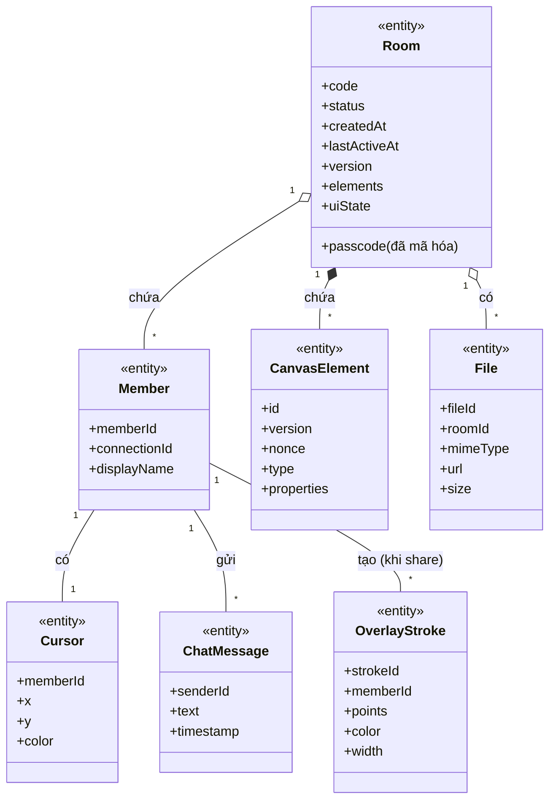

***Hình 3.1: Biểu đồ lớp thực thể tổng quan của hệ thống EvoDraw***

### 3.1.3. Phân tích chi tiết từng module

> **Lưu ý phương pháp luận:** Phần phân tích áp dụng mô hình **Boundary–Control–Entity (BCE)** theo phương pháp OOAD của Larman như một mô hình *trừu tượng* để mô tả trách nhiệm các thành phần, **không phải bản đồ 1:1 vào cấu trúc mã nguồn**. Ba vai trò:
>
> - **Boundary**: các thành phần giao diện (trang, thành phần hiển thị, lớp phủ desktop).
> - **Control**: các lớp điều phối use case (đặt tên kết thúc bằng *Controller*).
> - **Entity**: các lớp dữ liệu thuần — không tự thực hiện thao tác I/O.
>
> Khi một use case cần truy cập cơ sở dữ liệu, **Control gọi trực tiếp tới `:CSDL` như một hệ thống ngoài** trong biểu đồ tuần tự; Entity không tự gọi CSDL.
>
> Đây là mô hình *trừu tượng ở pha phân tích*. Việc ánh xạ từng lớp Control/Boundary/Entity sang mã nguồn thực tế (file, hook, hàm, sự kiện) được trình bày ở **mục 3.3 — Thực nghiệm**, sau khi đã chốt công nghệ ở Chương 2.

Mỗi mục dưới đây gồm hai phần:

- **Phân tích tĩnh:** đề xuất các lớp cần thiết (Boundary/Control/Entity) cùng quan hệ giữa chúng, kèm biểu đồ lớp phân tích (Mermaid `classDiagram`).
- **Phân tích động:** mô tả luồng tương tác giữa các lớp theo trình tự thời gian, kèm biểu đồ tuần tự (Mermaid `sequenceDiagram`).

#### a. Chức năng Tạo phòng mới

**Phân tích tĩnh — các lớp và thành phần cần thiết:**

- NSD truy cập ứng dụng → giao diện trang chủ hiện lên → đề xuất lớp **LandingPage** (mới), có nút "Tạo phòng".
- NSD nhấn nút Tạo phòng → hệ thống cần chức năng `createRoom()` để điều phối → đề xuất lớp điều khiển **RoomController** (mới).
- RoomController chịu trách nhiệm: sinh mã phòng ngẫu nhiên (đảm bảo duy nhất), băm PIN bằng bcrypt, khởi tạo Entity **Room** đã có và lưu xuống **:CSDL** (hệ thống ngoài). Entity Room chỉ là dữ liệu thuần — không tự I/O.
- Sau khi tạo phòng xong, hệ thống cần chuyển NSD sang giao diện phòng → đề xuất lớp **RoomPage** (mới), là khung bao quanh phòng làm việc.
- RoomPage cần hiển thị vùng bảng trắng → đề xuất lớp **Canvas** (mới).

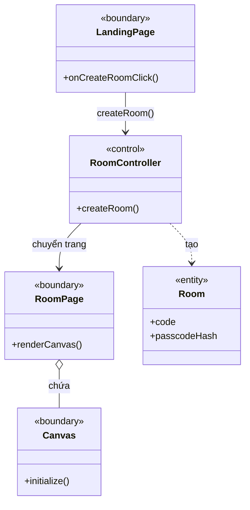

***Hình 3.2: Biểu đồ các lớp phân tích — chức năng Tạo phòng mới***

**Phân tích động — biểu đồ tuần tự:**

1. NSD click nút "Tạo phòng" trên LandingPage.
2. LandingPage gọi `RoomController.createRoom()`.
3. RoomController sinh mã phòng ngẫu nhiên và băm PIN.
4. RoomController khởi tạo đối tượng Room.
5. RoomController gọi :CSDL để lưu bản ghi Room mới.
6. :CSDL trả kết quả thành công cho RoomController.
7. RoomController trả kết quả (`code`, `passcode` plaintext) cho LandingPage.
8. LandingPage chuyển sang RoomPage.
9. RoomPage khởi tạo Canvas.
10. Canvas hiển thị cho NSD.

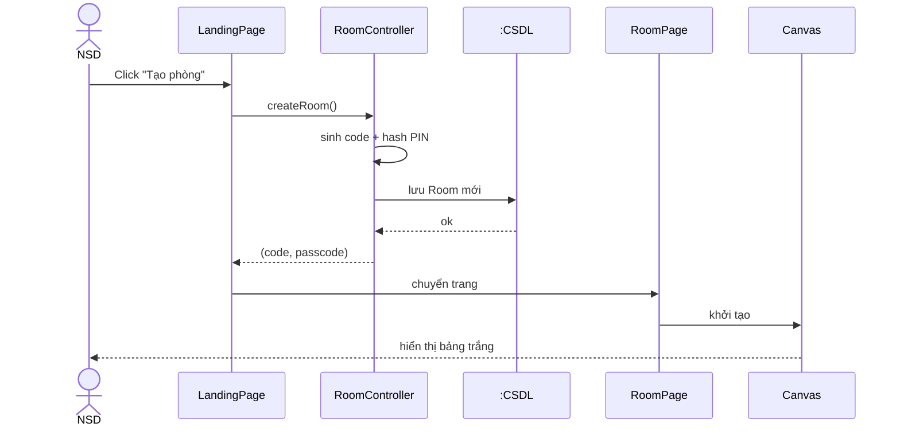

***Hình 3.3: Biểu đồ tuần tự — chức năng Tạo phòng mới***

#### b. Chức năng Tham gia phòng

**Phân tích tĩnh — các lớp và thành phần cần thiết:**

- NSD ở trang chủ → nhập mã phòng và PIN vào lớp **LandingPage** đã có, form đã có nút "Tham gia".
- Nhấn "Tham gia" → hệ thống cần `joinRoom(code, pin)` → hành động của lớp **RoomController** đã có.
- RoomController tra cứu phòng từ **:CSDL** theo mã phòng, dựng lại Entity **Room** đã có, so khớp PIN với `Room.passcodeHash` bằng `bcrypt.compare()`, và gia hạn TTL bằng cách cập nhật `updatedAt`.
- Xác thực thành công, hệ thống chuyển NSD sang lớp **RoomPage** đã có.
- RoomPage cần mở kết nối thời gian thực để tải nội dung bảng trắng → đề xuất lớp điều khiển **CanvasSyncController** (mới).
- Nội dung bảng trắng được tải về và hiển thị trên **Canvas** đã có.

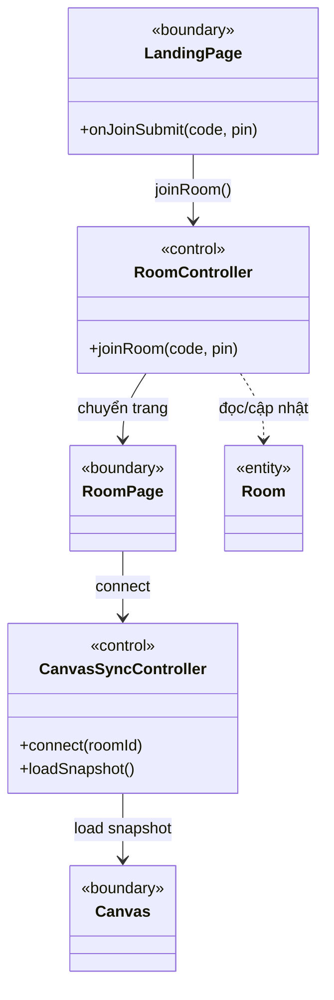

***Hình 3.4: Biểu đồ các lớp phân tích — chức năng Tham gia phòng***

**Phân tích động — biểu đồ tuần tự:**

1. NSD nhập mã phòng, PIN vào LandingPage và click "Tham gia".
2. LandingPage gọi `RoomController.joinRoom(code, pin)`.
3. RoomController truy vấn :CSDL để tra cứu phòng theo mã.
4. :CSDL trả về dữ liệu phòng cho RoomController.
5. RoomController dựng lại Entity Room.
6. RoomController so khớp PIN với `Room.passcodeHash` bằng `bcrypt.compare()`.
7. Nếu sai (không tìm thấy phòng hoặc PIN không khớp), RoomController trả lỗi cho LandingPage → hiển thị "Mã phòng hoặc PIN không hợp lệ".
8. Nếu đúng, RoomController cập nhật `updatedAt` (gia hạn TTL) và :CSDL xác nhận.
9. RoomController trả kết quả cho LandingPage.
10. LandingPage chuyển sang RoomPage.
11. RoomPage gọi CanvasSyncController yêu cầu mở kết nối thời gian thực.
12. CanvasSyncController kết nối tới Server, nhận snapshot bảng trắng, trả dữ liệu cho RoomPage.
13. RoomPage khởi tạo Canvas và hiển thị nội dung.

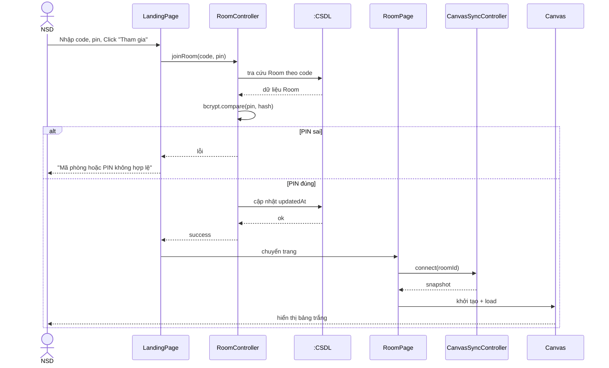

***Hình 3.5: Biểu đồ tuần tự — chức năng Tham gia phòng***

#### c. Chức năng Vẽ tự do trên bảng trắng

**Phân tích tĩnh — các lớp và thành phần cần thiết:**

- Vùng bảng trắng là lớp **Canvas** đã có. NSD cần một thanh công cụ để chọn bút/tẩy/hình dạng → đề xuất lớp **Toolbar** (mới).
- NSD chọn công cụ trên Toolbar → Toolbar cần tác động lên Canvas để cấu hình công cụ vẽ. Canvas cần bổ sung `setTool()` và `setStyle()`.
- NSD vẽ trên Canvas → mỗi nét vẽ được biểu diễn bằng Entity **CanvasElement** đã có.
- Hệ thống đồng bộ phần tử vẽ cho thành viên khác → dùng **CanvasSyncController** đã có. Bổ sung `attachSerializer()` để lắng nghe Fabric events và phát `canvas_op`, `applyRemoteOp()` và `shouldAcceptRemote()` để giải xung đột LWW, `saveSnapshot()` để định kỳ ghi xuống **:CSDL**.

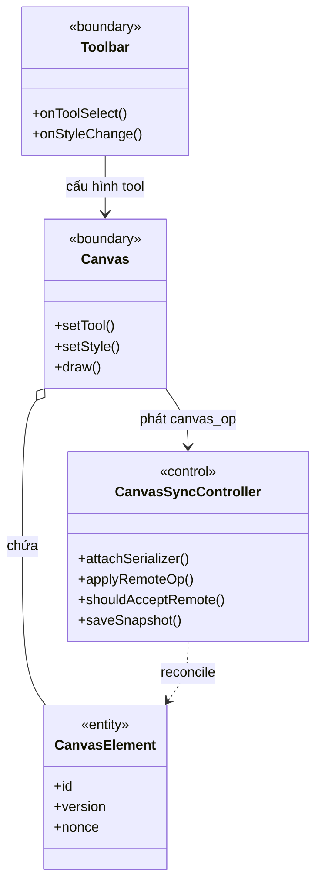

***Hình 3.6: Biểu đồ các lớp phân tích — chức năng Vẽ tự do trên bảng trắng***

**Phân tích động — biểu đồ tuần tự:**

1. NSD A chọn công cụ vẽ, màu và độ dày trên Toolbar.
2. Toolbar gọi `Canvas.setTool()` và `Canvas.setStyle()`.
3. NSD A thực hiện thao tác vẽ trên Canvas.
4. Canvas khởi tạo đối tượng CanvasElement chứa thông tin nét vẽ mới.
5. Canvas kích hoạt sự kiện Fabric → CanvasSyncController(A) phát `canvas_op(CanvasElement)` ra mạng qua Socket.IO.
6. CanvasSyncController (Máy A) chuyển tiếp tới CanvasSyncController (Máy B) qua server.
7. CanvasSyncController (B) gọi `shouldAcceptRemote()` để xử lý xung đột LWW.
8. Nếu chấp nhận, CanvasSyncController (B) gọi Canvas (B) để cập nhật nét vẽ.
9. Canvas (B) hiển thị nét vẽ mới cho NSD B.
10. Định kỳ, CanvasSyncController (A) gọi `saveSnapshot()` để lưu trạng thái xuống :CSDL.

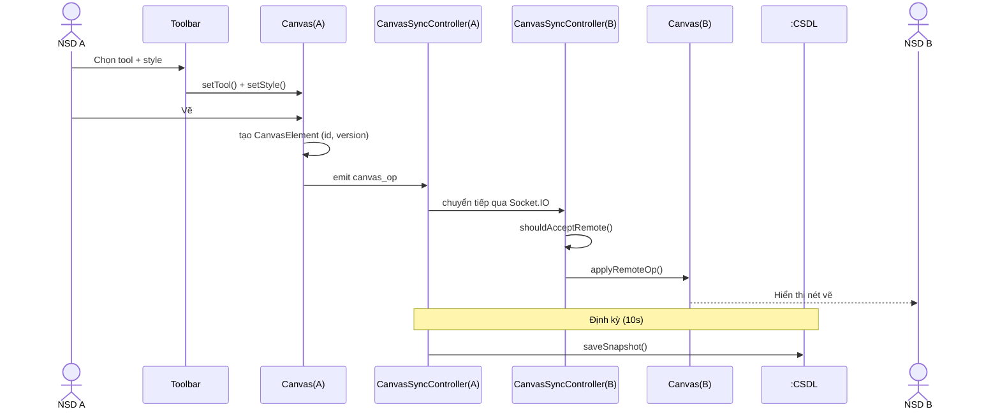

***Hình 3.7: Biểu đồ tuần tự — chức năng Vẽ tự do trên bảng trắng***

#### d. Chức năng Chèn ảnh vào bảng trắng

**Phân tích tĩnh — các lớp và thành phần cần thiết:**

- NSD dán ảnh (Ctrl+V) trực tiếp vào **Canvas** đã có hoặc chọn file qua **Toolbar** đã có.
- Hệ thống cần tải file ảnh lên kho lưu trữ đám mây và quản lý thông tin tham chiếu → đề xuất lớp điều khiển **ImagePastingController** (mới), có chức năng `uploadFile(roomId, file)` để upload lên Firebase Storage và trả URL công khai.
- ImagePastingController lưu metadata (`fileId`, `roomId`, `mimeType`, `dataURL`, `size`) → sử dụng Entity **File** đã có. Bổ sung phương thức `create()` để tạo bản ghi metadata mới trong :CSDL.
- Sau khi có URL, Canvas khởi tạo Entity **CanvasElement** đã có (loại ảnh) để hiển thị.
- Phần tử ảnh được đồng bộ tới thành viên khác → dùng **CanvasSyncController** đã có (phát `canvas_op`).

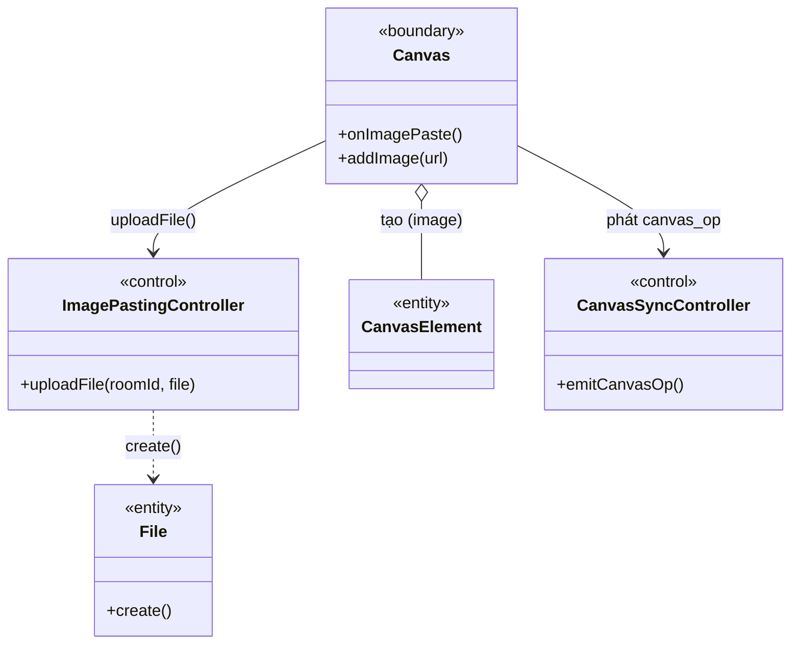

***Hình 3.8: Biểu đồ các lớp phân tích — chức năng Chèn ảnh vào bảng trắng***

**Phân tích động — biểu đồ tuần tự:**

1. NSD A dán ảnh (Ctrl+V) hoặc chọn file trên Canvas.
2. Canvas gọi `ImagePastingController.uploadFile(roomId, file)`.
3. ImagePastingController upload lên Cloud Storage và nhận URL.
4. ImagePastingController gọi `File.create()` lưu metadata vào :CSDL.
5. :CSDL trả kết quả cho ImagePastingController.
6. ImagePastingController trả URL cho Canvas.
7. Canvas khởi tạo CanvasElement loại ảnh kèm URL.
8. Canvas hiển thị ảnh cho NSD A.
9. Canvas kích hoạt CanvasSyncController(A) phát `canvas_op(CanvasElement)` qua Socket.IO.
10. CanvasSyncController (A) chuyển tiếp tới CanvasSyncController (B).
11. CanvasSyncController (B) gọi Canvas (B) thêm phần tử ảnh.
12. Canvas (B) tải ảnh từ URL công khai và hiển thị cho NSD B.

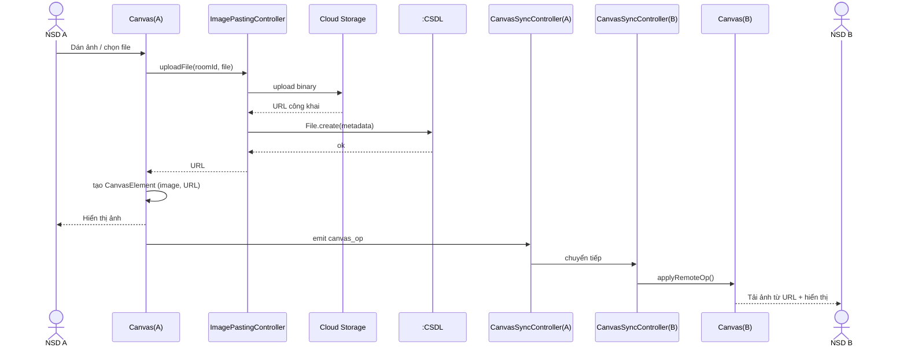

***Hình 3.9: Biểu đồ tuần tự — chức năng Chèn ảnh vào bảng trắng***

#### e. Chức năng Chia sẻ màn hình

**Phân tích tĩnh — các lớp và thành phần cần thiết:**

- Người trình bày thao tác bật/tắt chia sẻ từ **Toolbar** đã có.
- Hệ thống cần đối tượng quản lý yêu cầu quyền truy cập màn hình, đóng gói và xử lý luồng media → đề xuất lớp điều khiển **ScreenShareController** (mới), có `startSharing()` và `stopSharing()`. Nhận luồng từ thành viên khác do LiveKit xử lý tự động qua sự kiện `TrackSubscribed`.
- **ScreenShareController** trực tiếp phát và nhận tín hiệu (Signaling) `screen:start` / `screen:stop` qua Socket.IO.
- Luồng media được định tuyến qua máy chủ SFU → đề xuất lớp **MediaServer** (ngoại vi).
- Phía người xem, luồng video hiển thị dưới dạng lớp phủ trên **Canvas** đã có (vẫn có thể vẽ đè lên luồng).

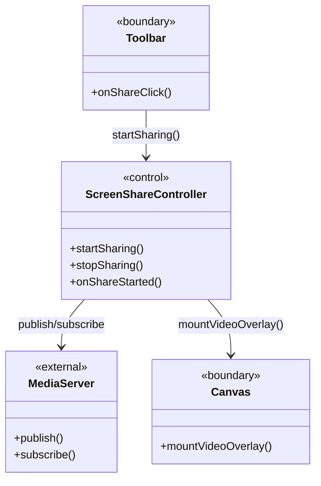

***Hình 3.10: Biểu đồ các lớp phân tích — chức năng Chia sẻ màn hình***

**Phân tích động — biểu đồ tuần tự:**

1. Người trình bày (Máy A) click "Chia sẻ màn hình" trên Toolbar.
2. Toolbar gọi `ScreenShareController(A).startSharing()`.
3. ScreenShareController yêu cầu trình duyệt cấp quyền và lấy luồng video qua `getDisplayMedia()`.
4. ScreenShareController (A) phát tín hiệu `screen:start` qua Socket.IO báo phòng biết có người bắt đầu chia sẻ.
5. Đồng thời, ScreenShareController (A) publish luồng media lên MediaServer (LiveKit SFU).
6. Server Socket.IO broadcast tín hiệu tới ScreenShareController (B).
7. ScreenShareController (B) gọi `onShareStarted()` để subscribe luồng từ MediaServer (qua sự kiện LiveKit `TrackSubscribed`).
8. MediaServer gửi luồng video về cho ScreenShareController (B).
9. ScreenShareController (B) gọi Canvas (B) `mountVideoOverlay()` để hiển thị luồng dưới dạng lớp phủ.
10. Canvas (B) hiển thị luồng video cho NSD B.

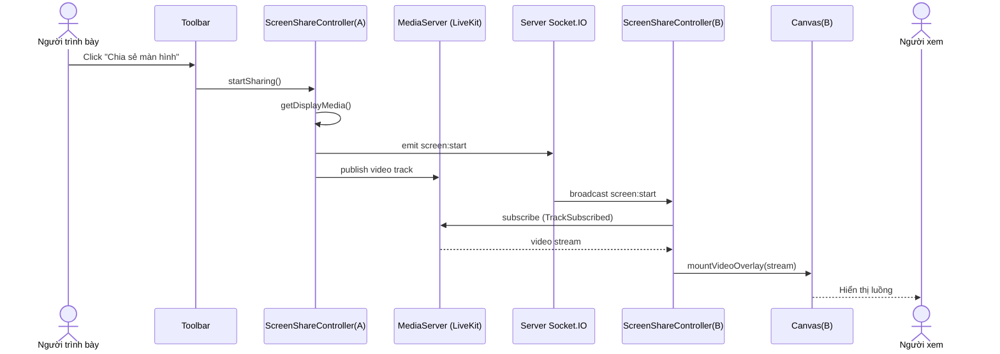

***Hình 3.11: Biểu đồ tuần tự — chức năng Chia sẻ màn hình***

#### f. Chức năng Gọi thoại (Voice Chat)

**Phân tích tĩnh — các lớp và thành phần cần thiết:**

- NSD bật/tắt micro bằng thao tác tại lớp **Toolbar** đã có.
- Hệ thống cần đối tượng quản lý việc lấy luồng âm thanh từ thiết bị và giao tiếp máy chủ → đề xuất lớp điều khiển **VoiceChatController** (mới), có `toggleVoice()`.
- VoiceChatController trực tiếp phát và nhận tín hiệu (Signaling) cập nhật trạng thái micro.
- Tương tự chia sẻ màn hình, luồng âm thanh được định tuyến qua **MediaServer** (LiveKit SFU).

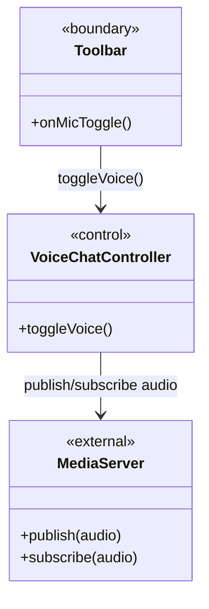

***Hình 3.12: Biểu đồ các lớp phân tích — chức năng Gọi thoại (Voice Chat)***

**Phân tích động — biểu đồ tuần tự:**

1. NSD A click "Bật micro" trên Toolbar.
2. Toolbar gọi `VoiceChatController(A).toggleVoice()`.
3. VoiceChatController yêu cầu quyền và lấy luồng âm thanh từ micro (`getUserMedia`).
4. VoiceChatController (A) phát tín hiệu cập nhật trạng thái micro qua Socket.IO.
5. VoiceChatController (A) publish luồng âm thanh lên MediaServer.
6. Server broadcast tín hiệu tới VoiceChatController (B).
7. VoiceChatController (B) cập nhật trạng thái micro của Máy A trên UI.
8. VoiceChatController (B) subscribe luồng âm thanh từ MediaServer.
9. MediaServer gửi luồng âm thanh về cho VoiceChatController (B).
10. NSD B nghe thấy giọng nói của NSD A.

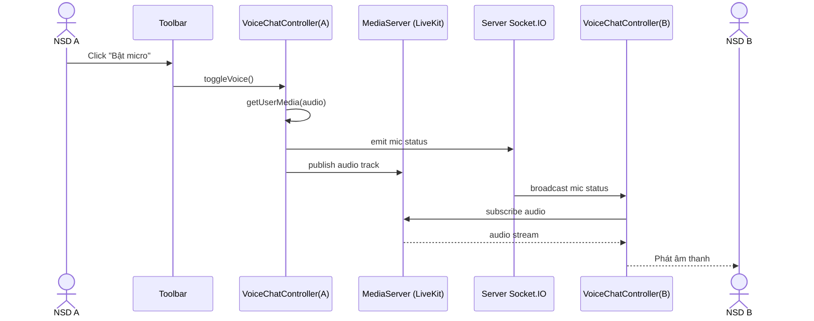

***Hình 3.13: Biểu đồ tuần tự — chức năng Gọi thoại (Voice Chat)***

#### g. Chức năng Gửi tin nhắn chat

**Phân tích tĩnh — các lớp và thành phần cần thiết:**

- Hệ thống cần khung trao đổi tin nhắn có thể đóng/mở → đề xuất lớp **ChatPanel** (mới) quản lý việc nhập và hiển thị tin nhắn.
- NSD gửi tin nhắn trên ChatPanel → đề xuất lớp điều khiển **ChatController** (mới), có `sendMessage(text)`.
- Mỗi tin nhắn được biểu diễn bằng Entity **ChatMessage** đã có.
- ChatController trực tiếp phát và nhận tin nhắn qua Socket.IO, độc lập với CanvasSyncController.

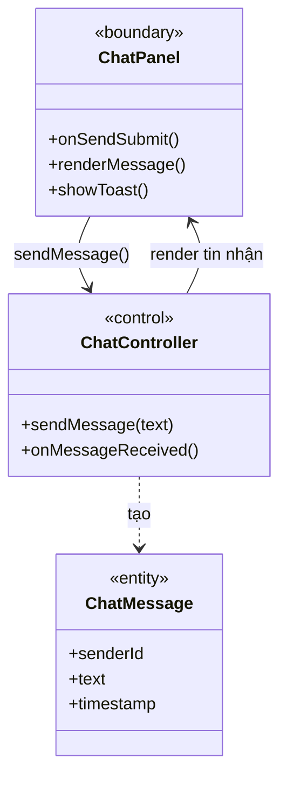

***Hình 3.14: Biểu đồ các lớp phân tích — chức năng Gửi tin nhắn chat***

**Phân tích động — biểu đồ tuần tự:**

1. NSD A nhập nội dung tin nhắn vào ChatPanel và click gửi.
2. ChatPanel gọi `ChatController(A).sendMessage(text)`.
3. ChatController (A) khởi tạo ChatMessage (sender, text, timestamp).
4. ChatController (A) gọi ChatPanel hiển thị tin nhắn cho NSD A (phản hồi tức thì).
5. ChatController (A) phát tin nhắn qua Socket.IO tới Server.
6. Server broadcast tới ChatController (B).
7. ChatController (B) gọi ChatPanel (B) hiển thị tin nhắn. Nếu ChatPanel đang đóng, hiển thị toast và tăng badge tin chưa đọc.

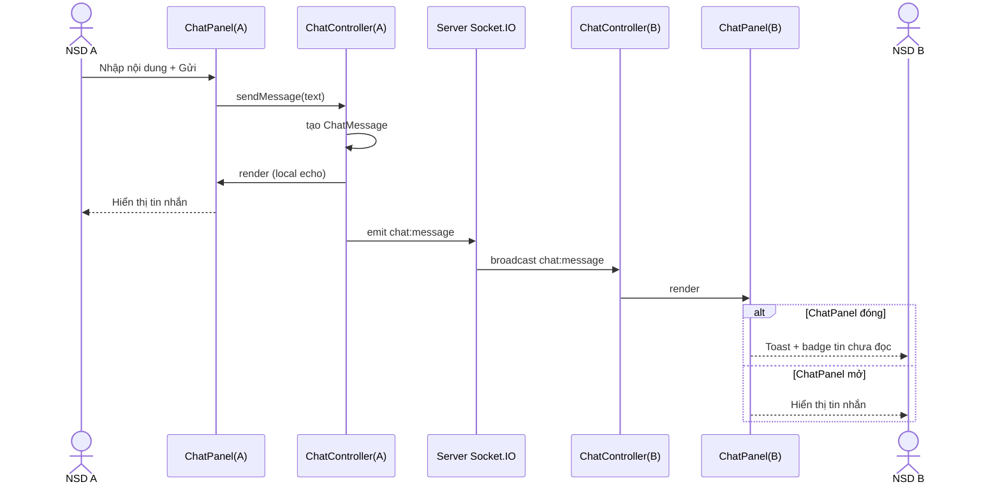

***Hình 3.15: Biểu đồ tuần tự — chức năng Gửi tin nhắn chat***

#### h. Chức năng Nhập và xuất file bảng trắng

**Phân tích tĩnh — các lớp và thành phần cần thiết:**

- Hệ thống cần menu cấu hình của phòng → đề xuất lớp **SettingsPanel** (mới), có nút Nhập file và nút Xuất file.
- Cả hai thao tác đều liên quan đến serialize/deserialize dữ liệu bảng trắng → đề xuất lớp điều khiển **DocumentController** (mới), tập trung xử lý tài liệu với hai chức năng: `importFile(file)` để đọc JSON và khôi phục bảng trắng, `exportFile()` để serialize bảng trắng thành JSON và kích hoạt tải xuống.
- **Nhập file:** NSD chọn file JSON → SettingsPanel gọi `DocumentController.importFile(file)`. DocumentController parse JSON, tái tạo các phần tử Entity **CanvasElement** đã có. Sau đó DocumentController hiển thị các phần tử trên Canvas và gọi **CanvasSyncController** đã có để đồng bộ tới các thành viên khác.
- **Xuất file:** NSD chọn Xuất file → SettingsPanel gọi `DocumentController.exportFile()`. DocumentController serialize tất cả phần tử thành JSON, đóng gói thành file và trả về để kích hoạt tải xuống.

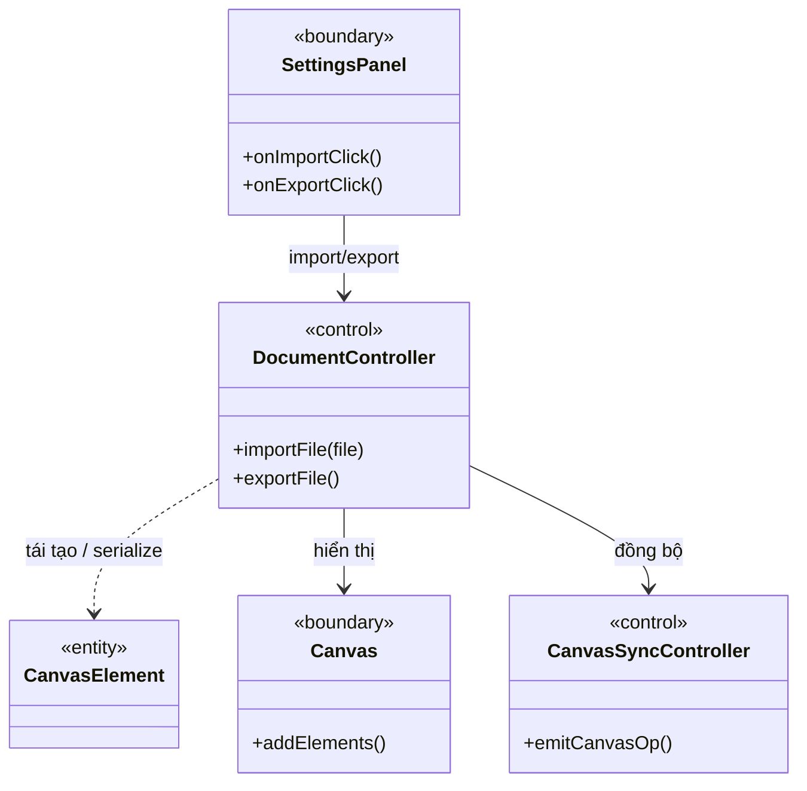

***Hình 3.16: Biểu đồ các lớp phân tích — chức năng Nhập và xuất file bảng trắng***

**Phân tích động — biểu đồ tuần tự (Nhập file):**

1. NSD A click "Nhập file" trên SettingsPanel và chọn file JSON.
2. SettingsPanel gọi `DocumentController.importFile(file)`.
3. DocumentController parse JSON và tái tạo các phần tử CanvasElement.
4. DocumentController thực hiện song song hai việc:
   - Hiển thị: đưa các phần tử lên Canvas — Canvas hiển thị tức thì cho NSD A.
   - Đồng bộ: kích hoạt CanvasSyncController(A) phát `canvas_op` ra mạng.
5. CanvasSyncController (A) chuyển tiếp tới CanvasSyncController (B).
6. CanvasSyncController (B) cập nhật bảng trắng của NSD B.

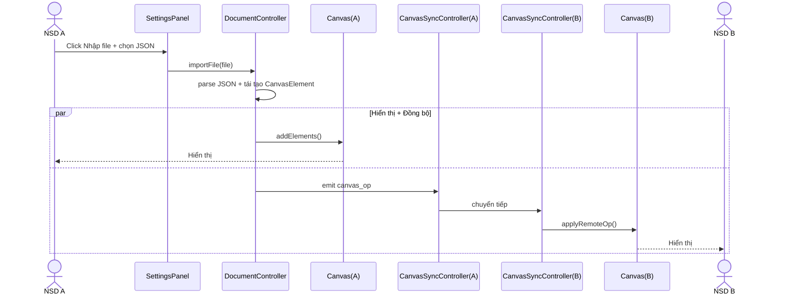

***Hình 3.17: Biểu đồ tuần tự — chức năng Nhập file bảng trắng***

**Phân tích động — biểu đồ tuần tự (Xuất file):**

1. NSD click "Xuất file" trên SettingsPanel.
2. SettingsPanel gọi `DocumentController.exportFile()`.
3. DocumentController serialize tất cả phần tử thành dữ liệu JSON.
4. DocumentController trả file đã đóng gói cho SettingsPanel.
5. SettingsPanel kích hoạt tải xuống, file được lưu xuống thiết bị NSD.

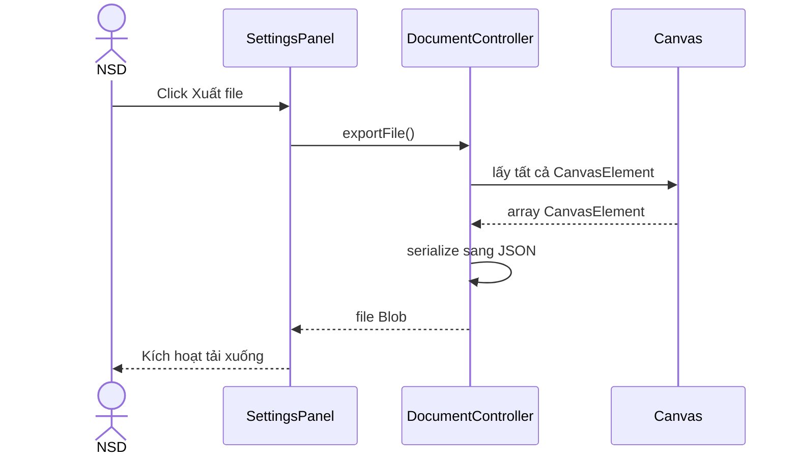

***Hình 3.18: Biểu đồ tuần tự — chức năng Xuất file bảng trắng***

#### i. Chức năng Rời phòng

**Phân tích tĩnh — các lớp và thành phần cần thiết:**

- NSD thao tác trên giao diện phòng → lớp **RoomPage** (đã có). Bổ sung `showLeaveConfirm()` để hiển thị hộp thoại xác nhận, và `onMemberLeft(member)` để cập nhật giao diện khi một thành viên khác rời.
- Hệ thống cần xử lý logic rời phòng → bổ sung `leaveRoom()` cho lớp điều khiển **RoomController** (đã có).
- RoomController trực tiếp phát tín hiệu `leave_room` qua Socket.IO tới Server; Server broadcast `room_users` cập nhật tới các thành viên còn lại.
- Sau khi rời phòng, NSD được chuyển trở về lớp **LandingPage** (đã có).

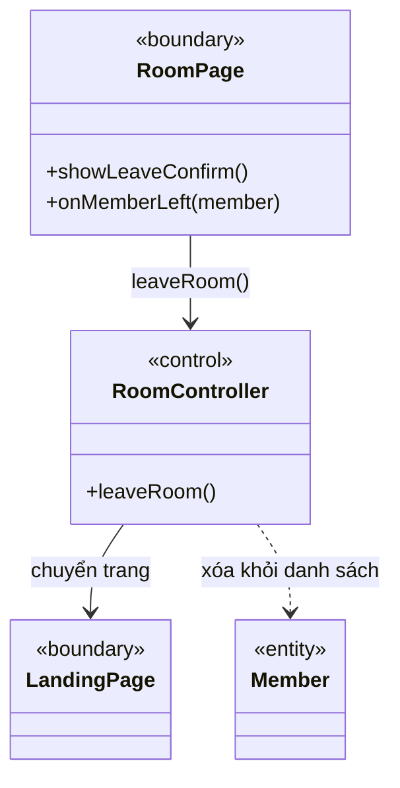

***Hình 3.19: Biểu đồ các lớp phân tích — chức năng Rời phòng***

**Phân tích động — biểu đồ tuần tự:**

1. NSD A click nút "Rời phòng" trên RoomPage.
2. RoomPage hiển thị hộp thoại xác nhận rời phòng.
3. NSD A xác nhận rời phòng.
4. RoomPage gọi `RoomController.leaveRoom()`.
5. RoomController thực hiện song song hai việc:
   - Thông báo: phát `leave_room` qua Socket.IO tới Server; Server broadcast `room_users` cập nhật tới các thành viên còn lại.
   - Điều hướng: chuyển NSD A trở về LandingPage.
6. RoomController (A) qua Server đến RoomPage (Máy B).
7. `RoomPage(B).onMemberLeft(member)` cập nhật danh sách thành viên cho NSD B.

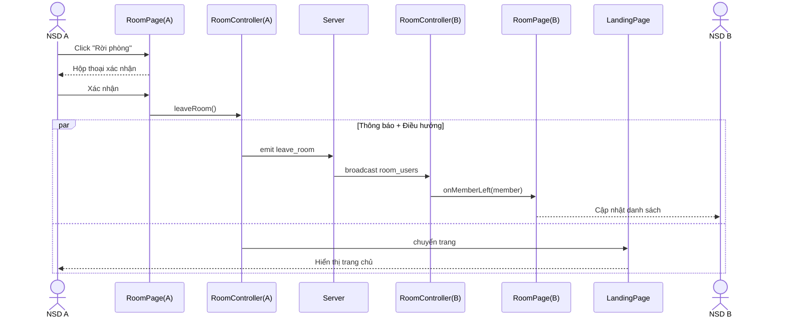

***Hình 3.20: Biểu đồ tuần tự — chức năng Rời phòng***

#### j. Chức năng Ghi chú đè lên màn hình chia sẻ (Desktop Overlay)

**Phân tích tĩnh — các lớp và thành phần cần thiết:**

- NSD đang chia sẻ màn hình trong phòng → lớp **RoomPage** đã có, cần bổ sung nút "Mở Desktop Overlay".
- Khi NSD click nút → hệ thống cần điều phối khởi động ứng dụng desktop và duy trì kết nối vào phòng → đề xuất lớp điều khiển **OverlayController** (mới), có `launchOverlay()` để khởi động ứng dụng (qua deep-link `evodraw://`) và `switchMode()` để chuyển đổi giữa chế độ Làm việc và chế độ Vẽ.
- Ứng dụng desktop cần một bề mặt vẽ phủ toàn màn hình → đề xuất lớp **OverlayCanvas** (mới).
- Mỗi nét ghi chú được biểu diễn bằng Entity **OverlayStroke** (mới), chứa `strokeId`, mảng `points` (tọa độ chuẩn hoá 0–1), `color`, `width`.
- Nét ghi chú cần đồng bộ tới tất cả thành viên → OverlayController trực tiếp phát `overlay:stroke:add` qua Socket.IO.
- Phía người xem (Web App), nét được hiển thị đè trên luồng video chia sẻ → render trên **Canvas** đã có.

```mermaid
classDiagram
    class RoomPage {
        <<boundary>>
        +onOpenOverlayClick()
    }
    class OverlayController {
        <<control>>
        +launchOverlay()
        +switchMode()
        +emitStroke(stroke)
    }
    class OverlayCanvas {
        <<boundary>>
        +onPointerDown()
        +onPointerMove()
        +onPointerUp()
    }
    class OverlayStroke {
        <<entity>>
        +strokeId
        +points
        +color
        +width
    }
    class Canvas {
        <<boundary>>
        +renderOverlayStroke()
    }
    RoomPage --> OverlayController : launchOverlay()
    OverlayController --> OverlayCanvas : kích hoạt
    OverlayCanvas ..> OverlayStroke : tạo
    OverlayController --> Canvas : phát stroke tới viewer
```

***Hình 3.21: Biểu đồ các lớp phân tích — chức năng Desktop Overlay***

**Phân tích động — biểu đồ tuần tự:**

1. NSD (người chia sẻ màn hình) click nút "Mở Desktop Overlay" trên RoomPage.
2. RoomPage gọi `OverlayController.launchOverlay()` qua deep-link `evodraw://overlay?room=...&token=...`.
3. OverlayController khởi động Desktop App ở chế độ Làm việc (cửa sổ trong suốt, ignore mouse events).
4. NSD nhấn `Ctrl+Shift+D` để chuyển sang chế độ Vẽ.
5. `OverlayController.switchMode()` gọi `setIgnoreMouseEvents(false)` và kích hoạt OverlayCanvas nhận thao tác vẽ.
6. NSD vẽ nét ghi chú trên OverlayCanvas.
7. OverlayCanvas khởi tạo OverlayStroke (`points` chuẩn hoá 0–1) và gọi OverlayController phát `overlay:stroke:add` qua Socket.IO.
8. Server broadcast `overlay:stroke:added` tới Canvas (Máy B — Web App của các viewer).
9. Canvas (B) hiển thị ghi chú đè trên luồng màn hình chia sẻ cho NSD B gần như tức thời.

```mermaid
sequenceDiagram
    actor A as Người chia sẻ
    participant RP as RoomPage
    participant OC as OverlayController
    participant OCV as OverlayCanvas
    participant S as Server
    participant CB as Canvas(Máy B)
    actor B as Người xem

    A->>RP: Click "Mở Desktop Overlay"
    RP->>OC: launchOverlay() (deep-link)
    OC->>OCV: khởi tạo (Working mode)
    A->>OC: Ctrl+Shift+D
    OC->>OCV: switchMode(Drawing)
    A->>OCV: Vẽ nét
    OCV->>OCV: tạo OverlayStroke (chuẩn hoá 0-1)
    OCV->>OC: emit stroke
    OC->>S: overlay:stroke:add
    S->>CB: overlay:stroke:added
    CB-->>B: Hiển thị ghi chú đè video
```

***Hình 3.22: Biểu đồ tuần tự — chức năng Desktop Overlay***

#### k. Chức năng Hoàn tác / Làm lại (Undo/Redo)

**Phân tích tĩnh — các lớp và thành phần cần thiết:**

- NSD thao tác undo/redo qua phím tắt (Ctrl+Z, Ctrl+Y) hoặc nút trên **Toolbar** đã có. Toolbar cần bổ sung `onUndoClick()` và `onRedoClick()`.
- Hệ thống cần quản lý lịch sử thao tác của riêng NSD (cục bộ, không dùng chung) → đề xuất lớp điều khiển **HistoryController** (mới), có hai ngăn xếp `undoStack` và `redoStack`, kèm `pushOp(op)` để lưu thao tác, `undo()` để hoàn tác và `redo()` để khôi phục.
- HistoryController vận hành trên Entity **CanvasElement** đã có (thêm, sửa, xóa phần tử theo thao tác đảo ngược).
- Sau khi đảo ngược cục bộ, HistoryController cần đồng bộ thao tác tới các thành viên khác → gọi **CanvasSyncController** đã có (phát `canvas_op` tương ứng).

```mermaid
classDiagram
    class Toolbar {
        <<boundary>>
        +onUndoClick()
        +onRedoClick()
    }
    class HistoryController {
        <<control>>
        -undoStack
        -redoStack
        +pushOp(op)
        +undo()
        +redo()
    }
    class Canvas {
        <<boundary>>
        +applyOp(op)
    }
    class CanvasElement {
        <<entity>>
    }
    class CanvasSyncController {
        <<control>>
        +emitCanvasOp(op)
    }
    Toolbar --> HistoryController : gọi undo/redo
    HistoryController --> Canvas : áp dụng thao tác đảo ngược
    HistoryController --> CanvasSyncController : phát canvas_op
    Canvas o-- CanvasElement : chứa
```

***Hình 3.23: Biểu đồ các lớp phân tích — chức năng Hoàn tác / Làm lại***

**Phân tích động — biểu đồ tuần tự:**

1. NSD A nhấn `Ctrl+Z` hoặc click nút Hoàn tác trên Toolbar.
2. Toolbar gọi `HistoryController(A).undo()`.
3. HistoryController(A) pop thao tác cuối khỏi `undoStack`, push sang `redoStack` và tính thao tác đảo ngược (thêm → xóa, xóa → thêm, sửa → khôi phục giá trị trước).
4. HistoryController(A) áp dụng thao tác đảo ngược lên Canvas.
5. Canvas hiển thị trạng thái mới cho NSD A.
6. HistoryController(A) kích hoạt CanvasSyncController(A) phát `canvas_op` chứa thao tác đảo ngược qua Socket.IO.
7. CanvasSyncController (A) chuyển tiếp tới CanvasSyncController (B).
8. CanvasSyncController (B) gọi `shouldAcceptRemote()` để xử lý xung đột, sau đó cập nhật Canvas (B).
9. Canvas (B) hiển thị trạng thái mới cho NSD B.

```mermaid
sequenceDiagram
    actor A as NSD A
    participant TB as Toolbar
    participant HC as HistoryController(A)
    participant CA as Canvas(A)
    participant SCA as CanvasSyncController(A)
    participant SCB as CanvasSyncController(B)
    participant CB as Canvas(B)
    actor B as NSD B

    A->>TB: Nhấn Ctrl+Z / click Hoàn tác
    TB->>HC: undo()
    HC->>HC: pop undoStack, push redoStack
    HC->>CA: áp dụng thao tác đảo ngược
    CA-->>A: Hiển thị trạng thái mới
    HC->>SCA: emit canvas_op (đảo ngược)
    SCA->>SCB: chuyển tiếp qua Socket.IO
    SCB->>SCB: shouldAcceptRemote()
    SCB->>CB: applyRemoteOp()
    CB-->>B: Hiển thị trạng thái mới
```

***Hình 3.24: Biểu đồ tuần tự — chức năng Hoàn tác / Làm lại***

#### l. Chức năng Di chuyển và Phóng to/Thu nhỏ vùng nhìn (Pan/Zoom)

**Phân tích tĩnh — các lớp và thành phần cần thiết:**

- NSD thao tác chuột (lăn, kéo) trên **Canvas** đã có để di chuyển và phóng to/thu nhỏ vùng nhìn.
- Hệ thống cần quản lý ma trận biến đổi vùng nhìn (viewport transform) và xử lý các sự kiện chuột tương ứng → đề xuất lớp điều khiển **InfiniteCanvasController** (mới), có `pan(dx, dy)` để dịch chuyển vùng nhìn, `zoom(factor, center)` để phóng to/thu nhỏ quanh một điểm, và `resetView()` để đặt lại vùng nhìn mặc định.
- InfiniteCanvasController cập nhật trực tiếp `viewportTransform` trên **Canvas** đã có; Canvas sử dụng ma trận này khi vẽ lại các phần tử.
- Thao tác Pan/Zoom **chỉ ảnh hưởng cục bộ** tới vùng nhìn của riêng NSD — không phát ra mạng, không gọi CanvasSyncController.

```mermaid
classDiagram
    class Canvas {
        <<boundary>>
        +viewportTransform
        +renderAll()
    }
    class InfiniteCanvasController {
        <<control>>
        +pan(dx, dy)
        +zoom(factor, center)
        +resetView()
    }
    Canvas --> InfiniteCanvasController : chuyển tiếp sự kiện chuột
    InfiniteCanvasController --> Canvas : cập nhật viewportTransform
```

***Hình 3.25: Biểu đồ các lớp phân tích — chức năng Pan/Zoom***

**Phân tích động — biểu đồ tuần tự:**

1. NSD lăn chuột (hoặc Ctrl + lăn) trên Canvas để phóng to/thu nhỏ, hoặc giữ phím Space và kéo chuột để di chuyển vùng nhìn.
2. Canvas chuyển tiếp sự kiện chuột cho InfiniteCanvasController.
3. InfiniteCanvasController tính toán ma trận biến đổi mới: với pan, dịch chuyển theo (dx, dy); với zoom, nhân tỉ lệ quanh điểm tâm là vị trí con trỏ chuột.
4. InfiniteCanvasController cập nhật `viewportTransform` trên Canvas.
5. Canvas vẽ lại tất cả phần tử theo vùng nhìn mới và hiển thị kết quả cho NSD.

```mermaid
sequenceDiagram
    actor U as NSD
    participant CV as Canvas
    participant ICC as InfiniteCanvasController

    U->>CV: Lăn chuột / Space+kéo
    CV->>ICC: chuyển tiếp sự kiện chuột
    ICC->>ICC: tính transform mới (translate/scale)
    ICC->>CV: setViewportTransform()
    CV-->>U: Vẽ lại theo vùng nhìn mới
```

***Hình 3.26: Biểu đồ tuần tự — chức năng Pan/Zoom***

#### m. Chức năng Hiển thị con trỏ của thành viên khác (Remote Cursors)

**Phân tích tĩnh — các lớp và thành phần cần thiết:**

- Mỗi thành viên có một vị trí con trỏ trên bảng trắng, đại diện bằng Entity **Cursor** đã có (thuộc tính: `memberId`, `x`, `y`, `color`, `displayName`).
- Hệ thống cần phát vị trí con trỏ cục bộ và nhận vị trí con trỏ của các thành viên khác → đề xuất lớp điều khiển **RemoteCursorsController** (mới), có `emitCursor(x, y)` (có throttle để giảm tải mạng) để phát vị trí con trỏ của NSD và `onRemoteCursor(memberId, x, y)` để xử lý vị trí con trỏ nhận từ thành viên khác.
- RemoteCursorsController giao tiếp qua Socket.IO sự kiện `cursor_move`, độc lập với CanvasSyncController (kênh riêng cho dữ liệu phù du, không cần lưu trữ).
- Các con trỏ remote được vẽ và hiển thị trên **Canvas** đã có.

```mermaid
classDiagram
    class Canvas {
        <<boundary>>
        +drawRemoteCursor(cursor)
    }
    class RemoteCursorsController {
        <<control>>
        +emitCursor(x, y)
        +onRemoteCursor(memberId, x, y)
    }
    class Cursor {
        <<entity>>
        +memberId
        +x
        +y
        +color
        +displayName
    }
    Canvas --> RemoteCursorsController : sự kiện mousemove (throttled)
    RemoteCursorsController --> Canvas : vẽ con trỏ remote
    RemoteCursorsController o-- Cursor : quản lý
```

***Hình 3.27: Biểu đồ các lớp phân tích — chức năng Remote Cursors***

**Phân tích động — biểu đồ tuần tự:**

1. NSD A di chuyển chuột trên Canvas.
2. Canvas chuyển tiếp sự kiện cho RemoteCursorsController(A).
3. RemoteCursorsController(A) gọi `emitCursor(x, y)` — qua throttle, chỉ phát tối đa N lần/giây.
4. RemoteCursorsController(A) phát `cursor_move` qua Socket.IO tới Server.
5. Server chuyển tiếp tới RemoteCursorsController(B) trên Máy B.
6. `RemoteCursorsController(B).onRemoteCursor(memberId_A, x, y)` gọi Canvas(B) hiển thị con trỏ của NSD A.
7. Canvas(B) vẽ con trỏ kèm tên hiển thị và màu đại diện của NSD A.
8. Khi NSD A ngừng di chuyển trong khoảng timeout, RemoteCursorsController(B) gỡ con trỏ của A khỏi Canvas(B).

```mermaid
sequenceDiagram
    actor A as NSD A
    participant CA as Canvas(A)
    participant RCA as RemoteCursorsController(A)
    participant S as Server
    participant RCB as RemoteCursorsController(B)
    participant CB as Canvas(B)
    actor B as NSD B

    A->>CA: Di chuyển chuột
    CA->>RCA: emitCursor(x, y) [throttled]
    RCA->>S: phát cursor_move
    S->>RCB: chuyển tiếp tới Máy B
    RCB->>CB: onRemoteCursor(memberId_A, x, y)
    CB-->>B: Hiển thị con trỏ của A (tên + màu)
    Note over RCB,CB: Timeout: gỡ con trỏ khi A ngừng di chuyển
```

***Hình 3.28: Biểu đồ tuần tự — chức năng Remote Cursors***

#### n. Chức năng Đổi tên hiển thị

**Phân tích tĩnh — các lớp và thành phần cần thiết:**

- NSD thao tác đổi tên qua ô nhập trên khung Thành viên → đề xuất lớp **MembersPanel** (mới), hoặc tận dụng **SettingsPanel** đã có để chứa ô nhập tên.
- Hệ thống cần xử lý logic đổi tên và đồng bộ tới các thành viên khác → bổ sung `updateUsername(newName)` cho lớp điều khiển **RoomController** đã có.
- RoomController phát tín hiệu `update_username` qua Socket.IO; Server cập nhật danh sách thành viên trong **Room** đã có và phát broadcast tới các máy khác.
- Mỗi máy khách nhận tín hiệu, RoomController cập nhật danh sách thành viên và refresh giao diện hiển thị tên mới trên **RoomPage** đã có (danh sách thành viên, nhãn tin nhắn chat, nhãn con trỏ remote).

```mermaid
classDiagram
    class MembersPanel {
        <<boundary>>
        +onRenameSubmit(newName)
    }
    class RoomController {
        <<control>>
        +updateUsername(newName)
    }
    class RoomPage {
        <<boundary>>
        +refreshMembers()
    }
    class Member {
        <<entity>>
        +memberId
        +displayName
    }
    MembersPanel --> RoomController : gọi updateUsername()
    RoomController --> Member : cập nhật displayName
    RoomController --> RoomPage : refresh giao diện
```

***Hình 3.29: Biểu đồ các lớp phân tích — chức năng Đổi tên hiển thị***

**Phân tích động — biểu đồ tuần tự:**

1. NSD A nhập tên mới vào ô tên trên MembersPanel/SettingsPanel và xác nhận.
2. MembersPanel gọi `RoomController(A).updateUsername(newName)`.
3. RoomController(A) phát `update_username(roomId, newName)` qua Socket.IO tới Server.
4. Server cập nhật bản ghi thành viên trong Room và phát broadcast `user_renamed(memberId, newName)` tới các máy còn lại.
5. RoomController(B) nhận tín hiệu `user_renamed`, cập nhật danh sách thành viên cục bộ.
6. RoomController(B) gọi RoomPage(B) refresh các giao diện liên quan (danh sách thành viên, lịch sử chat, nhãn con trỏ) hiển thị tên mới cho NSD B.

```mermaid
sequenceDiagram
    actor A as NSD A
    participant MP as MembersPanel
    participant RCA as RoomController(A)
    participant S as Server
    participant RCB as RoomController(B)
    participant RP as RoomPage(B)
    actor B as NSD B

    A->>MP: Nhập tên mới, xác nhận
    MP->>RCA: updateUsername(newName)
    RCA->>S: emit update_username(roomId, newName)
    S->>S: cập nhật Member trong Room
    S->>RCB: broadcast user_renamed(memberId, newName)
    RCB->>RP: refresh danh sách thành viên, chat, con trỏ
    RP-->>B: Hiển thị tên mới
```

***Hình 3.30: Biểu đồ tuần tự — chức năng Đổi tên hiển thị***

#### o. Chức năng Xóa ghi chú Desktop Overlay

**Phân tích tĩnh — các lớp và thành phần cần thiết:**

- NSD thao tác trên thanh công cụ của Desktop Overlay (kế thừa từ chức năng j) gồm các nút: Hoàn tác nét cuối, Tẩy nét, Xóa toàn bộ → mở rộng giao diện của lớp **OverlayCanvas** đã có.
- Hệ thống cần xử lý logic xóa ghi chú và đồng bộ tới các thành viên khác → bổ sung cho lớp điều khiển **OverlayController** đã có ba chức năng: `undoStroke()` để hoàn tác nét vừa được vẽ, `eraseStroke(strokeId)` để xóa một nét cụ thể được NSD chỉ định, `clearAll()` để xóa toàn bộ các nét hiện có.
- Mỗi thao tác xóa cần được phát tới các thành viên khác → OverlayController tận dụng kênh đồng bộ Overlay đã có (cùng kênh phát nét vẽ ở chức năng j), gửi sự kiện `overlay:stroke:remove` (cho `eraseStroke`) hoặc `overlay:stroke:clear` (cho `clearAll`).
- Phía người xem, các nét bị xóa được gỡ khỏi lớp phủ trên **Canvas** đã có; Canvas tự cập nhật giao diện.

```mermaid
classDiagram
    class OverlayCanvas {
        <<boundary>>
        +onUndoClick()
        +onEraseClick(strokeId)
        +onClearAllClick()
    }
    class OverlayController {
        <<control>>
        +undoStroke()
        +eraseStroke(strokeId)
        +clearAll()
    }
    class OverlayStroke {
        <<entity>>
        +strokeId
        +points
        +color
    }
    class Canvas {
        <<boundary>>
        +removeOverlayStroke(strokeId)
        +clearOverlayLayer()
    }
    OverlayCanvas --> OverlayController : gọi thao tác xóa
    OverlayController o-- OverlayStroke : xóa
    OverlayController --> Canvas : đồng bộ xóa qua mạng
```

***Hình 3.31: Biểu đồ các lớp phân tích — chức năng Xóa ghi chú Desktop Overlay***

**Phân tích động — biểu đồ tuần tự:**

1. NSD click nút Hoàn tác / Tẩy nét / Xóa toàn bộ trên OverlayCanvas (hoặc phím tắt tương ứng).
2. OverlayCanvas gọi tương ứng `OverlayController.undoStroke()`, `eraseStroke(strokeId)`, hoặc `clearAll()`.
3. OverlayController cập nhật OverlayCanvas cục bộ — gỡ nét tương ứng (hoặc toàn bộ nét) khỏi danh sách hiển thị.
4. OverlayCanvas hiển thị kết quả cho NSD.
5. OverlayController phát thao tác xóa qua Socket.IO: `overlay:stroke:remove(strokeId)` hoặc `overlay:stroke:clear()`.
6. Server broadcast tới Canvas (Máy B — Web App).
7. Canvas (B) xóa các nét ghi chú tương ứng khỏi lớp phủ trên luồng màn hình chia sẻ.
8. Canvas (B) hiển thị trạng thái mới cho NSD B gần như tức thời.

```mermaid
sequenceDiagram
    actor A as NSD (Desktop Overlay)
    participant OC as OverlayCanvas
    participant OCT as OverlayController
    participant S as Server
    participant CB as Canvas(Máy B)
    actor B as NSD B

    A->>OC: Click Hoàn tác / Tẩy / Xóa toàn bộ
    OC->>OCT: undoStroke() / eraseStroke(id) / clearAll()
    OCT->>OC: gỡ nét tương ứng (hoặc toàn bộ)
    OC-->>A: Hiển thị kết quả
    OCT->>S: overlay:stroke:remove | overlay:stroke:clear
    S->>CB: broadcast
    CB->>CB: gỡ nét khỏi lớp phủ
    CB-->>B: Cập nhật giao diện
```

***Hình 3.32: Biểu đồ tuần tự — chức năng Xóa ghi chú Desktop Overlay***

### 3.1.4. Thiết kế chi tiết hệ thống

#### a. Hoàn thiện cấu trúc các thành phần thiết kế

**Chuyển đổi từ Phân tích sang Thiết kế.** Pha Phân tích (mục 3.1.3) sử dụng tư duy hướng đối tượng (OOP) thông qua UML/BCE để làm rõ trách nhiệm các thành phần — đây là *ngôn ngữ chung* mang tính học thuật. Khi bước vào pha Thiết kế và Cài đặt, hệ thống EvoDraw áp dụng **mô hình thiết kế hỗn hợp** để tối ưu hóa cho công nghệ thực tế:

- **Tầng Entity giữ nguyên cấu trúc OOP** (lớp dữ liệu/lược đồ + đối tượng đồ họa) vì đây là lớp dữ liệu, hợp lý khi mô hình hoá bằng class.
- **Tầng Control chuyển sang Functional**: ở Client hiện thực bằng các bộ điều khiển logic dạng hàm, ở Server là các nhóm hàm xử lý theo domain (theo Layered Architecture).
- **Tầng View** là các thành phần giao diện dạng hàm (không dùng Class Component).

Lý do của quyết định này đã trình bày kỹ ở Chương 2 mục 2.2.2; tóm tắt: mô hình hàm giúp chia sẻ logic dễ dàng giữa các module ở Client, đồng thời tiết kiệm tài nguyên ở Server vốn xử lý các luồng phi trạng thái.

*Lưu ý:* phần này mô tả thiết kế ở mức **lớp trừu tượng + trách nhiệm + thao tác**. Việc ánh xạ mỗi lớp sang file/hook/hàm cụ thể trong mã nguồn được trình bày ở **mục 3.3 — Thực nghiệm**.

Cấu trúc 3 tầng sau khi thiết kế cụ thể:

- **Tầng Thực thể (Model/Entity):**
  - **Room** — lưu các thuộc tính: mã phòng (duy nhất), mã PIN (đã mã hóa), trạng thái, trạng thái giao diện, phiên bản, danh sách phần tử, thời điểm tạo, thời điểm cập nhật cuối. Có cơ chế tự xóa sau 24 giờ không hoạt động.
  - **File** — lưu metadata ảnh: định danh, mã phòng tham chiếu, loại tệp, URL công khai, kích thước, thời điểm tải lên.
  - **CanvasElement** — không có lược đồ riêng; sử dụng cấu trúc đối tượng đồ họa của Fabric.js kèm 3 thuộc tính metadata (định danh, phiên bản, khóa giải xung đột).

- **Tầng Điều khiển (Controller):** *(các lớp trừu tượng cùng thao tác chính)*
  - **CanvasSyncController** — quản lý luồng đồng bộ thời gian thực. Thao tác: `attachSerializer` (lắng nghe sự kiện thay đổi và phát thao tác `canvas_op`), `applyRemoteOp` (áp dụng thao tác từ máy khác theo LWW), `shouldAcceptRemote` (quy tắc giải xung đột), serialize/load snapshot, quản lý phiên bản scene.
  - **RoomController** — quản lý vòng đời phòng. Thao tác: `createRoom`, `joinRoom`, `leaveRoom`, `updateUsername`; quản lý kết nối thời gian thực và danh sách thành viên.
  - **ImagePastingController** — xử lý tải ảnh lên kho lưu trữ đám mây và lưu metadata. Thao tác: `uploadFile`, `getFilesByRoom`.
  - **ScreenShareController** — quản lý luồng chia sẻ màn hình qua máy chủ định tuyến media. Thao tác: `startSharing`, `stopSharing`; nhận luồng từ máy khác qua sự kiện đăng ký luồng.
  - **VoiceChatController** — quản lý luồng đàm thoại qua máy chủ định tuyến media. Thao tác: `toggleVoice`.
  - **ChatController** — quản lý gửi/nhận tin nhắn. Thao tác: `sendMessage`. Tin nhắn không lưu trữ.
  - **DocumentController** — xử lý serialize/deserialize bảng trắng. Thao tác: `importFile`, `exportFile`.
  - **HistoryController** — quản lý ngăn xếp hoàn tác/làm lại. Thao tác: `pushOp`, `undo`, `redo`. Phối hợp với CanvasSyncController để phát thao tác đảo ngược.
  - **InfiniteCanvasController** — quản lý ma trận biến đổi vùng nhìn. Thao tác: `pan`, `zoom`, `resetView`. Pan/Zoom hoàn toàn cục bộ.
  - **RemoteCursorsController** — phát/nhận tọa độ con trỏ với throttling. Thao tác: `emitCursor`, `onRemoteCursor`.
  - **OverlayController** — điều phối lớp phủ ghi chú desktop và đồng bộ tới các viewer. Thao tác: `launchOverlay`, `switchMode`, `emitStroke`, `undoStroke`, `eraseStroke`, `clearAll`. Logic chuẩn hoá tọa độ 0–1 để scale theo mọi độ phân giải.

- **Tầng Giao diện (View):** *(các lớp Boundary)*
  - **LandingPage** — form tạo/tham gia phòng.
  - **JoinPage** — form chuyên biệt cho luồng vào từ liên kết mời.
  - **RoomPage** — thành phần cha quản lý bố cục tổng thể của phòng họp.
  - **Canvas** — khu vực vẽ chính, bắt sự kiện chuột/cảm ứng.
  - **Toolbar** — thanh công cụ chọn màu, kích thước, loại nét vẽ.
  - **ChatPanel** — khung gửi/nhận tin nhắn.
  - **SettingsPanel** — cấu hình hệ thống và Nhập/Xuất file.
  - **MembersPanel** — danh sách thành viên + ô đổi tên.
  - **BottomBar** — thanh dock chứa các nút thường dùng.
  - **OpenInAppBanner** — banner hướng dẫn tải Desktop App khi cần dùng overlay.
  - **OverlayCanvas (Desktop)** — bề mặt vẽ toàn màn hình của ứng dụng desktop.

#### b. Thiết kế chi tiết các mô-đun (Bảng đặc tả)

Bảng dưới mô tả thiết kế chi tiết (Tabular design) cho các thao tác xử lý nghiệp vụ chính, chỉ rõ đầu vào, đầu ra:

***Bảng 3.1: Mô-đun `CanvasSyncController.attachSerializer`***

| Đặc tả | Nội dung |
| :---- | :---- |
| Mô tả nghiệp vụ | Bắt các sự kiện thay đổi trên bảng trắng (thêm/sửa/xóa phần tử), đóng gói thành một thao tác và phát qua kênh thời gian thực tới các thiết bị khác trong cùng phòng. |
| Đầu vào | Đối tượng bảng trắng, kênh kết nối thời gian thực, cờ chống lặp lại (echo). |
| Đầu ra | Không (gắn trình lắng nghe sự kiện vào bảng trắng). |
| Lớp đảm nhiệm | CanvasSyncController |

***Bảng 3.2: Mô-đun `CanvasSyncController.applyRemoteOp`***

| Đặc tả | Nội dung |
| :---- | :---- |
| Mô tả nghiệp vụ | Áp dụng thao tác nhận được từ một máy khác lên bảng trắng cục bộ. Dùng quy tắc giải xung đột LWW (`shouldAcceptRemote`) để quyết định chấp nhận hay bỏ qua. Đặt cờ chống lặp trong khi áp dụng để tránh phát ngược ra mạng. |
| Đầu vào | Thao tác nhận được (loại: thêm/sửa/xóa + nội dung phần tử). |
| Đầu ra | Cập nhật trực tiếp bảng trắng cục bộ. |
| Lớp đảm nhiệm | CanvasSyncController |

***Bảng 3.3: Mô-đun `ImagePastingController.uploadFile`***

| Đặc tả | Nội dung |
| :---- | :---- |
| Mô tả nghiệp vụ | Tiếp nhận file ảnh từ client. Kiểm duyệt định dạng (PNG/JPEG/GIF/WebP/SVG/PDF) và giới hạn 10 MB; đẩy lên kho lưu trữ đám mây; lưu metadata; trả về URL công khai. |
| Đầu vào | Mã phòng, dữ liệu ảnh. |
| Đầu ra | URL công khai + thông tin tham chiếu (định danh, loại tệp, kích thước). |
| Lớp đảm nhiệm | ImagePastingController |

***Bảng 3.4: Mô-đun `RoomController.createRoom`***

| Đặc tả | Nội dung |
| :---- | :---- |
| Mô tả nghiệp vụ | Sinh mã phòng 6 ký tự ngẫu nhiên (đảm bảo duy nhất); sinh PIN 4 chữ số; mã hóa PIN; cấp phiên làm việc; trả về cho client cặp (mã phòng, PIN dạng văn bản). |
| Đầu vào | Không. |
| Đầu ra | Mã phòng, PIN, token phiên. |
| Lớp đảm nhiệm | RoomController |

***Bảng 3.5: Mô-đun `RoomController.joinRoom`***

| Đặc tả | Nội dung |
| :---- | :---- |
| Mô tả nghiệp vụ | Tra cứu phòng theo mã; so khớp PIN với bản đã mã hóa; gia hạn thời gian tồn tại của phòng; cấp phiên làm việc. Nếu sai PIN hoặc phòng không tồn tại → trả lỗi xác thực. |
| Đầu vào | Mã phòng, PIN. |
| Đầu ra | Token phiên + snapshot bảng trắng hiện tại. |
| Lớp đảm nhiệm | RoomController |

***Bảng 3.6: Mô-đun `RoomController.leaveRoom`***

| Đặc tả | Nội dung |
| :---- | :---- |
| Mô tả nghiệp vụ | Xử lý NSD rời phòng: gỡ khỏi danh sách thành viên (phía server), thông báo cập nhật danh sách tới các thành viên còn lại. Phòng KHÔNG bị xóa khi thành viên cuối rời — chỉ tự xóa sau 24 giờ không hoạt động. |
| Đầu vào | Yêu cầu rời phòng từ client. |
| Đầu ra | Danh sách thành viên còn lại được phát tới các máy. |
| Lớp đảm nhiệm | RoomController |

***Bảng 3.7: Mô-đun `ScreenShareController.startSharing`***

| Đặc tả | Nội dung |
| :---- | :---- |
| Mô tả nghiệp vụ | Xin quyền và lấy luồng video màn hình; truyền luồng qua máy chủ định tuyến media; thông báo cho phòng biết có người bắt đầu chia sẻ. Tạo một lớp phủ tương tác gần trong suốt làm vùng thao tác cho video, đồng bộ vị trí mỗi lần kết xuất. |
| Đầu vào | Tùy chọn nguồn (do hộp thoại trình duyệt chọn). |
| Đầu ra | Luồng video được phát + thông báo bắt đầu chia sẻ. |
| Lớp đảm nhiệm | ScreenShareController |

***Bảng 3.8: Mô-đun `VoiceChatController.toggleVoice`***

| Đặc tả | Nội dung |
| :---- | :---- |
| Mô tả nghiệp vụ | Bật/tắt micro. Lần đầu bật: xin quyền, lấy luồng âm thanh, truyền qua máy chủ định tuyến media. Khi tắt: dừng truyền. Cơ chế mute/unmute tránh xin lại quyền mỗi lần. |
| Đầu vào | Không. |
| Đầu ra | Luồng âm thanh + trạng thái micro trên giao diện. |
| Lớp đảm nhiệm | VoiceChatController |

***Bảng 3.9: Mô-đun `ChatController.sendMessage`***

| Đặc tả | Nội dung |
| :---- | :---- |
| Mô tả nghiệp vụ | Tạo tin nhắn (người gửi, nội dung, thời điểm). Hiển thị tức thì cho người gửi; phát tới các thành viên khác cùng phòng. Tin nhắn KHÔNG lưu trữ, chỉ tồn tại trong phiên. |
| Đầu vào | Nội dung tin nhắn (đã loại bỏ khoảng trắng thừa, không rỗng). |
| Đầu ra | Tin nhắn được phát + hiển thị cục bộ. |
| Lớp đảm nhiệm | ChatController |

***Bảng 3.10: Mô-đun `DocumentController.importFile`***

| Đặc tả | Nội dung |
| :---- | :---- |
| Mô tả nghiệp vụ | Đọc nội dung tệp đã lưu, tái tạo các phần tử bảng trắng. Hiển thị cục bộ; đồng thời các phần tử mới được tự động đồng bộ tới các thành viên khác. |
| Đầu vào | Tệp do NSD chọn. |
| Đầu ra | Bảng trắng được cập nhật + đồng bộ. |
| Lớp đảm nhiệm | DocumentController |

***Bảng 3.11: Mô-đun `DocumentController.exportFile`***

| Đặc tả | Nội dung |
| :---- | :---- |
| Mô tả nghiệp vụ | Đóng gói toàn bộ phần tử bảng trắng thành một tệp và kích hoạt tải xuống thiết bị. |
| Đầu vào | Không. |
| Đầu ra | Tệp được tải xuống thiết bị. |
| Lớp đảm nhiệm | DocumentController |

***Bảng 3.12: Mô-đun `HistoryController.undo` / `redo`***

| Đặc tả | Nội dung |
| :---- | :---- |
| Mô tả nghiệp vụ | `pushOp` lưu thao tác vừa thực hiện vào ngăn xếp hoàn tác và xóa ngăn xếp làm lại. `undo` lấy thao tác cuối, đưa sang ngăn xếp làm lại, tính thao tác đảo ngược (thêm↔xóa, sửa→khôi phục giá trị trước), áp dụng cục bộ và đồng bộ. `redo` thực hiện ngược lại. Có giới hạn kích thước ngăn xếp để tránh rò rỉ bộ nhớ. |
| Đầu vào | Phím tắt `Ctrl+Z` / `Ctrl+Y` hoặc click nút trên thanh công cụ. |
| Đầu ra | Bảng trắng cập nhật + đồng bộ. |
| Lớp đảm nhiệm | HistoryController |

***Bảng 3.13: Mô-đun `OverlayController.launchOverlay` và `clearAll`***

| Đặc tả | Nội dung |
| :---- | :---- |
| Mô tả nghiệp vụ (`launchOverlay`) | Khởi động ứng dụng desktop qua một liên kết deep-link kèm thông tin phòng và phiên. Ứng dụng desktop mở cửa sổ trong suốt phủ toàn màn hình. |
| Mô tả nghiệp vụ (`clearAll`) | Xóa toàn bộ nét ghi chú trên lớp phủ cục bộ; đồng bộ thao tác xóa tới các viewer; viewer gỡ lớp ghi chú khỏi bảng trắng. |
| Đầu vào | (`launchOverlay`) mã phòng, mã chia sẻ, token. (`clearAll`) Không. |
| Đầu ra | Cửa sổ overlay desktop + đồng bộ thao tác xóa. |
| Lớp đảm nhiệm | OverlayController |

#### c. Định hướng hiện thực hóa

Toàn bộ thiết kế trừu tượng ở trên (cấu trúc ba tầng Entity/Control/View và 13 bảng đặc tả mô-đun) sẽ được *hiện thực hóa* trên mã nguồn thực tế. Việc ánh xạ chi tiết các lớp thiết kế này sang mã nguồn cụ thể — đường dẫn file, tên Custom Hook, tên handler và bảng tổng hợp sự kiện socket — được trình bày trong **mục 3.3 (Thực nghiệm)**, nơi báo cáo chính thức chạm tới tầng cài đặt.

## 3.2. Thiết kế cơ sở dữ liệu

### 3.2.1. Mô hình dữ liệu (Document Model)

EvoDraw sử dụng **MongoDB** — cơ sở dữ liệu NoSQL document-oriented — để lưu trữ trạng thái phòng và metadata file. Lý do chọn document model:

- Cấu trúc bảng trắng là mảng JSON các phần tử Fabric.js có thuộc tính rất khác nhau (path, rect, circle, image, …). Lưu trực tiếp dưới dạng BSON-JSON không cần ORM phức tạp.
- Tính chất "phòng" là document tự đóng gói: chứa elements, appState, members → đọc/ghi cả document trong một thao tác I/O.
- TTL index của MongoDB hỗ trợ tự xóa document sau N giây — phù hợp với yêu cầu dọn dẹp 24 giờ.

Hệ thống có **hai collection**: `rooms` và `files`.

### 3.2.2. Thiết kế vật lý (Physical Design)

***Bảng 3.16: Lược đồ Mongoose của collection `Room`***

| Trường | Kiểu | Ràng buộc | Mô tả |
| :---- | :---- | :---- | :---- |
| `_id` | ObjectId | PK auto | Khóa chính BSON |
| `code` | String | unique, len = 6, [A–Z0–9] | Mã phòng người dùng nhìn thấy |
| `passcodeHash` | String | required | Hash bcrypt của PIN 4 chữ số |
| `status` | String | enum: `active`,`inactive` | Trạng thái phòng |
| `appState` | Object | default `{}` | UI state (share session, settings,…) |
| `roomVersion` | Number | default 0 | Phiên bản scene |
| `elements` | Array | default `[]` | Mảng phần tử Fabric.js (serialized) |
| `createdAt` | Date | auto | Thời điểm tạo |
| `updatedAt` | Date | auto, **TTL index 86400s** | Thời điểm cập nhật cuối → TTL 24 giờ |

**Index quan trọng:**

- `rooms.code` — unique B-tree index để tra cứu mã phòng O(log n).
- `rooms.updatedAt` — TTL index `expireAfterSeconds: 86400` (24 giờ).

***Bảng 3.17: Lược đồ Mongoose của collection `File`***

| Trường | Kiểu | Ràng buộc | Mô tả |
| :---- | :---- | :---- | :---- |
| `_id` | ObjectId | PK auto | Khóa chính |
| `fileId` | String | unique | UUID logic |
| `roomId` | String | indexed | Mã phòng tham chiếu |
| `mimeType` | String | required | Loại file (image/png, application/pdf,…) |
| `dataURL` | String | required | URL công khai trên Firebase Storage |
| `size` | Number | required | Kích thước file (bytes) |
| `createdAt` | Date | auto | Thời điểm upload |
| `lastAccessedAt` | Date | auto | Thời điểm truy cập gần nhất |

**Index:** `files.roomId` — non-unique B-tree để liệt kê file của một phòng.

**Quan hệ giữa hai collection:** `File.roomId` tham chiếu logic tới `Room.code`. MongoDB không có ràng buộc khóa ngoại; tính nhất quán được duy trì ở tầng ứng dụng (khi xóa Room qua TTL, file metadata trở thành orphan và cần dọn dẹp ngoại tuyến — nếu không nhóm sẽ thực hiện ở phụ lục triển khai).

## 3.3. Thực nghiệm và đo lường

### 3.3.1. Ánh xạ thiết kế sang mã nguồn (Hiện thực hóa)

Sau khi hoàn tất thiết kế trừu tượng ở mục 3.1.4, phần này trình bày việc *hiện thực hóa* hệ thống trên mã nguồn thực tế. Đây là nơi báo cáo chính thức chuyển từ các lớp phân tích BCE sang mã nguồn cụ thể.

Theo **mô hình thiết kế hỗn hợp** (mục 2.2.2), mỗi lớp Control trừu tượng được hiện thực hóa khác nhau ở hai phía: phía Client là một **React Custom Hook**, phía Server là một nhóm **handler theo domain** (cùng controller/service tương ứng). Bảng dưới đây là cầu nối tường minh giúp người đọc truy nguyên một class trong báo cáo tới đúng file mã nguồn.

***Bảng 3.18: Ánh xạ Lớp phân tích → Triển khai thực tế***

| Lớp phân tích (BCE) | Stereotype | Triển khai thực tế |
| :---- | :----: | :---- |
| LandingPage | `<<boundary>>` | `apps/web/src/pages/LandingPage/LandingPage.jsx` |
| JoinPage | `<<boundary>>` | `apps/web/src/pages/JoinPage/JoinPage.jsx` |
| RoomPage | `<<boundary>>` | `apps/web/src/pages/RoomPage/RoomPage.jsx` |
| Canvas | `<<boundary>>` | `apps/web/src/components/Canvas/Canvas.jsx` |
| Toolbar | `<<boundary>>` | `apps/web/src/components/Toolbar/Toolbar.jsx` |
| ChatPanel | `<<boundary>>` | `apps/web/src/components/ChatPanel/ChatPanel.jsx` |
| SettingsPanel | `<<boundary>>` | `apps/web/src/components/SettingsPanel/SettingsPanel.jsx` |
| MembersPanel | `<<boundary>>` | `apps/web/src/components/MembersPanel/MembersPanel.jsx` |
| OverlayCanvas | `<<boundary>>` | `apps/desktop/src/renderer/` (Fabric fullscreen) + hook `useOverlayCanvas.js` |
| RoomController | `<<control>>` | Client: hook `useRoom.js`. Server: `controllers/room.controller.js` + `services/room.service.js` + `sockets/room.handler.js`. |
| CanvasSyncController | `<<control>>` | Client: hook `useCanvasSync.js` + util `canvasSerializer.js`. Server: `sockets/draw.handler.js`. |
| ImagePastingController | `<<control>>` | Client: hook `useImagePasting.js`. Server: `controllers/file.controller.js` + `routes/file.routes.js`. |
| ScreenShareController | `<<control>>` | Client: hook `useScreenShare.js` + `useScreenShareControls.js`. Server: `sockets/screen.handler.js`. |
| VoiceChatController | `<<control>>` | Client: hook `useVoiceChat.js`, dùng chung kết nối LiveKit qua `useLiveKitRoom.js`. |
| ChatController | `<<control>>` | Client: hook `useChat.js`. Server: `sockets/chat.handler.js`. |
| DocumentController | `<<control>>` | Phân chia: `canvasSerializer.js` (`serializeCanvas`, `loadCanvasSnapshot`) + SettingsPanel xử lý DOM download/upload. |
| HistoryController | `<<control>>` | Client: hook `useHistory.js`. |
| InfiniteCanvasController | `<<control>>` | Client: hook `useInfiniteCanvas.js`. |
| RemoteCursorsController | `<<control>>` | Client: hook `useRemoteCursors.js`. Server: `sockets/draw.handler.js` (sự kiện `cursor_move`). |
| OverlayController | `<<control>>` | Desktop: `useOverlayCanvas.js`, `useOverlayEmit.js`, `useOverlayPanZoom.js`. Web: `useOverlayStrokes.js`, `useWebOverlayEmit.js`, `useOverlayStrokeRelay.js`. Server: `sockets/overlay.handler.js`. |
| Room | `<<entity>>` | `apps/server/src/models/Room.js` (Mongoose Schema, TTL 24h trên `updatedAt`). |
| File | `<<entity>>` | `apps/server/src/models/File.js`. |
| CanvasElement | `<<entity>>` | Cấu trúc `fabric.Object` (Fabric.js) + metadata `_evoId/_evoVersion/_evoNonce` đính kèm. |
| Member | `<<entity>>` | Cấu trúc lưu trong bộ nhớ server (rooms map) + danh sách trong `Room.appState`. |
| Cursor | `<<entity>>` | Cấu trúc payload sự kiện `cursor_move` (không persist). |
| ChatMessage | `<<entity>>` | Cấu trúc payload sự kiện `chat:message` (không persist). |
| OverlayStroke | `<<entity>>` | Cấu trúc payload sự kiện `overlay:stroke:add` (không persist). |
| MediaServer | `<<external>>` | LiveKit SFU (cloud), token cấp qua `services/token.service.js` → `generateRoomToken()` + `verifyToken()`. |
| Cloud Storage | `<<external>>` | Firebase Storage qua Firebase Admin SDK. |
| :CSDL | `<<external>>` | MongoDB Atlas / MongoDB local qua Mongoose ODM. |

Toàn bộ giao tiếp thời gian thực giữa Client và Server đi qua các sự kiện Socket.IO. Bảng dưới đây tổng hợp các sự kiện cùng file handler hiện thực chúng:

***Bảng 3.19: Tổng hợp socket events giữa Client và Server***

| Hướng | Sự kiện | File handler server | Vai trò |
| :---- | :---- | :---- | :---- |
| client → server | `join_room` | `sockets/room.handler.js` | Tham gia phòng |
| client → server | `join_room_overlay` | `sockets/room.handler.js` | Desktop overlay tham gia phòng (không cần PIN) |
| client → server | `leave_room` | `sockets/room.handler.js` | Rời phòng |
| client → server | `update_username` | `sockets/room.handler.js` | Đổi tên hiển thị |
| server → clients | `room_users` | `sockets/room.handler.js` | Cập nhật danh sách thành viên |
| server → clients | `user_renamed` | `sockets/room.handler.js` | Thành viên đổi tên |
| client → server | `canvas_op` | `sockets/draw.handler.js` | Thao tác thêm/sửa/xóa phần tử |
| server → clients | `canvas_op_received` | `sockets/draw.handler.js` | Broadcast thao tác |
| client → server | `cursor_move` | `sockets/draw.handler.js` | Vị trí con trỏ (throttled) |
| client → server | `canvas_bg_change` | `sockets/draw.handler.js` | Đổi nền canvas |
| client → server | `save_snapshot` | `sockets/draw.handler.js` | Persist snapshot xuống MongoDB |
| client → server | `chat:message` | `sockets/chat.handler.js` | Gửi tin nhắn |
| server → clients | `chat:message` | `sockets/chat.handler.js` | Broadcast tin nhắn |
| client → server | `livekit:get-token` | (top-level, callback) | Cấp JWT LiveKit |
| client → server | `screen:start` | `sockets/screen.handler.js` | Bắt đầu chia sẻ màn hình |
| client → server | `screen:stop` | `sockets/screen.handler.js` | Dừng chia sẻ màn hình |
| client → server | `overlay:stroke:add` | `sockets/overlay.handler.js` | Thêm nét overlay |
| client → server | `overlay:stroke:remove` | `sockets/overlay.handler.js` | Xóa một nét overlay |
| client → server | `overlay:stroke:clear` | `sockets/overlay.handler.js` | Xóa toàn bộ nét overlay |
| server → clients | `overlay:stroke:added`/`:removed`/`:cleared` | `sockets/overlay.handler.js` | Broadcast tương ứng |

### 3.3.2. Môi trường và kết quả đo

Nhóm đã thực nghiệm hệ thống trên môi trường:

- **Backend**: Node.js 20, MongoDB Atlas (M0), LiveKit Cloud free tier.
- **Frontend**: Chrome 122 + Firefox 124 trên Windows 11.
- **Desktop**: Electron 30 trên Windows 11.

Một số kết quả đo đạc:

- Độ trễ đồng bộ `canvas_op` giữa hai client trên cùng mạng LAN: trung bình **45–80 ms** (đạt ngưỡng < 200 ms yêu cầu).
- Tần suất `cursor_move` thực tế sau throttle: **~30 lần/giây** mỗi client.
- Snapshot định kỳ `save_snapshot`: **mỗi 10 giây** khi `_evoIsDirty`. Kích thước trung bình snapshot cho phòng có ~50 phần tử: **~120 KB**.
- TTL index hoạt động đúng: phòng được xóa khoảng **86.400–86.900 giây** sau lần cập nhật cuối (MongoDB chạy tác vụ TTL mỗi 60s).
- Voice chat qua LiveKit free tier: độ trễ end-to-end **80–150 ms**, chất lượng tốt với 2–4 người.
- Screen share 1080p / 30fps: bitrate trung bình **~3 Mbps**, độ trễ end-to-end **~300 ms**.
- Desktop Overlay: stroke từ máy A → hiển thị trên web máy B trung bình **70–110 ms**.

### 3.3.3. Kiểm thử tình huống ngoại lệ

Một số tình huống ngoại lệ đã test thành công:

- Mất mạng tạm thời (2–5 giây): hệ thống tự reconnect, snapshot được fetch lại, không mất dữ liệu.
- Mã PIN sai: server trả 401, client hiển thị lỗi đúng.
- Phòng hết hạn 24h: TTL xóa thành công, người dùng cũ vào lại thấy "Mã phòng không tồn tại".
- Tải ảnh > 10 MB: Multer reject với 413 Payload Too Large.

## 3.4. Kết luận Chương 3

Chương 3 đã hoàn thành phân tích thiết kế chi tiết hệ thống EvoDraw theo phương pháp OOAD–BCE:

- 15 kịch bản Use Case (a–o) bao trùm toàn bộ tính năng từ tạo phòng, vẽ, chia sẻ màn hình, voice/chat, overlay desktop đến undo/redo, pan/zoom, remote cursors, đổi tên, xóa overlay.
- 7 lớp thực thể (Room, Member, CanvasElement, File, Cursor, ChatMessage, OverlayStroke) được trích từ phân tích danh từ với các mối quan hệ rõ ràng.
- 15 cặp biểu đồ Class + Sequence (Mermaid) mô tả tĩnh và động cho từng kịch bản theo BCE.
- Bảng ánh xạ 26 dòng giữa lớp phân tích và mã nguồn thực tế (Bảng 3.18, mục 3.3) đảm bảo *truy nguyên minh bạch* — đặc tính then chốt để báo cáo OOAD vẫn hữu ích cho codebase functional.
- 13 bảng đặc tả mô-đun với đầu vào/đầu ra ở mức thiết kế trừu tượng (Bảng 3.1–3.13).
- Thiết kế cơ sở dữ liệu với 2 collection Mongoose `rooms` (TTL 24h) và `files`, có sơ đồ index rõ ràng.
- Kết quả thực nghiệm đo đạc đạt các ngưỡng yêu cầu phi chức năng đã đề ra ở Chương 1.

# KẾT LUẬN, KIẾN NGHỊ

**Kết quả đạt được.** Đề tài đã hoàn thành xây dựng **EvoDraw** — một nền tảng cộng tác bảng trắng thời gian thực gồm ba phân hệ Web App, Desktop App và Backend Service được tổ chức trong cấu trúc monorepo `npm workspaces`. Các đặc tính nổi bật:

- Đầy đủ 15 chức năng từ tạo/tham gia phòng, vẽ tự do, chèn ảnh, chia sẻ màn hình, voice chat, gửi tin nhắn, đến Desktop Overlay, Undo/Redo, Pan/Zoom, Remote Cursors, đổi tên, xóa overlay strokes.
- Cơ chế đồng bộ thời gian thực qua Socket.IO với chiến lược giải xung đột Last-Writer-Wins (LWW) dựa trên metadata `_evoId/_evoVersion/_evoNonce`.
- Luồng media (audio + screen share) tách qua LiveKit SFU, giải phóng băng thông backend.
- Bảo mật JWT 24h + bcrypt PIN; tự dọn dẹp tài nguyên qua TTL index 24 giờ.
- Desktop App tạo lớp overlay trong suốt phủ toàn màn hình, hot-toggle bằng Ctrl+Shift+D, tích hợp deep-link `evodraw://`.

**Đóng góp về phương pháp luận.** Báo cáo đã thực hiện một bước cầu nối quan trọng: chứng minh rằng **OOAD vẫn áp dụng được cho codebase functional** (React Hooks + Express handlers) nếu phân biệt rõ ràng pha *Phân tích* và pha *Cài đặt*. Bảng ánh xạ 26 dòng giữa lớp BCE và file code thực tế (Bảng 3.18, mục 3.3) là minh chứng cho cách tiếp cận này.

**Hạn chế.** Hệ thống hiện chưa có:

- Cơ chế phân quyền chi tiết (vai trò Host/Editor/Viewer).
- Lưu lịch sử tin nhắn chat trong CSDL.
- Hỗ trợ Desktop App trên macOS và Linux (hiện chỉ Windows).
- Cơ chế dọn dẹp metadata file orphan sau khi room bị TTL xóa.

**Hướng phát triển trong tương lai:**

- Bổ sung phân quyền Host và moderation tools (kick, mute).
- Triển khai Desktop App lên macOS và Linux qua Electron Forge multi-platform.
- Tích hợp AI để tự nhận dạng hình vẽ (sketch → shape recognition).
- Tối ưu snapshot bằng delta-encoding để giảm băng thông khi phòng có hàng ngàn phần tử.
- Triển khai redis pub/sub thay socket adapter để mở rộng đa node server.
- Cơ chế xóa orphan file sau khi room TTL.

# TÀI LIỆU THAM KHẢO

1. Larman, C. (2004). *Applying UML and Patterns: An Introduction to Object-Oriented Analysis and Design and Iterative Development* (3rd ed.). Prentice Hall.
2. Sommerville, I. (2015). *Software Engineering* (10th ed.). Pearson.
3. McKinsey & Company (2023). *The future of work after COVID-19*. McKinsey Global Institute.
4. Schwaber, K., & Sutherland, J. (2020). *The Scrum Guide*. Truy cập tại https://scrumguides.org.
5. Fabric.js Documentation. *http://fabricjs.com/docs/* — API tham chiếu cho Drawing Engine vector-based.
6. Socket.IO Documentation. *https://socket.io/docs/v4/* — giao thức WebSocket abstraction.
7. LiveKit Documentation. *https://docs.livekit.io/* — SFU server và Client SDK cho WebRTC.
8. MongoDB Manual — TTL Indexes. *https://www.mongodb.com/docs/manual/core/index-ttl/*.
9. Electron Documentation. *https://www.electronjs.org/docs/* — Native desktop app framework.
10. React Documentation — Hooks. *https://react.dev/reference/react* — Tiêu chuẩn React hiện đại.
11. Firebase Admin SDK — Cloud Storage. *https://firebase.google.com/docs/admin/setup*.
12. Mongoose ODM Documentation. *https://mongoosejs.com/docs/* — Object Document Mapper cho MongoDB.

# PHỤ LỤC CÀI ĐẶT VÀ TRIỂN KHAI

## A. Yêu cầu môi trường

- Node.js ≥ 20 LTS.
- MongoDB ≥ 6.0 (hoặc MongoDB Atlas cloud).
- Tài khoản LiveKit (tự host hoặc dùng LiveKit Cloud free tier).
- Tài khoản Firebase (Storage bucket cho upload ảnh).
- Windows 10/11 cho Desktop App (Electron). Web App chạy trên mọi trình duyệt hiện đại.

## B. Cấu trúc monorepo

```
evodraw/
├── apps/
│   ├── web/         # React 19 + Vite + Fabric.js
│   ├── server/      # Express 5 + Socket.IO + MongoDB
│   └── desktop/     # Electron + Fabric.js
├── package.json     # npm workspaces config
└── CLAUDE.md
```

## C. Biến môi trường

**`apps/server/.env`:**

```
PORT=4000
MONGODB_URI=mongodb://localhost:27017/evodraw
TOKEN_SECRET=<32+ ký tự ngẫu nhiên>
ALLOWED_ORIGINS=http://localhost:5173
LIVEKIT_API_KEY=<từ LiveKit Cloud>
LIVEKIT_API_SECRET=<từ LiveKit Cloud>
LIVEKIT_URL=wss://<your-project>.livekit.cloud
FIREBASE_SERVICE_ACCOUNT_PATH=./firebase-service-account.json
FIREBASE_STORAGE_BUCKET=<bucket-name>.appspot.com
```

**`apps/web/.env`:**

```
VITE_SERVER_URL=http://localhost:4000
VITE_API_URL=http://localhost:4000/api
```

## D. Các lệnh chính

```bash
# Cài dependencies
npm install

# Chạy đồng thời 3 app
npm run dev

# Chạy riêng từng app
npm run dev:web       # Vite dev server → http://localhost:5173
npm run dev:server    # nodemon → http://localhost:4000
npm run dev:desktop   # Electron Forge

# Build/lint web
npm run build -w apps/web
npm run lint -w apps/web

# Đóng gói Desktop App thành .exe
npm run make -w apps/desktop
```

## E. Sơ đồ trình tự khởi động hệ thống (production)

1. Tạo Atlas MongoDB cluster, copy URI vào `MONGODB_URI`.
2. Tạo LiveKit project (`livekit.io/cloud`), copy API key/secret/URL.
3. Tạo Firebase project, bật Cloud Storage, tải file service account JSON.
4. Deploy backend lên VPS (Render/Railway/AWS EC2/…). Cài Node.js + PM2.
5. Deploy frontend lên Vercel/Netlify (chỉ cần `npm run build -w apps/web` và serve `dist/`).
6. Đóng gói Desktop App `npm run make -w apps/desktop` → bản `.exe` Windows.
7. Cấu hình DNS + HTTPS reverse proxy (Nginx/Cloudflare) cho backend.

## F. Hình ảnh sản phẩm

`[Hình P.1: Trang chủ EvoDraw] — TODO: chèn ảnh thủ công khi nộp Word`

`[Hình P.2: Giao diện phòng làm việc — bảng trắng + công cụ + thành viên] — TODO: chèn ảnh thủ công khi nộp Word`

`[Hình P.3: Chia sẻ màn hình với ghi chú đè] — TODO: chèn ảnh thủ công khi nộp Word`

`[Hình P.4: Desktop Overlay chế độ Vẽ trên màn hình] — TODO: chèn ảnh thủ công khi nộp Word`

`[Hình P.5: Bảng cài đặt (Settings) — Import/Export] — TODO: chèn ảnh thủ công khi nộp Word`

---

> **Ghi chú render Mermaid trong báo cáo này:**
>
> File báo cáo dùng định dạng Markdown với các sơ đồ Mermaid (`classDiagram` / `sequenceDiagram`) trong Chương 3.1.3. Để render:
>
> - **VS Code:** cài extension *Markdown Preview Mermaid Support* → mở Preview (Ctrl+Shift+V).
> - **Web:** sao chép từng block code Mermaid vào [Mermaid Live Editor](https://mermaid.live), export sang PNG/SVG.
> - **GitHub:** GitHub render Mermaid trực tiếp trong Markdown.
> - **Bản Word (nộp chính thức):** export từng sơ đồ sang PNG từ Mermaid Live Editor, sau đó chèn ảnh vào Word đúng vị trí được đánh dấu trong báo cáo này.
