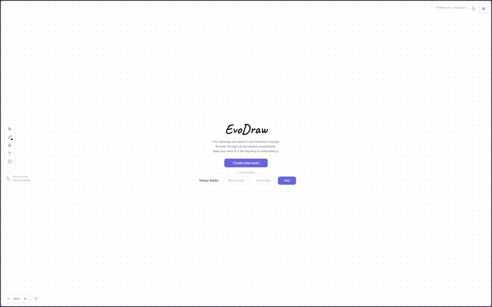
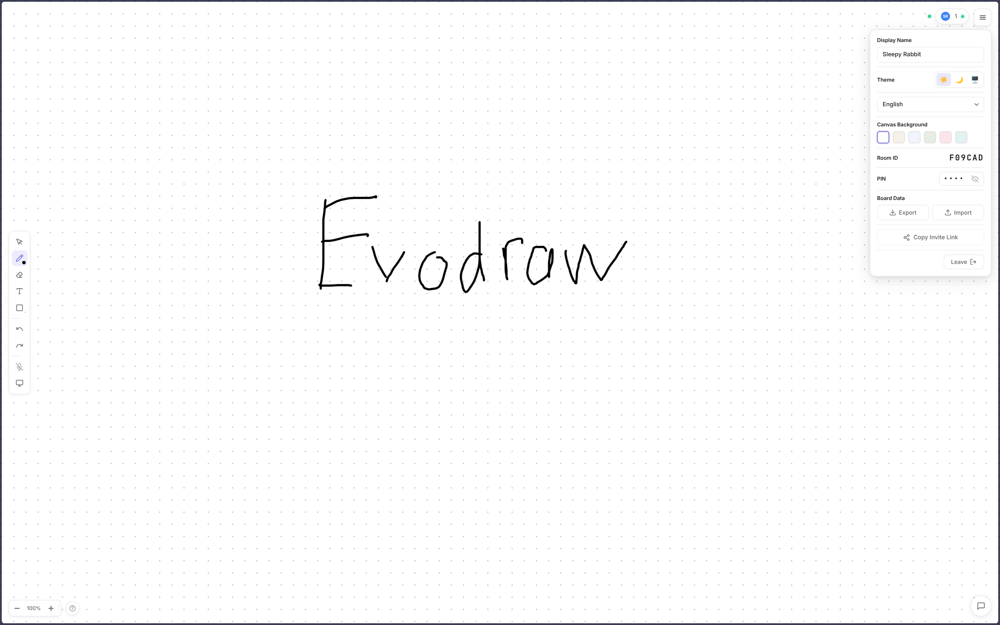
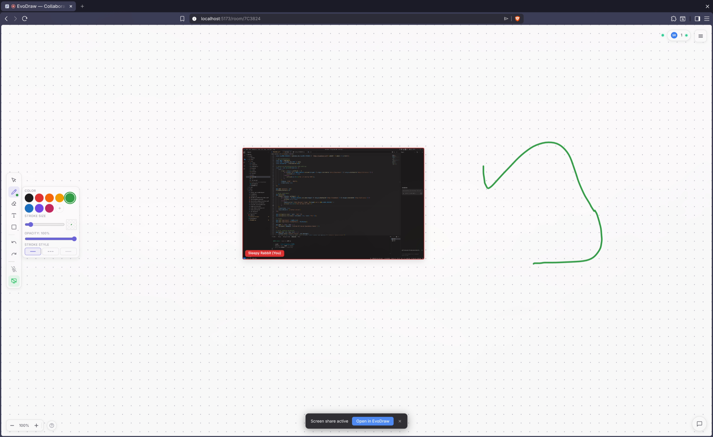

<div align="center">
  
  <h1>Evodraw</h1>

  <p>
    <a href="https://github.com/KhangDaoz/evodraw/blob/main/LICENSE"></a>
    
    
    
    
    
    
  </p>
</div>

---

Evodraw is a real-time collaborative whiteboard featuring a React web application and a Node.js server that allow multiple users to draw together on a shared canvas. It also includes a transparent Electron desktop application, enabling you to sketch directly on top of your screen.

---

## Table of Contents
- [Screenshots](#screenshots)
- [Features](#features)
- [System Architecture](#system-architecture)
- [Project Structure](#project-structure)
- [Prerequisites](#prerequisites)
- [Installation](#installation)
- [Environment Configuration](#environment-configuration)
- [Usage & Quick Start](#usage--quick-start)
- [Docker](#docker)
- [Deployment](#deployment)
- [Contributing](#contributing)
- [License](#license)

---

## Screenshots

### Homepage


### Real-Time Collaborative Whiteboard


### Screen Sharing on Canvas


---

## Features

- **Real-Time Sync:** Drawing actions (pen strokes, shapes, text, eraser) sync instantly across all users using Fabric.js and Socket.IO.
- **Conflict Resolution (LWW):** Element-level conflict resolution prevents overwriting newer drawings with older ones.
- **Desktop Overlay:** An Electron desktop app to draw directly on your screen. Stroke coordinates map cleanly to web viewers.
- **Screen Sharing:** Share screens using LiveKit SFU. The stream displays on the canvas inside a resizable box.
- **Paste Images:** Paste images (Ctrl+V) from your clipboard. Images upload to Firebase Storage and render on everyone's canvas.
- **Secure Rooms:** Rooms are protected by password hashes. Inactive rooms are deleted automatically after 24 hours.

---

## System Architecture

The project uses a client-authoritative sync model. The server acts as a message router and saves database snapshots, while clients resolve conflicts locally.

```
+───────────────────────────+
|      Desktop App          |   (Launched via evodraw:// overlay link)
|  (Electron + Fabric.js)   |
+─────────────┬─────────────+
              │ (Socket.IO Strokes)
              ▼
+───────────────────────────+                 +───────────────────────────+
|     Node.js Server        |──(Socket.IO)───►|       Web Browser         |
|  (Express + Socket.IO)    |◄───(REST API)───| (React 19 + Fabric.js)    |
+──────┬──────────────┬─────+                 +─────────────┬─────────────+
       │              │                                     │
       ▼              ▼                                     ▼
+─────────────+ +─────────────+                       +─────────────+
|   MongoDB   | |  Firebase   |                       | LiveKit SFU |
| (Snapshots) | |  (Storage)  |                       | (WebRTC A/V)|
+─────────────+ +─────────────+                       +─────────────+
```

---

## Project Structure

The project uses `npm workspaces` for monorepo management:
- `apps/web`: React client running in the web browser.
- `apps/server`: Express backend running APIs and Socket.IO servers.
- `apps/desktop`: Electron wrapper displaying the drawing overlay.
- `packages/types`: Shared types and WebSocket events.

---

## Prerequisites

- **Node.js**: `>= 16.0.0`
- **npm**: `>= 8.0.0`
- **Docker** & **Docker Compose**: For containerized development (optional)
- **MongoDB**: Database for room snapshots (or use Docker)
- **Firebase Project**: Storage bucket for clipboard images
- **LiveKit Server**: A/V streaming keys

---

## Installation

Run the following command in the root folder to install dependencies for all workspaces:
```bash
npm install
```

---

## Environment Configuration

### Server Configuration
Create a `.env` file in `apps/server/`:
```env
PORT=4000
MONGODB_URI=mongodb://localhost:27017/evodraw
TOKEN_SECRET=your-secure-jwt-secret-key
ALLOWED_ORIGINS=http://localhost:5173

# LiveKit
LIVEKIT_API_KEY=your-livekit-api-key
LIVEKIT_API_SECRET=your-livekit-api-secret
LIVEKIT_URL=wss://your-livekit-url.livekit.cloud

# Firebase (choose one of the two methods below)
# Method 1 — Local dev: path to the JSON key file
FIREBASE_SERVICE_ACCOUNT_PATH=./firebase-service-account.json
# Method 2 — Production (Render): paste the entire JSON as a string
# FIREBASE_SERVICE_ACCOUNT_JSON={"type":"service_account",...}
FIREBASE_STORAGE_BUCKET=your-app.appspot.com
```

### Web Configuration
Create a `.env` file in `apps/web/`:
```env
VITE_SERVER_URL=http://localhost:4000
VITE_API_URL=http://localhost:4000
```

---

## Usage & Quick Start

### Option A: Run all apps concurrently (Recommended)
This runs the web client, server, and Electron app at the same time:
```bash
npm run dev
```

### Option B: Run apps separately
Open separate terminals and run:
```bash
# Terminal 1 - Backend Server
npm run dev:server

# Terminal 2 - Web Client
npm run dev:web

# Terminal 3 - Electron Desktop App
npm run dev:desktop
```

---

## Docker

You can run the backend server and MongoDB locally using Docker Compose without installing MongoDB on your host machine.

### Quick Start with Docker
```bash
# Start server + MongoDB containers
docker compose up --build -d

# Check that both containers are running
docker compose ps

# View server logs
docker compose logs -f server

# Run the frontend on your host (HMR needs direct browser access)
npm run dev:web
```

Open `http://localhost:5173` in your browser.

---

## Deployment

The project is set up for automatic deployment on every `git push` to `main`:

| Component | Platform | URL |
|-----------|----------|-----|
| **Backend** | [Render](https://render.com) (Docker runtime) | `https://evodraw-v9rt.onrender.com` |
| **Frontend** | [Vercel](https://vercel.com) | `https://evodraw.vercel.app` |
| **Database** | [MongoDB Atlas](https://www.mongodb.com/atlas) | Cloud cluster |

---

## Contributing

1. Fork this repository.
2. Create your feature branch (`git checkout -b feature/NewFeature`).
3. Commit your changes (`git commit -m 'Add NewFeature'`).
4. Push to the branch (`git push origin feature/NewFeature`).
5. Open a Pull Request.

---

## Authors

* [**KhangDaoz**](https://github.com/KhangDaoz)
* [**lightzgls**](https://github.com/lightzgls)

---

## License

This project is licensed under the MIT License.

---

## Project Status

Active development.