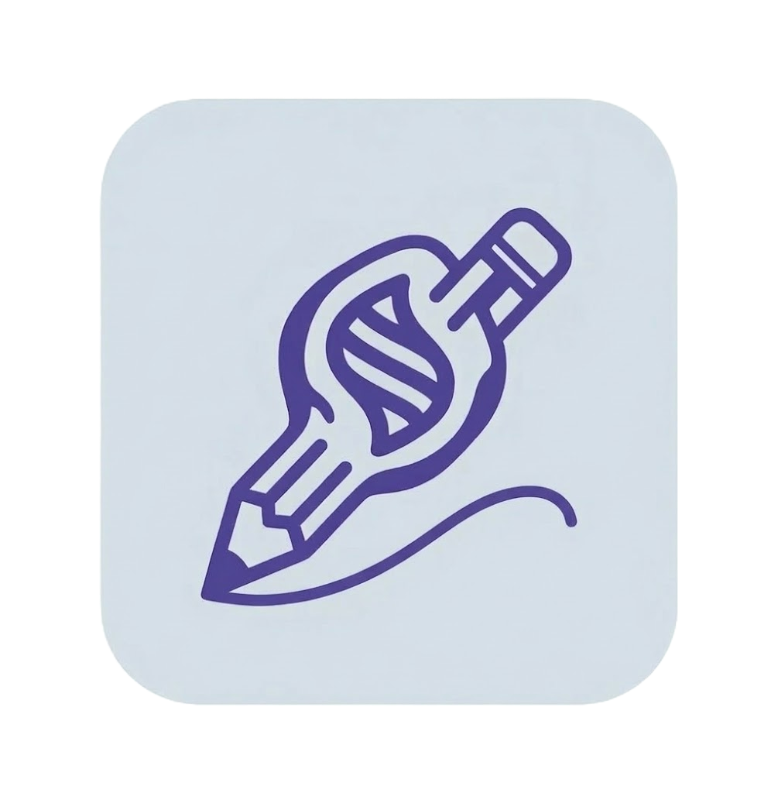

# evodraw

## Cấu trúc dự án

```text
evodraw/
├── apps/
│   ├── web/                          # React - Trình duyệt (người xem)
│   │   ├── src/
│   │   │   ├── components/
│   │   │   ├── pages/
│   │   │   ├── hooks/
│   │   │   ├── services/             # Gọi REST API
│   │   │   ├── socket/               # Kết nối Socket.io, nhận tọa độ
│   │   │   ├── canvas/               # Vẽ lại tọa độ nhận được
│   │   │   └── main.jsx
│   │   └── package.json
│   │
│   ├── desktop/                      # Electron - Người trình bày
│   │   ├── src/
│   │   │   ├── main/                 # Main process (Electron)
│   │   │   │   ├── index.js          # Entry point chính
│   │   │   │   ├── screenCapture.js  # Quay màn hình (desktopCapturer)
│   │   │   │   └── ipc.js            # IPC handlers
│   │   │   ├── renderer/             # Renderer process (UI)
│   │   │   │   ├── components/
│   │   │   │   ├── socket/           # Gửi tọa độ lên server
│   │   │   │   └── App.jsx
│   │   │   └── preload.js
│   │   └── package.json
│   │
│   └── server/                       # Node.js + Express + Socket.io
│       ├── src/
│       │   ├── config/
│       │   │   └── db.js
│       │   ├── controllers/
│       │   ├── models/
│       │   ├── routes/
│       │   ├── middlewares/
│       │   ├── socket/               # Xử lý realtime
│       │   │   ├── index.js          # Khởi tạo Socket.io server
│       │   │   ├── drawHandler.js    # Nhận/phát tọa độ vẽ
│       │   │   └── screenHandler.js  # Nhận/phát stream màn hình
│       │   └── server.js
│       └── package.json
│
├── packages/                         # Code dùng chung
│   ├── types/                        # Shared constants/schemas (JS)
│   │   ├── socket-events.js          # Định nghĩa tên events Socket.io
│   │   └── drawing.js                # Cấu trúc dữ liệu tọa độ, stroke...
│   └── utils/                        # Hàm dùng chung
│
├── package.json                      # Root - chạy script toàn bộ
└── README.md
```

## How to create (npm workspace)

## Bước 1 — Tạo root project

```bash
mkdir evodraw && cd evodraw
npm init -y
```

---

## Bước 2 — Sửa root `package.json`

Mở file `package.json` và thay nội dung thành:

```json
{
  "name": "evodraw",
  "private": true,
  "workspaces": [
    "apps/*",
    "packages/*"
  ],
  "scripts": {
    "dev:web": "npm run dev -w apps/web",
    "dev:server": "npm run dev -w apps/server",
    "dev:desktop": "npm run dev -w apps/desktop",
    "dev": "concurrently -n web,server,desktop -c blue,green,magenta \"npm run dev:web\" \"npm run dev:server\" \"npm run dev:desktop\""
  },
  "devDependencies": {
    "concurrently": "^9.2.1"
  }
}
```

---

## Bước 3 — Tạo thư mục gốc

```bash
mkdir -p apps packages
```

---

## Bước 4 — Khởi tạo Web

```bash
npm create vite@latest apps/web -- --template react
```

Tạo thêm thư mục:

```bash
mkdir -p apps/web/src/components
mkdir -p apps/web/src/pages
mkdir -p apps/web/src/hooks
mkdir -p apps/web/src/services
mkdir -p apps/web/src/socket
mkdir -p apps/web/src/canvas
```

---

## Bước 5 — Khởi tạo Desktop (Electron)

```bash
npm create @quick-start/electron@latest apps/desktop
```

Khi được hỏi, chọn:
- Framework: **React**
- Language: **JavaScript**

Tạo thêm thư mục và file:

```bash
mkdir -p apps/desktop/src/main
mkdir -p apps/desktop/src/renderer/components
mkdir -p apps/desktop/src/renderer/socket

touch apps/desktop/src/main/screenCapture.js
touch apps/desktop/src/main/ipc.js

```

---

## Bước 6 — Khởi tạo Server

```bash
mkdir -p apps/server/src/config
mkdir -p apps/server/src/controllers
mkdir -p apps/server/src/models
mkdir -p apps/server/src/routes
mkdir -p apps/server/src/middlewares
mkdir -p apps/server/src/socket
```

Tạo `apps/server/package.json`:

```json
{
  "name": "server",
  "version": "1.0.0",
  "private": true,
  "scripts": {
    "dev": "nodemon src/server.js"
  },
  "dependencies": {},
  "devDependencies": {}
}
```

Tạo các file:

```bash
touch apps/server/src/config/db.js
touch apps/server/src/socket/index.js
touch apps/server/src/socket/drawHandler.js
touch apps/server/src/socket/screenHandler.js
touch apps/server/src/server.js
```

---

## Bước 7 — Khởi tạo Shared Packages

```bash
mkdir -p packages/types
mkdir -p packages/utils
```

Tạo `packages/types/package.json`:

```json
{
  "name": "@evodraw/types",
  "version": "1.0.0",
  "private": true,
  "main": "index.js"
}
```

Tạo `packages/utils/package.json`:

```json
{
  "name": "@evodraw/utils",
  "version": "1.0.0",
  "private": true,
  "main": "index.js"
}
```

Tạo các file:

```bash
touch packages/types/index.js
touch packages/types/socket-events.js
touch packages/types/drawing.js
touch packages/utils/index.js
```

---

## Bước 8 — Liên kết shared packages

```bash
npm install @evodraw/types -w apps/web
npm install @evodraw/types -w apps/server
npm install @evodraw/types -w apps/desktop
```

---

## Bước 9 — Cài dependencies

```bash
# Server
npm install express socket.io mongoose -w apps/server
npm install -D nodemon -w apps/server

# Web
npm install socket.io-client -w apps/web

# Desktop
npm install socket.io-client -w apps/desktop
```

---

## Bước 10 — Cài tất cả

```bash
npm install
```

---

## Bước 11 — Chạy project

```bash
npm run dev:web
npm run dev:server
npm run dev:desktop

# Chạy đồng thời cả 3 app
npm run dev
```