# BÁO CÁO EVODRAW — PHIÊN BẢN VIẾT LẠI (v2)

> **Mục đích của file này.** Đây là phiên bản viết lại của Chương 2 và Chương 3 trong báo cáo Thực tập cơ sở "Xây dựng nền tảng hỗ trợ làm việc nhóm từ xa tương tác trực quan với bảng trắng EvoDraw". Phiên bản này **kết hợp** phương pháp luận **Phân tích và Thiết kế hướng đối tượng (OOAD)** — làm nền tảng cấu trúc — với **Phân tích và Thiết kế hướng sự kiện (EDAD)** — bổ sung hành vi động theo sự kiện, và đặt tên rõ ràng kiến trúc phần mềm là **Event-Driven Architecture với Broker Topology, mở rộng từ mô hình MVC**.
>
> **Phạm vi:** giữ nguyên Chương 1 của báo cáo gốc (chỉ bổ sung một mục "Ghi chú sửa Hình 1.2"); viết lại hoàn toàn Chương 2 và Chương 3 dưới đây; bổ sung bảng phân chia công việc theo nhận xét của TS. Đỗ Thị Liên.
>
> **Quy ước về phạm vi nội dung:** Báo cáo phân tích và thiết kế các chức năng nằm trong phạm vi MVP đã xác định ở Chương 1, theo trình tự Phân tích → Thiết kế → Cài đặt. Chức năng Nhập/Xuất bảng trắng dạng file JSON — tuy nêu trong đề cương sơ bộ — nằm ngoài phạm vi MVP nên được chuyển sang phần "Hướng phát triển" (Kết luận), không đưa vào pha phân tích/thiết kế để giữ phạm vi báo cáo nhất quán.

---

## GHI CHÚ SỬA CHƯƠNG 1 — HÌNH 1.2 (chiều quan hệ extend)

Cô đã nhận xét Hình 1.2 "Sơ đồ Use Case phân rã — Vẽ lên bảng trắng" và Hình 1.3 đặt sai chiều mối quan hệ `<<extend>>`. Quy ước UML chuẩn cho `<<extend>>` như sau:

> Use case **mở rộng** (extending) là use case bổ sung thêm hành vi cho use case **cơ sở** (base). Mũi tên `<<extend>>` được vẽ **từ use case mở rộng trỏ tới use case cơ sở** (extending → base), KHÔNG phải ngược lại.

Áp dụng cho EvoDraw, các quan hệ phải vẽ lại như sau:

| Hình | Use case mở rộng (extending) | Use case cơ sở (base) | Mũi tên |
| :--- | :--- | :--- | :--- |
| 1.2 | Tùy chỉnh nét vẽ (màu, độ dày, độ trong suốt) | Vẽ tự do trên bảng trắng | Tùy chỉnh nét vẽ — `<<extend>>` → Vẽ tự do |
| 1.2 | Hoàn tác / Làm lại (Undo/Redo) | Vẽ tự do trên bảng trắng | Undo/Redo — `<<extend>>` → Vẽ tự do |
| 1.2 | Chèn ảnh từ clipboard | Vẽ trên bảng trắng | Chèn ảnh — `<<extend>>` → Vẽ trên bảng trắng |
| 1.3 | Vẽ ghi chú đè màn hình chia sẻ (Desktop Overlay) | Chia sẻ màn hình | Vẽ ghi chú — `<<extend>>` → Chia sẻ màn hình |
| 1.3 | Đổi độ phân giải / FPS | Chia sẻ màn hình | Đổi độ phân giải — `<<extend>>` → Chia sẻ màn hình |

Đồng thời, các quan hệ `<<include>>` của Hình 1.4 (Quản lý dữ liệu canvas) giữ nguyên hướng (use case cơ sở `<<include>>` → use case bị bao gồm):

| Hình | Use case cơ sở | Use case bị include | Mũi tên |
| :--- | :--- | :--- | :--- |
| 1.4 | Vẽ tự do | Đồng bộ canvas qua Broker | Vẽ tự do — `<<include>>` → Đồng bộ canvas |
| 1.4 | Chèn ảnh | Tải file lên Firebase Storage | Chèn ảnh — `<<include>>` → Tải file lên CDN |

**Yêu cầu thực hiện:** Vẽ lại các Hình 1.2, 1.3, 1.4 bằng Mermaid (xem bên dưới) theo đúng chiều bảng trên rồi thay thế trong báo cáo cuối cùng.

---

### BỔ SUNG CHƯƠNG 1 — Mục 1.5: Biểu đồ hoạt động (Activity Diagram)

Để bổ sung góc nhìn **hướng sự kiện** vào pha Xác định Yêu cầu (theo nguyên tắc OOAD+EDAD kết hợp), phần này thêm 3 biểu đồ hoạt động — mỗi biểu đồ tương ứng với một **Module nghiệp vụ** và mô tả luồng hoạt động tổng thể tích hợp tất cả chức năng trong module đó.

#### Activity Diagram M1 — Quản lý phòng
*(Bao gồm: a–Tạo phòng, b–Tham gia phòng, h–Rời phòng, m–Đổi tên hiển thị)*

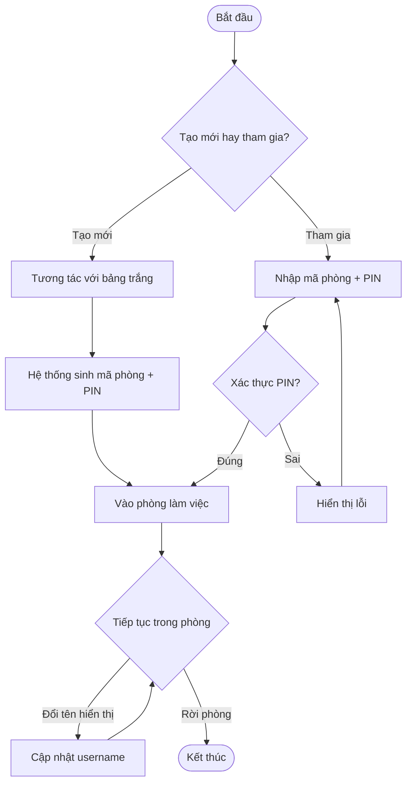

> *Hình 1.5a: Activity Diagram — Module M1 Quản lý phòng.*

#### Activity Diagram M2 — Cộng tác bảng trắng
*(Bao gồm: c–Vẽ tự do, d–Chèn ảnh, j–Undo/Redo, k–Pan/Zoom, l–Remote Cursors)*

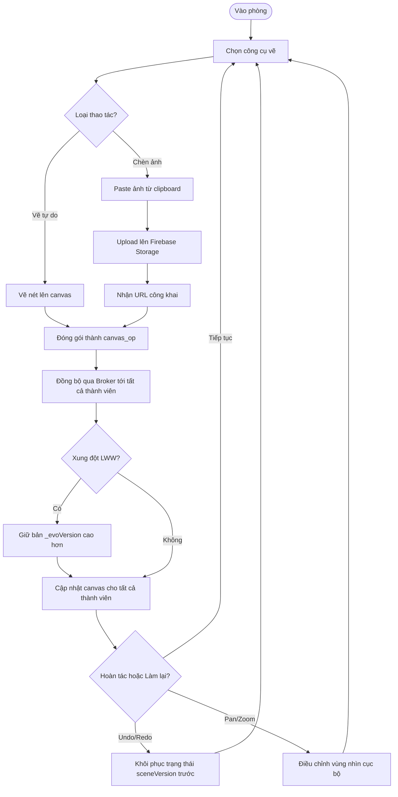

> *Hình 1.5b: Activity Diagram — Module M2 Cộng tác bảng trắng.*

#### Activity Diagram M3 — Chia sẻ & Truyền thông
*(Bao gồm: e–Chia sẻ màn hình, f–Gọi thoại, g–Chat, i–Desktop Overlay)*

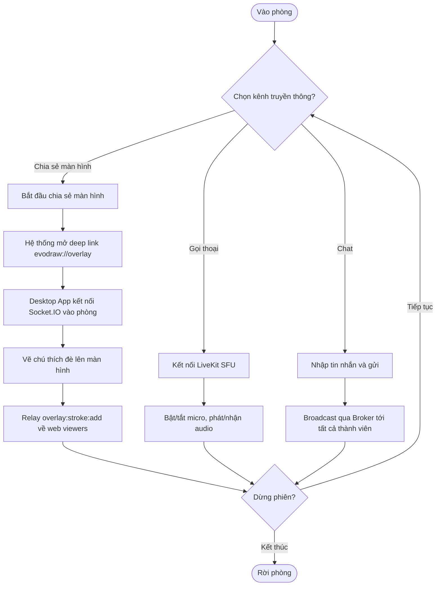

> *Hình 1.5c: Activity Diagram — Module M3 Chia sẻ & Truyền thông.*

---

# CHƯƠNG 2: NGHIÊN CỨU PHƯƠNG PHÁP TIẾP CẬN VÀ GIẢI QUYẾT VẤN ĐỀ

Chương 1 đã xác định rõ bài toán cần giải quyết, các yêu cầu chức năng và phi chức năng của hệ thống EvoDraw, đồng thời khảo sát ưu nhược điểm của các nền tảng hiện có (Miro, Google Meet, Zoom). Trên cơ sở đó, Chương 2 trình bày phương pháp tiếp cận của nhóm để xây dựng hệ thống — bao gồm mô hình tổng quát, **phương pháp phân tích và thiết kế hướng sự kiện**, mô hình phát triển phần mềm Scrum, **kiến trúc phần mềm Event-Driven Broker mở rộng từ MVC**, và lựa chọn công nghệ tương ứng cho từng module.

## 2.1. Mô hình tổng quát hệ thống

### 2.1.1. Tổng quan hệ thống

EvoDraw là một nền tảng cộng tác trực tuyến trên không gian bảng trắng thời gian thực, đi kèm các kênh giao tiếp đa phương tiện (chia sẻ màn hình, gọi thoại, chat). Khác với các hệ thống quản lý thông tin tĩnh, EvoDraw có **luồng dữ liệu thời gian thực mật độ cao** là đặc trưng cốt lõi: mỗi nét bút, mỗi vị trí con trỏ, mỗi tin nhắn đều là một **sự kiện** cần được phát tới mọi thành viên trong cùng phòng với độ trễ thấp.

Hệ thống bao gồm 4 thành phần phối hợp chặt chẽ:

* **Web App** — Client chính dành cho thành viên trong phòng. Toàn bộ logic xử lý đồ họa vector và hợp nhất trạng thái được đặt tại Client để phản hồi tức thì cho người dùng, đồng thời tự động giải quyết xung đột khi nhiều người cùng thao tác.
* **Desktop App** — Ứng dụng hỗ trợ riêng cho người trình bày màn hình. Tạo lớp phủ (overlay) trong suốt luôn nằm trên cùng để vẽ ghi chú đè lên bất kỳ ứng dụng nào khác đang mở. Khởi động từ Web App qua giao thức deep-link `evodraw://`.
* **Backend Service** — Điều phối trung tâm, không can thiệp nội dung bản vẽ. Chịu trách nhiệm xác thực, lưu trữ snapshot, và **phát sóng (broadcast) các sự kiện** thời gian thực tới các thành viên cùng phòng.
* **SFU Server (Media Broker)** — Tách biệt hoàn toàn luồng dữ liệu nặng (âm thanh, video chia sẻ màn hình) khỏi backend chính. Server SFU nhận luồng gốc một lần và phân phối tới từng người xem, khắc phục nghẽn băng thông của mô hình P2P khi phòng có đông người.

### 2.1.2. Sơ đồ kiến trúc tổng quát

*(Giữ Hình 2.1 của báo cáo gốc; cập nhật phụ đề: "Sơ đồ tổng quát hệ thống EvoDraw — Producer/Consumer giao tiếp qua Event Broker và Media Broker".)*

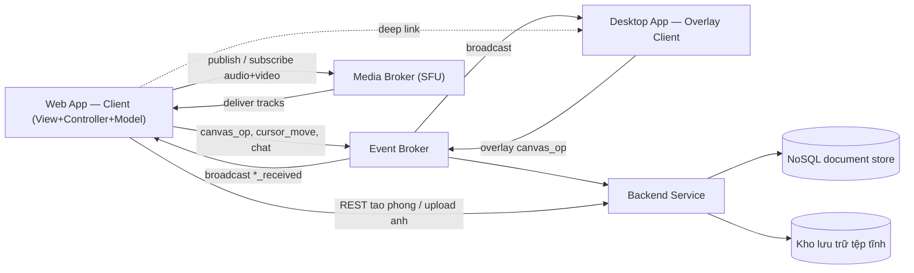

> *Hình 2.1: Sơ đồ tổng quát hệ thống EvoDraw — Producer/Consumer giao tiếp qua Event Broker và Media Broker (SFU); luồng REST và kho lưu trữ tệp tĩnh tách riêng.*

Link Lucidchart: [Lucidchart document](https://lucid.app/lucidchart/0ac2057e-9e56-42c9-9be5-b6b768a6ea17/edit)

### 2.1.3. Các luồng luân chuyển dữ liệu chính

Hệ thống phân tách kiến trúc luân chuyển thành **4 luồng độc lập** dựa trên đặc thù tần suất và dung lượng:

* **Luồng trạng thái và cấu hình (HTTP Request–Response):** Giao tiếp giữa Client và REST API Server cho các yêu cầu không liên tục — tạo phòng, xác thực mã PIN, cấp token JWT, tải snapshot bảng trắng khi mới tham gia, upload ảnh.
* **Luồng sự kiện thời gian thực (WebSocket full-duplex):** Hoạt động liên tục với tần suất cao nhưng dung lượng payload nhỏ. Vận chuyển các sự kiện `canvas_op`, `cursor_move`, `chat:message`, `screen:start/stop`, `room_users` qua Event Broker. **Broker định tuyến trong bộ nhớ đệm**, không ghi xuống database trên mỗi sự kiện.
* **Luồng định tuyến đa phương tiện (Media Broker / SFU):** Dữ liệu nặng (luồng âm thanh và video chia sẻ màn hình) đi qua máy chủ SFU chuyên biệt. SFU nhận luồng gốc từ Publisher và phân phối độc lập tới từng Subscriber.
* **Luồng tệp tin tĩnh (kho lưu trữ tệp tĩnh):** File ảnh đi qua REST API (multipart upload), được đẩy lên kho lưu trữ tệp tĩnh, và trả về URL công khai. Client chỉ trao đổi URL qua luồng sự kiện thời gian thực, không truyền bytes ảnh qua WebSocket.

> **Đặc tính chung của cả 4 luồng:** mọi luồng đều vận hành theo mô hình **Producer → Broker → Consumer** — đây là cơ sở để chọn kiến trúc Event-Driven Broker ở mục 2.4 thay vì kiến trúc Client–Server thuần đồng bộ.

### 2.1.4. Cơ chế đồng bộ và chiến lược giải quyết xung đột

Việc nhiều thành viên cùng tương tác vào một không gian chung đòi hỏi chiến lược xử lý đồng thời nghiêm khắc. Hệ thống áp dụng 4 cơ chế cốt lõi:

* **Broker không trạng thái:** Broker **không phân tích, không vẽ lại** cấu trúc hình học. Mọi thao tác vẽ được engine đồ họa vector ở Client đóng gói thành Domain Event `canvas_op` chứa toàn bộ thông tin phần tử; Broker chỉ chuyển tiếp event nguyên bản. Thiết kế này giải phóng CPU Server và cho phép mở rộng theo chiều ngang.
* **Giải quyết xung đột bằng Last-Writer-Wins (LWW):** Mỗi phần tử trên bảng trắng được định danh bởi `_evoId` duy nhất và mang một bộ đếm `_evoVersion`. Khi hai Client cùng thao tác lên một đối tượng, phía nhận so sánh phiên bản: **phiên bản lớn hơn thắng**. Trường hợp cùng phiên bản, sử dụng `_evoNonce` (số ngẫu nhiên 30-bit) làm tiebreaker — nonce nhỏ hơn thắng — để đảm bảo tính nhất quán xác định.
* **Tối ưu băng thông bằng Throttling:** Tọa độ con trỏ chuột bị throttle ở ngưỡng tối đa (~20–30 lần/giây) trước khi emit `cursor_move`, tránh network flooding. Các thao tác liên tục như kéo giãn chỉ broadcast khi người dùng kết thúc thao tác (`object:modified`).
* **Đối chiếu trạng thái khi tái kết nối (State Reconciliation):** Khi một Client mới tham gia hoặc khôi phục sau mất mạng, nó phát đồng thời `request_snapshot` (tới Server) và `canvas_state_request` (tới peer cùng phòng). Server trả về snapshot từ kho dữ liệu bền (`snapshot_loaded`); peer trả về snapshot trong RAM (`canvas_state_response` → `canvas_state_init`). Client hợp nhất hai nguồn theo LWW. Định kỳ mỗi ~10 giây, khi bảng trắng có thay đổi chưa lưu, Client phát `save_snapshot` để Server ghi xuống kho dữ liệu bền.

## 2.2. Phương pháp xây dựng phần mềm

Đề tài áp dụng **phương pháp kết hợp OOAD và EDAD**, sử dụng **UML** làm công cụ biểu diễn chính.

**Quan hệ giữa OOAD và EDAD:** Hai phương pháp **song song và bổ trợ nhau**, không loại trừ:
- **OOAD** (Phân tích và Thiết kế hướng đối tượng) đảm bảo hệ thống có **cấu trúc đối tượng rõ ràng** (phân tích BCE, thiết kế lớp, quan hệ giữa các đối tượng), dễ bảo trì và phát triển lâu dài.
- **EDAD** (Phân tích và Thiết kế hướng sự kiện) bổ sung **hành vi động theo sự kiện** — mô tả luồng hoạt động bất đồng bộ, một-nhiều, phù hợp với bản chất thời gian thực của EvoDraw (mỗi nét vẽ, mỗi thao tác đều là sự kiện phát tới nhiều thành viên).

Kết hợp cả hai giúp hệ thống vừa có **khung xương tĩnh** (cấu trúc lớp, quan hệ), vừa **phản ứng linh hoạt** với sự kiện thực tế.

**Bảng phân công biểu đồ theo pha:**

| Pha | Phương pháp OOAD (nền tảng) | Bổ sung EDAD |
| :--- | :--- | :--- |
| **Xác định yêu cầu** | Domain model, Use Case Diagram | **Activity Diagram** — mô tả luồng sự kiện, quy trình nghiệp vụ tích hợp |
| **Phân tích** | BCE Class Diagram (View + Controller + Entity), Sequence Diagram phân tích | **State Machine Diagram** — mô tả trạng thái đối tượng thay đổi theo sự kiện |
| **Thiết kế** | Class Diagram thiết kế, DB Design, UI Design, Sequence Diagram thiết kế | **Communication Diagram** (đối tượng phối hợp khi sự kiện xảy ra), **Component Diagram**, **Deployment Diagram** |

**Bốn khái niệm EDAD sử dụng xuyên suốt báo cáo:**

1. **Domain Event** — sự kiện nghiệp vụ đã xảy ra (vd. `canvas_op`, `chat:message`, `screen:start`, `user_joined`).
2. **Event Channel** — kênh logic nhóm các Domain Event có cùng chủ đề (vd. kênh `canvas.sync`, `chat`, `screen`).
3. **Event Producer / Event Consumer** — thành phần phát/nhận event qua channel.
4. **Aggregate (Entity)** — đối tượng dữ liệu có ranh giới nhất quán mà Event tác động lên (Room, CanvasElement, ChatMessage…).

**Tái diễn giải biểu đồ UML theo tư duy kết hợp:**

| Biểu đồ UML | Vai trò |
| :--- | :--- |
| **Use Case Diagram** | Xác định actor và các use case; kết hợp EDAD: mỗi use case là điểm **khởi phát Domain Event**. |
| **Activity Diagram** | Mô tả luồng hoạt động nghiệp vụ tích hợp nhiều use case; làm rõ các nhánh sự kiện bất đồng bộ. |
| **Class Diagram (BCE)** | Pha phân tích: 3 stereotype `«View»` (Boundary), `«Controller»` (Control), `«Entity»`; pha thiết kế: bổ sung phương thức và quan hệ. |
| **Sequence Diagram** | Phân tích: lifelines View + Entity; Thiết kế: thêm **lifeline `«Broker»`** tường minh giữa Producer và Consumer. |
| **State Machine Diagram** | Mô hình hóa vòng đời các Aggregate có chuyển trạng thái rõ rệt theo sự kiện. |
| **Communication Diagram** | Thiết kế: mô tả cách đối tượng phối hợp (numbered messages) khi sự kiện xảy ra — bổ sung Sequence Diagram. |
| **Component / Deployment Diagram** | Thiết kế: mô tả thành phần phần mềm và cách triển khai vật lý. |

## 2.3. Mô hình phát triển phần mềm

Đề tài áp dụng mô hình **Scrum** trên nền tảng Lặp và Tăng trưởng (Iterative & Incremental). Toàn bộ quá trình phát triển được chia thành 6 Sprint, mỗi Sprint cố định 2 tuần với các luồng Phân tích — Thiết kế — Thực thi — Kiểm thử. Nhóm áp dụng họp đứng hàng ngày (Daily Standup) để đồng bộ tiến độ và tháo gỡ khó khăn.

* **Sprint 1 — Foundation:** Phân tích yêu cầu, nghiên cứu kiến trúc Event-Driven Broker, các giao thức truyền tải thời gian thực (WebSocket, WebRTC/SFU), công nghệ đồ họa vector trên trình duyệt. Thiết kế kiến trúc tổng thể, cơ sở dữ liệu và phác thảo giao diện. *Milestone: tài liệu thiết kế cơ sở + môi trường mã nguồn.*
* **Sprint 2 — Core Services & Room System:** Khởi tạo monorepo cho 3 ứng dụng (web/server/desktop). Triển khai Room model, REST API tạo/tham gia phòng, kênh sự kiện realtime (Event Broker) với bảo mật JWT, TTL 24h tự động xóa phòng. *Milestone: tạo phòng, tham gia phòng, danh sách thành viên online.*
* **Sprint 3 — Whiteboard Real-time:** Tích hợp engine đồ họa vector, xây dựng các công cụ vẽ. Triển khai kênh `canvas.sync` với cơ chế LWW (`_evoId/_evoVersion/_evoNonce`), throttling con trỏ chuột, snapshot định kỳ. *Milestone: bảng trắng đồng bộ giữa nhiều người, chat văn bản hoạt động ổn định.*
* **Sprint 4 — Media Routing & Annotation:** Triển khai Media Broker (SFU), xây dựng chia sẻ màn hình độ trễ thấp. Phát triển Desktop App trên nền tảng desktop với overlay trong suốt, vẽ ghi chú đè lên màn hình chia sẻ. *Milestone: MVP hoàn chỉnh.*
* **Sprint 5 — Testing & Expansion:** Kiểm thử đa nền tảng (Chrome, Firefox, Edge), đo độ trễ < 200ms, khảo sát trải nghiệm. Tinh chỉnh giao diện, sửa lỗi phát sinh. *Milestone: Release Candidate.*
* **Sprint 6 — Documentation & Defense:** Tổng hợp số liệu, hoàn thiện báo cáo, slide, video demo, đóng gói Windows installer cho Desktop App. *Milestone: sẵn sàng bảo vệ.*

## 2.4. Kiến trúc phần mềm được áp dụng — *Event-Driven Architecture với Broker Topology, mở rộng từ MVC*

### 2.4.1. Cơ sở lựa chọn

Kiến trúc Mô hình–Khung nhìn–Điều khiển (MVC) là kiến trúc nền tảng được dạy trong môn Nhập môn Công nghệ phần mềm, trong đó tầng **Controller** chủ yếu đóng vai trò DAO (truy cập/xử lý dữ liệu) cho các nghiệp vụ Request–Response đồng bộ. Tuy nhiên, EvoDraw là một hệ thống mà phần lớn nghiệp vụ vận hành bất đồng bộ qua kênh sự kiện (qua Event Broker + Media Broker), do đó MVC nguyên gốc cần được **mở rộng** để tầng Controller có thể đăng ký lắng nghe và phản ứng với sự kiện đến từ Broker, chứ không chỉ phản hồi request đồng bộ.

Kiến trúc được lựa chọn là **Event-Driven Architecture với Broker Topology, mở rộng từ MVC** — sau đây gọi tắt là **EDA-MVC**. Đây là một kiến trúc cải tiến hợp lệ, vẫn giữ tinh thần phân tách 3 vai trò Model–View–Controller mà cô đã dạy, nhưng bổ sung **tầng Broker** vào hạ tầng và **mở rộng nội hàm Controller** thành Event Handler.

### 2.4.2. Sơ đồ kiến trúc

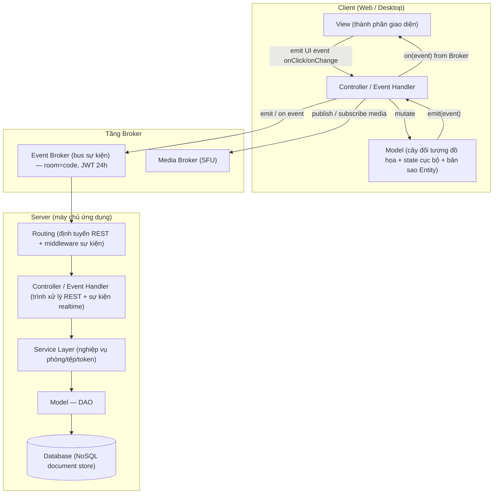

> *Hình 2.2: Kiến trúc EDA-MVC — Client (View → Controller/Event Handler → Model) ↔ Tầng Broker (Event Broker + Media Broker/SFU) ↔ Server (Routing → Handler → Service → DAO → Database).*

*Sơ đồ dạng văn bản (tham khảo):*

```
┌────────────────────────── Client (Web / Desktop) ─────────────────────────────────┐
│                                                                                   │
│         View (thành phần giao diện)                                               │
│              │  emit UI event (onClick, onChange…)                                │
│              ▼                                                                    │
│         Controller / Event Handler                                                │
│              │                                                  ▲                 │
│              │  mutate Model                                    │ on(event)       │
│              ▼                                                  │ from Broker     │
│         Model (cây đối tượng đồ họa + state cục bộ + Entity)    │                 │
│                                                                 │                 │
│              ▲                                                  │                 │
│              │   emit(event)                                    │                 │
│              └──────────────────┬──────────────────────────────┘                  │
│                                 │                                                 │
└─────────────────────────────────┼─────────────────────────────────────────────────┘
                                  ▼
                  ┌───────────────── Tầng Broker ───────────────┐
                  │   • Event Broker  (bus sự kiện)             │
                  │     room: `code`                            │
                  │     auth: JWT middleware (24h TTL)          │
                  │   • Media Broker (SFU)                      │
                  └────────────────────────┬────────────────────┘
                                           │
┌────────────────────────── Server (máy chủ ứng dụng) ─────────────────────────────┐
│                                                                                   │
│   Routing (định tuyến REST + middleware sự kiện)                                  │
│         │                                                                         │
│         ▼                                                                         │
│   Controller / Event Handler                                                      │
│       ┌─ REST: trình xử lý tạo/tham gia phòng, upload tệp                         │
│       └─ Sự kiện realtime: trình xử lý phòng, vẽ, chat, chia sẻ màn hình          │
│         │                                                                         │
│         ▼                                                                         │
│   Service Layer (nghiệp vụ phòng / tệp / cấp token)                               │
│         │                                                                         │
│         ▼                                                                         │
│   Model — DAO  ───►  Database (NoSQL document store)                              │
│                                                                                   │
│   Cross-cutting: băm một chiều mã PIN, cấp JWT, upload tệp                        │
└───────────────────────────────────────────────────────────────────────────────────┘
```

### 2.4.3. Ánh xạ MVC mở rộng × 3 môi trường thực thi

Bảng dưới đây là **cầu nối quan trọng nhất** giữa kiến trúc Chương 2 và quá trình sinh lớp ở Chương 3, **diễn đạt thuần theo vai trò** (chưa gắn sản phẩm/tệp mã nguồn cụ thể). Việc chốt tên hook/trình xử lý/tệp cụ thể cho từng vai trò là công việc của **pha Thiết kế (mục 3.2.4)**, sau khi đã chọn công nghệ ở mục 2.5.

| Vai trò MVC | Client Web | Client Desktop (Overlay) | Server |
| :--- | :--- | :--- | :--- |
| **M**odel | Cây đối tượng đồ họa vector (mỗi phần tử vẽ mang `_evoId/_evoVersion/_evoNonce`); state cục bộ trong tầng điều khiển; bản sao Entity phía client (Room, Member, CanvasElement, Cursor, ChatMessage) | Cây đối tượng đồ họa trong canvas overlay (cùng cấu trúc với web) | Lược đồ dữ liệu bền của các Aggregate Room (code, băm PIN, phiên bản, elements[], appState, status, timestamps + TTL 24h) và File (định danh, room, kiểu MIME, URL, kích thước) |
| **V**iew | Các trang (trang chủ, trang tham gia, phòng làm việc) và thành phần giao diện (vùng vẽ, thanh công cụ, bảng chat, bảng cài đặt, danh sách thành viên, banner mở ứng dụng) | Trang overlay + các thành phần giao diện trong tiến trình hiển thị | — (không có view) |
| **C**ontroller / **Event Handler** | Các bộ xử lý sự kiện phía giao diện (vòng đời phòng, đồng bộ canvas, chat, công cụ vẽ, lịch sử, dán ảnh, pan/zoom, media, con trỏ, chia sẻ màn hình, gọi thoại) | Các bộ xử lý sự kiện phía giao diện overlay + tiến trình chính của nền tảng desktop (IPC, phím tắt toàn cục, khay hệ thống) | Trình xử lý sự kiện realtime (phòng, vẽ, chat, chia sẻ màn hình) + trình xử lý REST (tạo/tham gia phòng, upload tệp) |
| **Event Broker** | (chỉ là client của Broker) | (chỉ là client của Broker) | Event Broker với JWT middleware; cơ chế phát sự kiện theo room. Media Broker (SFU) bên ngoài. |

### 2.4.4. Danh mục Event Channel của hệ thống

Các sự kiện đăng ký trên Broker được nhóm theo channel logic. Danh mục event dưới đây do thiết kế kênh sự kiện quy định (tên event là khái niệm thiết kế, độc lập với sản phẩm hiện thực):

| Channel | Tên event (in → out qua Broker) | Mô tả ngắn |
| :--- | :--- | :--- |
| **room.lifecycle** | `join_room`, `room_users`, `user_joined`, `user_left`, `update_username`, `user_name_changed`, `leave_room`, `room_error`, `join_room_overlay`, `room_joined` | Vòng đời thành viên trong phòng |
| **canvas.sync** | `canvas_op` → `canvas_op_received`; `draw_stroke` → `draw_stroke_received`; `canvas_bg_change` → `canvas_bg_changed`; `save_snapshot`; `request_snapshot` → `snapshot_loaded`; `canvas_state_request` → `canvas_state_response` → `canvas_state_init` | Đồng bộ phần tử bảng trắng (LWW) + snapshot |
| **cursor** | `cursor_move` → `cursor_moved` | Vị trí con trỏ chuột (throttled) |
| **chat** | `chat:message` (vào và ra cùng tên) | Tin nhắn văn bản trong phòng (không persist) |
| **screen** | `screen:start` → `screen:started`; `screen:stop` → `screen:stopped`; `screen:get_active` → `screen:active_list` | Metadata phiên chia sẻ màn hình (luồng video đi qua Media Broker/SFU) |
| **media.token** | `livekit:get-token` (callback) | Cấp JWT cho client kết nối Media Broker (SFU) |

**Quy ước về tên event ở pha phân tích:** mỗi cặp `<event_in>` / `<event_out>` (vd. `canvas_op` / `canvas_op_received`) đại diện cho cùng một Domain Event nhưng ở hai hướng — Producer phát `canvas_op` lên Broker, Broker rebroadcast thành `canvas_op_received` cho các Consumer còn lại. Trong các sequence diagram, chúng sẽ được vẽ là hai message hai bên lifeline `«Broker»`.

### 2.4.5. Hệ quả cho pha Phân tích & Thiết kế

Việc chọn EDA-MVC ràng buộc Chương 3 phải tuân thủ:

1. **Mọi class diagram pha phân tích đều xuất hiện đúng 3 stereotype** — `«View»`, `«Controller/EventHandler»`, `«Entity»` — đáp ứng nhận xét của cô về việc class diagram pha phân tích phải có lớp Controller.
2. **Mọi sequence diagram pha phân tích đều có lifeline `«Broker»`** cho mọi tương tác xuyên máy.
3. **Mỗi `«Controller/EventHandler»` được đặc tả bằng ba thành phần**:
   - `_subscribesTo: [event names]` — các event mà handler đăng ký lắng nghe.
   - `_emits: [event names]` — các event mà handler phát ra.
   - Tập method nội bộ tương ứng (`onCanvasOpReceived(op)`, `emitCursor(x,y)`…).
4. **Pha thiết kế ánh xạ trực tiếp** Controller phân tích → bộ xử lý sự kiện phía giao diện (web/desktop) hoặc trình xử lý sự kiện realtime / REST Controller (server) theo Bảng 2.4.3; tên hook/tệp cụ thể được chốt ở mục 3.2.4 sau khi đã chọn công nghệ.

## 2.5. Lựa chọn công nghệ phù hợp

Các công nghệ dưới đây được lựa chọn để hiện thực hóa kiến trúc EDA-MVC. **Đây là lần đầu báo cáo nêu tên sản phẩm công nghệ cụ thể** — sau khi đã xác lập xong các vai trò trừu tượng (View / Controller-EventHandler / Model / Broker / DAO) ở mục 2.4, mục này mới chọn sản phẩm để hiện thực hóa từng vai trò đó. Bảng tổng hợp ở mục 2.5.4 bổ sung cột "Vai trò trong EDA Broker" để gắn rõ từng công nghệ với một trong các vai trò (Producer, Consumer, Broker, Aggregate, DAO, Cross-cutting).

### 2.5.1. Công nghệ cho Module Web App

* **React 19 + Vite** — Hỗ trợ kiến trúc hướng thành phần. Cơ chế **Custom Hooks** là phương tiện tự nhiên nhất để hiện thực hóa "Controller/EventHandler" — mỗi hook bao bọc subscribe vào kênh Broker (qua Socket.IO client), giữ state cục bộ, expose API mutate ra View. Việc tách logic ra hooks giúp View (Component) chỉ tập trung render — đúng tinh thần MVC.
* **Fabric.js v6** — Drawing Engine hướng đối tượng cho bảng trắng. Mỗi nét vẽ/hình/ảnh là một Fabric Object có thể serialize qua `toObject(CUSTOM_PROPS)` để gói vào event `canvas_op`. Lưu ý: Fabric v6 có quirk `toJSON()` bỏ qua argument; phải dùng `toObject(props)` để giữ các flag tùy biến (`_evoScreenShare`, `_evoImage`, `_evoShareId`…) qua kênh đồng bộ.
* **Socket.IO Client** — Client của Event Broker. Đăng ký vào "room" tương ứng `code` phòng sau khi vượt JWT middleware để có thể subscribe/emit các Domain Event.
* **LiveKit Client SDK** — Client của Media Broker. Kết nối SFU bằng JWT do server `chat.handler.js` cấp (`livekit:get-token`); publish và subscribe các track âm thanh/video.
* **Firebase Storage SDK (qua REST)** — Backend mới đẩy bytes ảnh; client chỉ trao đổi URL công khai qua kênh `canvas.sync` để giảm payload.

### 2.5.2. Công nghệ cho Module Desktop App

Module desktop cần can thiệp sâu vào tài nguyên hệ thống mà trình duyệt web không cho phép:

* **Electron.js** — Nền tảng chính, kết hợp Chromium với quyền Node.js. Tạo cửa sổ không viền, trong suốt, luôn nằm trên cùng.
* **Transparent Window + Ignore Mouse Events** — Cửa sổ overlay ở chế độ "Làm việc" cho phép click-through (NSD tương tác với ứng dụng bên dưới), ở chế độ "Vẽ" thì bắt mọi sự kiện chuột để Fabric.js xử lý.
* **Global Hotkey** (`CommandOrControl+Shift+D`) — Toggle giữa hai chế độ mà không cần focus cửa sổ overlay.
* **Deep Link Protocol** (`evodraw://start?...`) — Web App truyền `room`, `token`, `shareId`, `username`, `server` qua URL khi user nhấn "Mở Desktop Overlay". Electron có cơ chế single-instance lock + `app.setAsDefaultProtocolClient`.
* **electron-store** — Cấu hình runtime (hotkey, màu mặc định, vị trí toolbar, server URL); không cần file `.env`.
* **electron-squirrel-startup** — Đóng gói thành Windows installer.

### 2.5.3. Công nghệ cho Module Backend Service

* **Node.js + Express 5** — Nền tảng cho REST controller và HTTP server. Non-blocking I/O phù hợp với mô hình duy trì hàng ngàn kết nối Socket.IO đồng thời.
* **Socket.IO Server** — Event Broker trung tâm. Quản lý khái niệm "rooms" trong RAM. JWT middleware ở `sockets/index.js` xác thực mọi kết nối trước khi cho phép subscribe vào bất kỳ kênh nào (`socket.data.auth.roomId` được gán từ token).
* **MongoDB + Mongoose** — NoSQL phù hợp với việc lưu mảng JSON phức tạp của Fabric.js làm trường `elements` trong document `Room`. **TTL index** trên `updatedAt` (`expireAfterSeconds: 86400`) tự động xóa phòng sau 24h không hoạt động — đáp ứng yêu cầu phi chức năng "Tính sẵn sàng" ở Chương 1.
* **bcrypt** — Băm một chiều mã PIN 4 chữ số trước khi lưu. So khớp tại `join_room`.
* **jsonwebtoken (JWT)** — Phát token 24h sau khi xác thực thành công ở REST `POST /rooms/join`. Token mang `roomId` và `role`; được middleware Socket.IO kiểm tra để bảo vệ kênh.
* **Multer + Firebase Admin** — Multer middleware đọc file ảnh upload (multipart) vào RAM tạm; Firebase Admin SDK đẩy lên Cloud Storage và trả URL công khai để Client gắn vào `CanvasElement` qua `canvas_op`.
* **LiveKit Server SDK** — Phát JWT cho Media Broker. Token gắn quyền `roomJoin/canPublish/canSubscribe` theo room.

### 2.5.4. Bảng tổng hợp công nghệ

| Module | Công nghệ | Vai trò trong EDA-MVC |
| :--- | :--- | :--- |
| **Desktop App** | Electron.js | Container cho Desktop View + Controller; chạy Renderer Process kết nối Broker |
| | Transparent Window + Ignore Mouse Events | Hạ tầng View overlay; toggle "Working/Drawing" |
| | Global Hotkey | UI Event Producer (toggle mode) ở cấp HĐH |
| | Deep Link Protocol | Cross-app Event Channel (web → desktop) |
| | electron-store | Cấu hình tĩnh; không tham gia EDA |
| **Web App** | React 19 + Vite | View framework + container cho Controller (Custom Hook) |
| | Fabric.js | **Aggregate runtime** cho CanvasElement + serializer cho Domain Event `canvas_op` |
| | Socket.IO Client | Event Channel Client (đăng ký kênh `room.lifecycle`, `canvas.sync`, `cursor`, `chat`, `screen`) |
| | LiveKit Client SDK | Media Broker Client |
| | Firebase Storage SDK | Storage adapter cho luồng tệp tin tĩnh |
| **Backend Service** | Node.js + Express 5 | REST Controller cho luồng lifecycle không real-time (tạo phòng, upload file) |
| | Socket.IO Server | **Event Broker trung tâm** |
| | MongoDB + Mongoose | DAO cho Aggregate Room/File; Event Store (snapshot) qua `save_snapshot` |
| | bcrypt | Cross-cutting concern: hash passcode |
| | JWT (jsonwebtoken) | Cross-cutting concern: xác thực để subscribe channel |
| | Multer + Firebase Admin | Upload pipeline cho file ảnh |
| | LiveKit Server SDK | Cấp token cho Media Broker |

##### *Bảng 2.1: Tổng hợp công nghệ — vai trò trong kiến trúc EDA-MVC*

## 2.6. Kết luận Chương 2

Chương 2 đã xác lập đầy đủ phương pháp và cơ sở kỹ thuật để xây dựng EvoDraw:

* **Phương pháp:** Event-Driven Analysis & Design (EDAD) với ngôn ngữ mô hình hóa UML — đặt sự kiện làm đơn vị mô hình hóa trung tâm, tái diễn giải Use Case/Class/Sequence/State Diagram theo tư duy hướng sự kiện.
* **Mô hình phát triển:** Scrum 6 sprint, mỗi sprint 2 tuần, lặp và tăng trưởng.
* **Kiến trúc phần mềm:** **Event-Driven Architecture với Broker Topology, mở rộng từ MVC (EDA-MVC)** — giữ ba vai trò Model–View–Controller cô đã dạy, mở rộng Controller thành Event Handler đăng ký vào kênh Broker, bổ sung tầng Broker (Socket.IO + LiveKit SFU) vào hạ tầng. Bảng 2.4.3 ánh xạ tường minh ba vai trò sang ba môi trường thực thi (Web/Desktop/Server).
* **Công nghệ:** hệ sinh thái JavaScript thống nhất (React, Electron, Node.js, Fabric.js, Socket.IO, LiveKit, MongoDB, Firebase) với mỗi công nghệ được gán rõ vai trò trong EDA-MVC.

Toàn bộ Chương 3 (Phân tích — Thiết kế — Thực nghiệm) sẽ **bám sát kiến trúc EDA-MVC** để: (i) sinh lớp theo đúng 3 stereotype `«View»`/`«Controller/EventHandler»`/`«Entity»` ở pha phân tích; (ii) vẽ sequence diagram với lifeline `«Broker»` tường minh; (iii) ánh xạ thẳng các lớp này về Custom Hook / Socket Handler / Mongoose Schema ở pha thiết kế và cài đặt.

---

# CHƯƠNG 3: PHÂN TÍCH, THIẾT KẾ, CÀI ĐẶT VÀ KIỂM THỬ HỆ THỐNG

Chương 3 được tổ chức thành **4 pha tuần tự** theo đúng quy trình Nhập môn CNPM mà cô đã dạy, đi từ trừu tượng đến cụ thể:

* **Pha Phân tích (mục 3.1)** — đặt câu hỏi *"Hệ thống làm gì?"*. Gồm 3 việc: (1) mô hình hóa nghiệp vụ dưới dạng scenario; (2) **phân tích tĩnh** — entity class diagram tổng quan + class diagram phân tích cho từng module (đều có lớp `«Controller»`); (3) **phân tích động** — sequence diagram phân tích cho từng module ở mức trừu tượng. Mọi tên gọi ở pha này đều là tên khái niệm nghiệp vụ; chưa nhắc tới công nghệ, hook, file mã nguồn hay tên event Socket.IO/LiveKit thực.
* **Pha Thiết kế (mục 3.2)** — đặt câu hỏi *"Hệ thống làm bằng cách nào?"*. Gồm 5 việc: (1) thiết kế biểu đồ lớp thực thể chi tiết; (2) thiết kế cơ sở dữ liệu; (3) thiết kế giao diện; (4) **thiết kế tĩnh** — bổ sung tầng `«Broker»` và ánh xạ Controller phân tích → hook/socket handler cụ thể; (5) **thiết kế động** — sequence diagram chi tiết kèm payload JSON và lifeline Broker.
* **Pha Cài đặt (mục 3.3)** — đặt câu hỏi *"Hệ thống được dựng lên ra sao?"*. Trình bày cấu trúc monorepo, các lệnh build/run, cấu hình môi trường, và quy trình triển khai.
* **Pha Kiểm thử (mục 3.4)** — đặt câu hỏi *"Hệ thống có đáp ứng yêu cầu không?"*. Trình bày môi trường, kịch bản kiểm thử và kết quả đối chiếu với yêu cầu phi chức năng ở Chương 1.

Bảng phân chia công việc (mục 3.5) tổng kết đóng góp của từng thành viên qua các pha.

**Phạm vi module được phân tích.** Báo cáo này chỉ phân tích/thiết kế những chức năng nằm trong phạm vi MVP đã đề ra ở Chương 1. Sau khi đối chiếu với yêu cầu chức năng, **13 module** dưới đây được đưa vào pha phân tích, thiết kế và kiểm thử:

| Mã | Tên module | Mô tả nghiệp vụ ngắn gọn |
| :---: | :--- | :--- |
| a | Tạo phòng mới | Sinh mã phòng + mã PIN, lưu phòng vào hệ thống |
| b | Tham gia phòng | Vào phòng đã tồn tại bằng mã + PIN, tải nội dung bảng trắng hiện có |
| c | Vẽ tự do trên bảng trắng | Tạo nét vẽ / hình khối / văn bản, đồng bộ tới các thành viên khác |
| d | Chèn ảnh vào bảng trắng | Tải ảnh từ clipboard hoặc thiết bị, đặt lên bảng trắng |
| e | Chia sẻ màn hình | Trình bày màn hình kèm khả năng vẽ ghi chú đè |
| f | Gọi thoại (Voice Chat) | Trao đổi bằng giọng nói với thành viên cùng phòng |
| g | Gửi tin nhắn chat | Trao đổi văn bản tức thời trong phòng |
| h | Rời phòng | Kết thúc phiên làm việc, cập nhật danh sách thành viên |
| i | Ghi chú đè màn hình chia sẻ bằng Desktop Overlay | Vẽ ghi chú trực tiếp lên màn hình đang chia sẻ thông qua ứng dụng desktop |
| j | Hoàn tác / Làm lại (Undo/Redo) | Đảo ngược / khôi phục thao tác vẽ gần nhất |
| k | Di chuyển và phóng to/thu nhỏ vùng nhìn (Pan/Zoom) | Điều hướng cục bộ trên bảng trắng vô hạn |
| l | Hiển thị con trỏ thành viên khác (Remote Cursors) | Quan sát vị trí con trỏ chuột của những người cùng phòng |
| m | Đổi tên hiển thị | Cập nhật tên hiển thị của bản thân trong phòng |

**Lưu ý loại trừ.** Chức năng Nhập/Xuất bảng trắng dạng file JSON từng xuất hiện trong đề cương sơ bộ nhưng chưa nằm trong phạm vi MVP — sẽ không phân tích/thiết kế trong báo cáo này và được chuyển sang phần "Hướng phát triển" ở Kết luận.

## 3.1. Pha Phân tích

> **Lưu ý về mô hình lớp pha Phân tích.** Vì hệ thống EvoDraw áp dụng phương pháp **Phân tích và Thiết kế hướng sự kiện (EDAD)** đã chốt ở Chương 2 — phương pháp đặt **sự kiện** làm đơn vị mô hình hóa trung tâm thay vì lớp điều khiển — nên pha Phân tích ở báo cáo này **chỉ trình bày hai tầng lớp**: `«View»` (đối tượng giao diện phát ra UI event) và `«Entity»` (lớp thực thể **chỉ giữ thuộc tính và quan hệ** — là *aggregate dữ liệu* mà các sự kiện tác động lên; **hành vi nghiệp vụ không gắn vào Entity** mà nằm ở tầng điều phối sự kiện, sẽ hiện ở pha Thiết kế). Tầng `«Controller/EventHandler»` — vốn là *hiện thân kỹ thuật* của tầng điều phối sự kiện — sẽ chỉ xuất hiện ở pha Thiết kế (mục 3.2.4), khi ta cần chỉ rõ event được lắng nghe ở đâu (React Hook, Socket Handler) và phát đi qua Broker nào (Socket.IO Server, LiveKit SFU). Cách trình bày này thống nhất với phong cách của giáo trình Nhập môn CNPM (mục 7.8.3) và đảm bảo flow báo cáo đi từ trừu tượng (Phân tích) đến cụ thể (Thiết kế).

### 3.1.1. Việc 1 — Mô hình hóa nghiệp vụ dưới dạng Scenario

Các kịch bản (scenarios) đầy đủ — gồm luồng chính và các ngoại lệ — của 13 module đã được trình bày trong Chương 1, mục "Mô hình nghiệp vụ bằng ngôn ngữ tự nhiên" và đặc tả nghiệp vụ chi tiết. Mục này tóm tắt mỗi kịch bản dưới dạng bộ ba **Tác nhân khởi phát → Hành động nghiệp vụ → Phản ứng hệ thống**, làm cơ sở để mục 3.1.2 trích các lớp phân tích và mục 3.1.3 vẽ biểu đồ tuần tự phân tích.

| Mã | Kịch bản | Tác nhân khởi phát | Hành động nghiệp vụ | Phản ứng của hệ thống |
| :---: | :--- | :--- | :--- | :--- |
| a | Tạo phòng mới | Người sử dụng (NSD) | Yêu cầu tạo một phòng làm việc mới | Sinh mã phòng + mã PIN, lưu phòng, mở giao diện phòng và hiển thị cặp mã |
| b | Tham gia phòng | NSD | Yêu cầu tham gia phòng bằng mã phòng + PIN | Xác thực thông tin; nếu hợp lệ, mở giao diện phòng, tải nội dung bảng trắng hiện có và cập nhật danh sách thành viên |
| c | Vẽ tự do | NSD trong phòng | Tạo nét vẽ / hình khối / văn bản trên bảng trắng | Ghi nhận phần tử mới và đồng bộ tới các thành viên cùng phòng theo thời gian thực |
| d | Chèn ảnh | NSD trong phòng | Dán ảnh từ clipboard để đặt lên bảng trắng | Tải ảnh lên kho lưu trữ, đặt ảnh tại vị trí con trỏ và đồng bộ tới các thành viên khác |
| e | Chia sẻ màn hình | NSD trong phòng (vai trò người trình bày) | Yêu cầu chia sẻ màn hình tới các thành viên cùng phòng | Lấy luồng màn hình, phân phối tới các thành viên dưới dạng lớp phủ trên bảng trắng |
| f | Gọi thoại | NSD trong phòng | Bật/tắt microphone để giao tiếp bằng giọng nói | Thu âm thanh, phân phối tới các thành viên cùng phòng |
| g | Gửi tin nhắn chat | NSD trong phòng | Soạn và gửi tin nhắn văn bản | Hiển thị tin nhắn cho người gửi và phân phối tới các thành viên còn lại; nếu khung chat đang đóng, hệ thống hiển thị thông báo nhỏ và đếm tin chưa đọc |
| h | Rời phòng | NSD trong phòng | Yêu cầu kết thúc phiên làm việc | Loại bỏ NSD khỏi phòng, cập nhật danh sách thành viên cho người còn lại và đưa NSD về trang chủ |
| i | Ghi chú đè màn hình chia sẻ (Desktop Overlay) | NSD đang chia sẻ màn hình | Mở lớp phủ desktop (mở thẳng ở chế độ Vẽ) và tạo nét ghi chú đè lên màn hình chia sẻ | Khởi động ứng dụng overlay với quyền truy cập phòng, tạo nét ghi chú và đồng bộ tới các thành viên cùng phòng |
| j | Hoàn tác / Làm lại (Undo/Redo) | NSD trong phòng | Đảo ngược hoặc khôi phục thao tác vẽ gần nhất | Tính thao tác đảo, áp dụng cục bộ và đồng bộ kết quả tới các thành viên khác |
| k | Pan/Zoom | NSD trong phòng | Di chuyển hoặc phóng to/thu nhỏ vùng nhìn trên bảng trắng | Cập nhật vùng nhìn cục bộ cho riêng NSD; các thành viên khác không bị ảnh hưởng |
| l | Hiển thị con trỏ thành viên khác | NSD trong phòng | Di chuyển con trỏ chuột trên bảng trắng | Cập nhật vị trí con trỏ của NSD và phân phối tới các thành viên cùng phòng để hiển thị |
| m | Đổi tên hiển thị | NSD trong phòng | Yêu cầu đổi tên hiển thị | Cập nhật tên trong danh sách thành viên và thông báo cho các thành viên khác |

##### *Bảng 3.1: Tóm tắt nghiệp vụ của 13 kịch bản — đầu vào cho việc trích lớp phân tích*

**Kịch bản chi tiết.** Dưới đây là kịch bản đầy đủ của 13 module, mỗi kịch bản trình bày luồng chính dưới dạng các bước đánh số (tương tác NSD ↔ hệ thống, kèm mô tả sơ bộ giao diện) và các luồng ngoại lệ. Toàn bộ kịch bản dùng ngôn ngữ nghiệp vụ; tên hook, tên event và công nghệ cụ thể được giữ lại cho pha Thiết kế.

**Kịch bản a — Tạo phòng mới**

1. NSD mở ứng dụng → hệ thống hiện trang chủ là một bảng trắng cục bộ kèm một *bảng chào* (welcome overlay): giới thiệu ngắn về ứng dụng và một form "Tham gia phòng" (ô nhập tên hiển thị, mã phòng, PIN, nút "Tham gia"). Trang chủ **không có nút "Tạo phòng" riêng**.
2. NSD bắt đầu tương tác với bảng trắng — chọn một công cụ trên thanh công cụ *hoặc* click vào vùng canvas — trong khi bảng chào đang hiển thị.
3. Hệ thống coi đây là yêu cầu mở một phiên cộng tác mới: sinh một mã phòng (6 ký tự) và một mã PIN (4 chữ số), lưu phòng mới vào hệ thống.
4. Hệ thống điều hướng NSD vào giao diện phòng làm việc; cặp mã phòng + PIN được hiển thị trong bảng cài đặt để NSD sao chép, gửi cho người khác.
- *Ngoại lệ:* không tạo được phòng (sự cố hệ thống/mạng) → hệ thống báo lỗi, giữ NSD ở trang chủ.

**Kịch bản b — Tham gia phòng**

NSD có thể tham gia phòng theo hai cách:

1. *Nhập mã thủ công:* tại bảng chào ở trang chủ, NSD nhập mã phòng + PIN (và tên hiển thị) vào form "Tham gia phòng" rồi click "Tham gia".
2. *Mở link mời:* NSD mở link mời do người khác chia sẻ → hệ thống đưa tới một trang tham gia riêng (hiển thị "Đang vào phòng…"), tự giải mã mã phòng + PIN từ link rồi tự động tham gia mà không cần NSD nhập lại.
3. Hệ thống xác thực mã phòng và PIN.
4. Xác thực hợp lệ → hệ thống mở giao diện phòng, tải toàn bộ nội dung bảng trắng hiện có, thêm NSD vào danh sách thành viên và cập nhật danh sách cho mọi người trong phòng; bảng trắng đầy đủ và danh sách thành viên đang online được hiển thị.
- *Ngoại lệ:* mã phòng sai, PIN sai, *hoặc* phòng không tồn tại / đã hết hạn (quá 24h không hoạt động) → hệ thống đều trả về **cùng một thông báo chung** "Mã phòng hoặc PIN không hợp lệ" (chủ đích không tiết lộ phòng có tồn tại hay không), giữ NSD ở trang chủ.

**Kịch bản c — Vẽ tự do trên bảng trắng**

1. NSD A trong phòng chọn công cụ vẽ trên thanh công cụ (bút, hình khối, đường thẳng, mũi tên, văn bản) kèm màu sắc và độ dày nét.
2. NSD A thực hiện thao tác vẽ trên vùng bảng trắng (nhấn — kéo — thả chuột).
3. Hệ thống tạo phần tử vẽ mới và hiển thị ngay cho NSD A.
4. Hệ thống đồng bộ phần tử mới tới các thành viên cùng phòng; NSD B thấy phần tử xuất hiện trên bảng trắng của mình gần như tức thời.
5. *(Định kỳ)* hệ thống lưu lại trạng thái bảng trắng.
- *Ngoại lệ:* hai NSD cùng chỉnh sửa một phần tử tại cùng thời điểm → hệ thống áp quy tắc nhất quán (giữ phiên bản mới hơn) để kết quả hội tụ giống nhau ở mọi máy.

**Kịch bản d — Chèn ảnh vào bảng trắng**

1. NSD A dán ảnh từ clipboard (Ctrl+V) lên bảng trắng.
2. Hệ thống kiểm tra dữ liệu dán: chỉ chấp nhận nội dung là ảnh (định dạng `image/*`).
3. Hợp lệ → hệ thống hiển thị ngay ảnh xem trước cục bộ tại vị trí con trỏ gần nhất (mặc định tâm vùng nhìn), ảnh rộng quá khổ được thu nhỏ để vừa khung; sau đó tải ảnh lên kho lưu trữ và thay nguồn ảnh bằng URL công khai.
4. Sau khi tải lên xong, hệ thống đồng bộ ảnh tới các thành viên khác; NSD B tải ảnh và thấy hiển thị trên bảng trắng.
- *Ngoại lệ:* dữ liệu dán không phải ảnh → hệ thống bỏ qua; tải lên thất bại → hệ thống gỡ ảnh xem trước và báo lỗi.

**Kịch bản e — Chia sẻ màn hình**

1. NSD A (người trình bày) click "Chia sẻ màn hình" trên thanh công cụ; chọn độ phân giải, FPS và có/không kèm âm thanh.
2. Hệ thống yêu cầu NSD A chọn nguồn chia sẻ (toàn màn hình / cửa sổ / tab).
3. NSD A chọn nguồn → hệ thống lấy luồng màn hình và phân phối tới các thành viên cùng phòng.
4. NSD B thấy luồng màn hình hiển thị dưới dạng lớp phủ trên bảng trắng và có thể vẽ ghi chú đè lên.
5. *(Tùy chọn)* NSD A thay đổi độ phân giải/FPS trong khi đang chia sẻ.
6. NSD A click "Dừng chia sẻ" → hệ thống gỡ lớp phủ khỏi bảng trắng của mọi thành viên.
- *Ngoại lệ:* NSD A hủy hộp thoại chọn nguồn → không bắt đầu chia sẻ.

**Kịch bản f — Gọi thoại (Voice Chat)**

1. NSD A click nút bật microphone trên thanh công cụ.
2. Hệ thống yêu cầu quyền truy cập microphone.
3. NSD A cho phép → hệ thống thu âm thanh và phân phối tới các thành viên cùng phòng.
4. NSD B nghe được giọng của NSD A; chỉ báo trạng thái microphone hiển thị trên giao diện.
5. NSD A click tắt microphone → hệ thống ngừng phân phối âm thanh.
- *Ngoại lệ:* NSD từ chối quyền hoặc không có thiết bị thu âm → hệ thống báo lỗi, không kích hoạt.

**Kịch bản g — Gửi tin nhắn chat**

1. NSD A mở khung chat, soạn nội dung và nhấn Enter (hoặc nút gửi).
2. Hệ thống hiển thị ngay tin nhắn cho NSD A.
3. Hệ thống phân phối tin nhắn tới các thành viên còn lại.
4. NSD B thấy tin nhắn mới; nếu khung chat đang đóng → hệ thống hiện thông báo nhỏ kèm badge đếm số tin chưa đọc.
- *Ngoại lệ:* nội dung tin nhắn rỗng → không gửi.

**Kịch bản h — Rời phòng**

1. NSD A mở bảng cài đặt (menu) và click nút "Rời phòng".
2. Hệ thống đưa NSD A về trang chủ ngay lập tức (**không có hộp thoại xác nhận**).
3. Khi rời, client phát tín hiệu rời phòng; hệ thống loại NSD A khỏi phòng và cập nhật danh sách thành viên cho những người còn lại.
4. NSD B thấy danh sách thành viên không còn NSD A.
- *Ngoại lệ:* NSD A đóng tab trình duyệt → mất kết nối cũng được hệ thống coi như rời phòng và cập nhật lại danh sách thành viên.

**Kịch bản i — Ghi chú đè màn hình chia sẻ bằng Desktop Overlay**

1. NSD A đang chia sẻ màn hình → trên giao diện phòng xuất hiện banner "Mở trong ứng dụng" (chỉ hiển thị khi đang có phiên chia sẻ); NSD A click để khởi động lớp phủ desktop qua deep link.
2. Hệ thống khởi động ứng dụng lớp phủ desktop trong suốt toàn màn hình với quyền truy cập phòng. Vì được mở cho một phiên chia sẻ, lớp phủ mở thẳng ở chế độ "Vẽ": thanh công cụ hiện ra và vùng nhìn được khóa khớp với vùng màn hình đang chia sẻ.
3. NSD A vẽ nét ghi chú đè lên màn hình đang chia sẻ.
4. Hệ thống đồng bộ nét ghi chú tới các thành viên cùng phòng; NSD B thấy nét ghi chú đè lên luồng màn hình chia sẻ.
5. NSD A có thể xóa nét ghi chú (công cụ tẩy hoặc nút "Clear All"), hoặc chuyển sang chế độ "Làm việc" (cho phép thao tác xuyên xuống ứng dụng bên dưới) bằng phím tắt Ctrl+Shift+D hoặc biểu tượng khay hệ thống.
- *Ngoại lệ:* NSD A chưa chia sẻ màn hình → banner "Mở trong ứng dụng" không hiển thị.

**Kịch bản j — Hoàn tác / Làm lại (Undo/Redo)**

1. NSD A click "Hoàn tác" (hoặc Ctrl+Z) trên thanh công cụ.
2. Hệ thống tính thao tác đảo của thao tác vẽ gần nhất của NSD A, áp dụng cục bộ và hiển thị trạng thái mới.
3. Hệ thống đồng bộ thao tác đảo tới các thành viên cùng phòng; NSD B cập nhật theo.
4. NSD A click "Làm lại" (hoặc Ctrl+Y) → hệ thống khôi phục thao tác vừa hoàn tác và đồng bộ tương tự.
- *Ngoại lệ:* chưa có thao tác nào để hoàn tác/làm lại → nút ở trạng thái vô hiệu, hệ thống không làm gì.

**Kịch bản k — Di chuyển và Phóng to/Thu nhỏ vùng nhìn (Pan/Zoom)**

1. NSD A lăn chuột để phóng to/thu nhỏ, hoặc giữ phím Space và kéo để di chuyển vùng nhìn trên bảng trắng.
2. Hệ thống cập nhật vùng nhìn cục bộ của riêng NSD A và vẽ lại bảng trắng theo vùng nhìn mới.
3. Các thành viên khác không bị ảnh hưởng — mỗi người có vùng nhìn riêng.
- *Ngoại lệ:* phóng to/thu nhỏ vượt ngưỡng → hệ thống giữ ở mức tối đa/tối thiểu.

**Kịch bản l — Hiển thị con trỏ thành viên khác (Remote Cursors)**

1. NSD A di chuyển con trỏ chuột trên bảng trắng.
2. Hệ thống cập nhật vị trí con trỏ của NSD A và phân phối tới các thành viên cùng phòng (giới hạn tần suất để giảm tải mạng).
3. NSD B thấy con trỏ của NSD A di chuyển kèm tên hiển thị và màu đại diện.
- *Ngoại lệ:* NSD A ngừng di chuyển quá lâu hoặc rời phòng → hệ thống gỡ con trỏ của NSD A khỏi màn hình các thành viên khác.

**Kịch bản m — Đổi tên hiển thị**

1. Tên hiển thị của NSD được chọn khi tham gia phòng (ở bảng chào trang chủ). Trong bản hiện tại, ô tên hiển thị trong bảng cài đặt ở **chế độ chỉ-đọc** ("tên hiển thị được đặt lúc tham gia") — giao diện chưa nối thao tác đổi tên trong phòng.
2. Hệ thống đã có sẵn cơ chế đổi tên ở tầng xử lý: khi được kích hoạt, tên mới của NSD A được cập nhật và thông báo tới các thành viên còn lại thông qua **danh sách thành viên**.
3. Khi cơ chế này được nối vào giao diện, NSD B sẽ thấy tên mới cập nhật trên danh sách thành viên đang online. (Các tin nhắn chat đã gửi vẫn giữ tên tại thời điểm gửi; nhãn tên trên con trỏ remote cập nhật ở lần di chuyển kế tiếp.)
- *Ngoại lệ:* tên mới để rỗng → hệ thống không cập nhật.

### 3.1.2. Việc 2 — Phân tích tĩnh (Mô hình hóa lớp)

Phân tích tĩnh trả lời câu hỏi *"hệ thống cần những lớp gì để hoạt động được"*. Theo phong cách giáo trình Nhập môn CNPM (mục 7.8.3) và thống nhất với mô hình EDAD đã chốt ở Chương 2, mỗi class diagram phân tích chỉ chứa hai stereotype:

- `«View»` — đối tượng giao diện trực tiếp nhận thao tác từ NSD và hiển thị kết quả. Tên lớp dùng dạng PascalCase đúng kiểu React Component (`LandingPage`, `RoomPage`, `Canvas`, `Toolbar`, `ChatPanel`, `MembersPanel`, `SettingsPanel`, `BottomBar`, `OverlayPage`).
- `«Entity»` — lớp thực thể **chỉ giữ thuộc tính và quan hệ** (aggregate dữ liệu). Ở pha phân tích, Entity **không mang phương thức nghiệp vụ**: hành vi được biểu diễn bằng luồng sự kiện ở biểu đồ tuần tự (mục 3.1.3).

> **Vì sao Entity không có phương thức ở pha Phân tích?** Vì EvoDraw là hệ **hướng sự kiện** (Chương 2), phần lớn nghiệp vụ không phải là chuỗi lời gọi phương thức tuần tự giữa các đối tượng, mà là những **sự kiện** được phát qua Broker tới nhiều bên quan tâm (một nét vẽ là sự kiện `canvas_op`; một tin nhắn là `chat:message`; một thao tác chia sẻ là `screen:start`). Do đó, ở pha Phân tích, mỗi lớp thực thể được mô hình hóa như một **aggregate dữ liệu** — chỉ gồm thuộc tính và quan hệ — còn **hành vi nghiệp vụ được biểu diễn bằng luồng sự kiện trong biểu đồ tuần tự** (mục 3.1.3) và được hiện thực ở tầng Event Handler tại pha Thiết kế (mục 3.2). Trong số đó, **chỉ `Room` và `File` là hai thực thể có vòng đời lưu trữ bền**; các thực thể còn lại (`Member`, `CanvasElement`, `Cursor`, `ChatMessage`, `ScreenShareSession`, `VoiceSession`, `OverlayStroke`) là **dữ liệu tạm do sự kiện mang theo**, không lưu thành bản ghi riêng. Cách mô hình hóa này phản ánh trung thực bản chất event-driven của hệ thống và nhất quán với quan điểm "Entity là aggregate bị sự kiện tác động" đã nêu ở Chương 2.

Tầng hiện thân kỹ thuật của *bộ điều phối sự kiện* (React Hook, Socket Handler, REST Controller, Mongoose DAO, Broker) sẽ được giới thiệu lần đầu ở pha Thiết kế (mục 3.2.4).

#### a) Biểu đồ lớp thực thể tổng quan

**Mô tả hệ thống trong một đoạn văn.** Hệ thống EvoDraw cho phép người dùng tạo và tham gia các *phòng* làm việc cộng tác trên một *bảng trắng* chung thời gian thực. Trong mỗi phòng, các *thành viên* cùng vẽ *nét bút*, *hình khối*, *văn bản* và chèn *ảnh* lên bảng trắng; mọi *phần tử* được đồng bộ tới các thành viên khác. Thành viên có thể trao đổi bằng *tin nhắn* văn bản, *gọi thoại*, và *chia sẻ màn hình* kèm khả năng vẽ *nét ghi chú đè*. *Vị trí con trỏ* chuột của mỗi thành viên được hiển thị cho người khác. Khi một phòng không còn hoạt động sau 24 giờ, phòng cùng toàn bộ dữ liệu liên quan sẽ tự bị xóa.

**Phân tích các danh từ.** Rút các danh từ từ mô tả trên và các kịch bản ở mục 3.1.1, ta phân loại:

* *Phòng làm việc* — đối tượng gốc mà hệ thống quản lý, chứa toàn bộ trạng thái bảng trắng → là 1 lớp thực thể: **Room**.
* *Thành viên / người dùng trong phòng* — đối tượng được hệ thống theo dõi (danh sách online, tên hiển thị, vai trò) → là 1 lớp thực thể: **Member**.
* *Phần tử trên bảng trắng* (nét bút, hình khối, văn bản, ảnh, lớp phủ chia sẻ) — đối tượng xử lý chính, có chung thông tin hình học và trình bày → gộp thành 1 lớp thực thể: **CanvasElement**.
* *Ảnh / file* — có metadata riêng (URL công khai, kích thước, định dạng) cần lưu lại → là 1 lớp thực thể: **File**.
* *Con trỏ chuột* — vị trí của một thành viên cần phân phối cho người khác → là 1 lớp thực thể: **Cursor**.
* *Tin nhắn* — đối tượng trao đổi văn bản trong phòng → là 1 lớp thực thể: **ChatMessage**.
* *Màn hình / luồng chia sẻ* — một phiên chia sẻ màn hình của một thành viên (chỉ tồn tại trong lúc trình bày) → là 1 lớp thực thể phụ trợ: **ScreenShareSession**.
* *Âm thanh / microphone* — một phiên gọi thoại của một thành viên → là 1 lớp thực thể phụ trợ: **VoiceSession**.
* *Nét ghi chú đè* (vẽ từ Desktop Overlay, gắn với phiên chia sẻ) → là 1 lớp thực thể phụ trợ: **OverlayStroke**.
* *Bảng trắng* — không tách lớp riêng vì chỉ là tập hợp các `CanvasElement` thuộc một `Room` → loại (làm thuộc tính của Room).
* *Mã phòng, mã PIN, phiên bản phòng, màu sắc, độ dày, độ phân giải, FPS, thời điểm tạo/hết hạn* — danh từ chỉ giá trị → loại (làm thuộc tính của các lớp tương ứng).
* *Hệ thống, thông tin, mạng* — danh từ chung chung → loại.

**Kết quả:** phân tích danh từ cho ra **6 lớp thực thể nghiệp vụ** và **3 lớp thực thể phụ trợ** (transient — đại diện các phiên đa phương tiện, không lưu bền):

**6 Entity nghiệp vụ chính**

| Lớp | Vai trò | Thuộc tính nghiệp vụ |
| :--- | :--- | :--- |
| **Room** | Phòng làm việc — đối tượng gốc, chứa toàn bộ trạng thái bảng trắng | mã phòng, mã PIN, phiên bản phòng, danh sách phần tử bảng trắng, trạng thái phòng, thời điểm tạo, thời điểm tương tác gần nhất |
| **Member** | Thành viên đang trong phòng | định danh phiên, tên hiển thị, phòng đang tham gia, vai trò (thành viên thường / overlay) |
| **CanvasElement** | Phần tử trên bảng trắng (nét vẽ, hình khối, văn bản, ảnh, lớp phủ chia sẻ) | định danh phần tử, loại, thông tin hình học (tọa độ, kích thước, đường nét…), thuộc tính trình bày (màu, độ dày, độ trong suốt), thuộc tính chủ sở hữu |
| **File** | Metadata ảnh đã tải lên | định danh file, phòng tham chiếu, loại nội dung, URL công khai, kích thước, thời điểm tạo |
| **Cursor** | Vị trí con trỏ chuột của một thành viên | thành viên sở hữu, tọa độ x/y trên bảng trắng |
| **ChatMessage** | Tin nhắn văn bản trong phòng | người gửi, nội dung, thời điểm gửi |

**3 Entity phụ trợ (transient)** — không persist, đại diện cho các phiên đa phương tiện:

| Lớp | Vai trò | Thuộc tính nghiệp vụ |
| :--- | :--- | :--- |
| **ScreenShareSession** | Phiên chia sẻ một màn hình của một thành viên | định danh phiên, người trình bày, loại nguồn (toàn màn hình / cửa sổ / tab), độ phân giải, tốc độ khung hình, trạng thái âm thanh |
| **VoiceSession** | Phiên gọi thoại của một thành viên | thành viên sở hữu, trạng thái microphone |
| **OverlayStroke** | Nét ghi chú đè lên màn hình chia sẻ (vẽ từ Desktop Overlay) | điểm bắt đầu/kết thúc, mảng điểm, màu, độ dày, phiên chia sẻ tham chiếu, người vẽ |

**Quan hệ giữa các lớp thực thể**

* Một `Room` chứa nhiều `Member` (1–n). Một `Member` thuộc đúng một `Room` tại một thời điểm.
* Một `Room` chứa nhiều `CanvasElement` (1–n, composition).
* Một `Room` chứa nhiều `File` (1–n).
* Một `Member` có duy nhất một `Cursor` tại mỗi thời điểm (1–1).
* Một `Member` gửi nhiều `ChatMessage` trong phòng (1–n); mỗi `ChatMessage` được gắn với một `Member` duy nhất tại thời điểm gửi.
* Một `Member` có thể mở một `ScreenShareSession` và một `VoiceSession` tại mỗi thời điểm (1–0..1).
* Một `ScreenShareSession` có nhiều `OverlayStroke` liên kết (1–n).
* Khi `Room` hết hạn (sau 24 giờ không tương tác), toàn bộ `Member`, `CanvasElement`, `File`, `Cursor`, `ChatMessage`, `ScreenShareSession`, `VoiceSession`, `OverlayStroke` liên quan đều không còn.

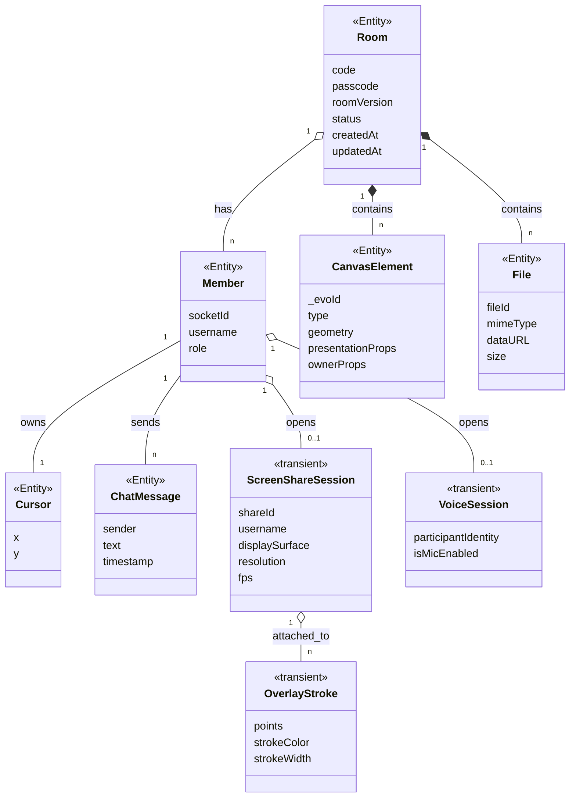

> *Hình 3.1: Biểu đồ lớp thực thể tổng quan của hệ thống EvoDraw — 6 lớp nghiệp vụ chính và 3 lớp phụ trợ `<<transient>>`.*

#### b) Biểu đồ lớp phân tích — theo Module nghiệp vụ (BCE)

Báo cáo tổ chức 13 chức năng thành **3 Module nghiệp vụ**. Mỗi module được phân tích bằng một biểu đồ lớp theo chuẩn **BCE (Boundary–Control–Entity)** gồm đủ ba stereotype:
- `«View»` (Boundary): thành phần giao diện — điểm phát sinh sự kiện từ người dùng.
- `«Controller»` (Control): điều phối nghiệp vụ, xử lý sự kiện; không mang trạng thái dài hạn.
- `«Entity»`: dữ liệu aggregate — **chỉ gồm thuộc tính**, không có phương thức nghiệp vụ.

Biểu đồ lớp chi tiết theo tên lớp thiết kế (gắn tên hook/handler cụ thể) được bổ sung ở pha Thiết kế tĩnh (mục 3.2.4). Tất cả biểu đồ dùng **Mermaid**.

---

##### Module M1 — Quản lý phòng
*(Bao gồm chức năng: a–Tạo phòng, b–Tham gia phòng, h–Rời phòng, m–Đổi tên hiển thị)*

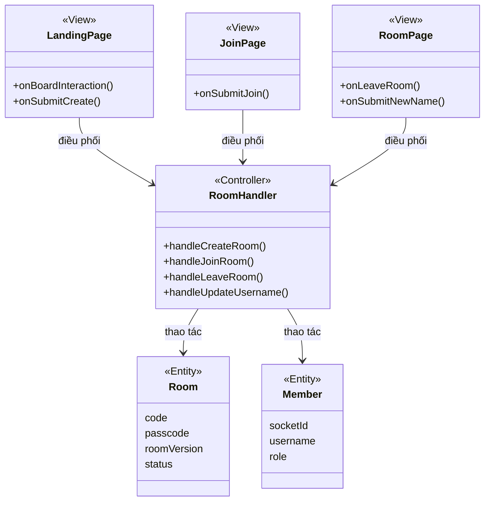

> *Hình 3.2: Biểu đồ lớp phân tích BCE — Module M1 Quản lý phòng.*

---

##### Module M2 — Cộng tác bảng trắng
*(Bao gồm chức năng: c–Vẽ tự do, d–Chèn ảnh, j–Undo/Redo, k–Pan/Zoom, l–Hiển thị con trỏ)*

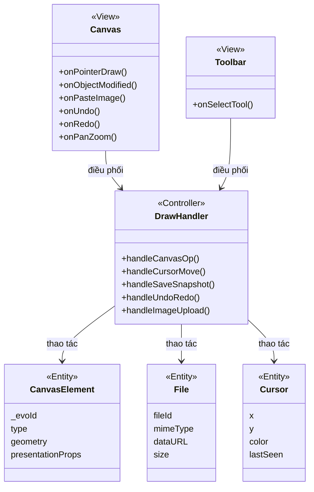

> *Hình 3.3: Biểu đồ lớp phân tích BCE — Module M2 Cộng tác bảng trắng.*

---

##### Module M3 — Chia sẻ & Truyền thông
*(Bao gồm chức năng: e–Chia sẻ màn hình, f–Gọi thoại, g–Chat, i–Desktop Overlay)*

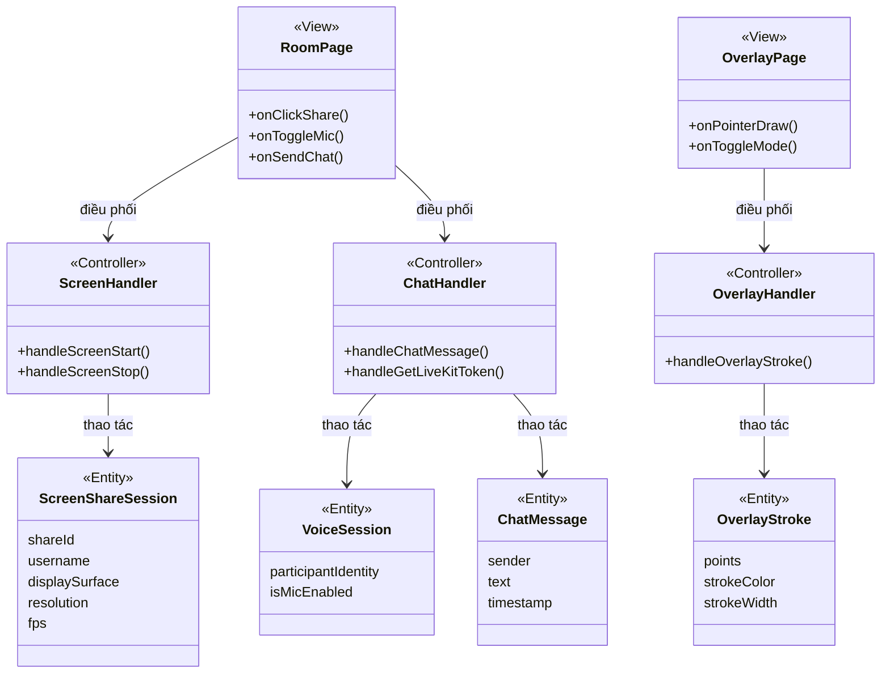

> *Hình 3.4: Biểu đồ lớp phân tích BCE — Module M3 Chia sẻ & Truyền thông.*


### 3.1.3. Việc 3 — Phân tích động (Sequence Diagram phân tích)

Phân tích động bao gồm hai loại biểu đồ bổ trợ nhau:

**a) Sequence Diagram phân tích** — mô tả thứ tự tương tác giữa các lớp BCE để hoàn thành từng chức năng. Lifelines: `actor`, `«View»`, `«Controller»`, `«Entity»`. Biểu diễn bằng **Mermaid** `sequenceDiagram`.

**b) State Machine Diagram** *(bổ sung EDAD)* — mô tả trạng thái đối tượng thay đổi theo sự kiện. Áp dụng cho các Entity có vòng đời rõ rệt. Biểu diễn bằng **Mermaid** `stateDiagram-v2`.

Mỗi tương tác được biểu diễn là **thao tác hoặc sự kiện nghiệp vụ** — không phải lời gọi phương thức Entity trực tiếp. *Chi tiết kênh sự kiện, tên event, payload cụ thể* thuộc về pha Thiết kế (mục 3.2.5).

---

#### Sequence diagram a — Tạo phòng mới

**Lifelines:** `NSD`, `LandingPage` `«View»`, `Room` `«Entity»`.

1. `NSD` → `LandingPage`: bắt đầu tương tác với bảng (chọn công cụ / click canvas) để khởi tạo phòng.
2. `LandingPage`: phát thao tác *tạo phòng mới*.
3. Hệ thống sinh mã phòng + PIN ngẫu nhiên, lưu một `Room` mới *(dữ liệu)*.
4. `Room` *(dữ liệu)* → `LandingPage`: trả về cặp mã phòng + PIN.
5. `LandingPage` → `NSD`: chuyển vào giao diện phòng và hiển thị cặp mã để chia sẻ.

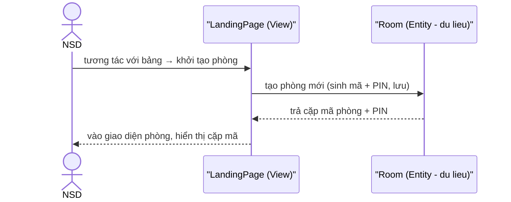

> *Hình 3.15: Sequence diagram phân tích — Tạo phòng mới.*

---

#### Sequence diagram b — Tham gia phòng

**Lifelines:** `NSD`, `LandingPage` `«View»`, `RoomPage` `«View»`, `Room` `«Entity»`, `Member` `«Entity»`, `CanvasElement` `«Entity»`.

1. `NSD` → `LandingPage`: nhập mã phòng + PIN, click "Tham gia" (hoặc mở link mời — xử lý qua trang tham gia riêng theo cùng luồng xác thực bên dưới).
2. `LandingPage` → `Room`: yêu cầu `verifyPasscode(code, pin)`.
3. `Room`: kiểm tra mã phòng và PIN.
   - *Ngoại lệ:* mã/PIN sai *hoặc* phòng không tồn tại → `Room` trả về cùng một lỗi chung → `LandingPage` hiển thị "Mã phòng hoặc PIN không hợp lệ".
4. `Room` → `LandingPage`: xác thực thành công.
5. `LandingPage` → `RoomPage`: chuyển sang giao diện phòng.
6. `RoomPage` → `Member`: `join(room)` — thêm NSD vào danh sách thành viên.
7. `RoomPage` → `Room`: `loadSnapshot()` — tải nội dung bảng trắng hiện có.
8. `Room` → `CanvasElement`: dựng lại các phần tử bảng trắng.
9. `CanvasElement` → `RoomPage`: trả các phần tử.
10. `RoomPage` → `NSD`: hiển thị bảng trắng đầy đủ và danh sách thành viên.

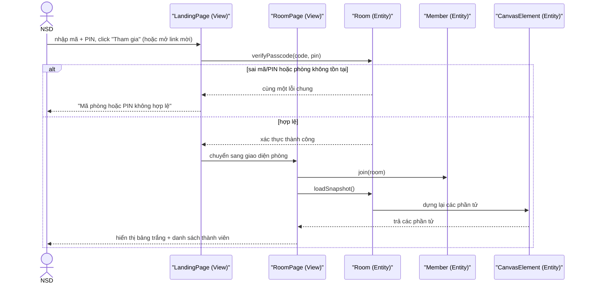

> *Hình 3.16: Sequence diagram phân tích — Tham gia phòng.*

---

#### Sequence diagram c — Vẽ tự do trên bảng trắng

**Lifelines:** `NSD A`, `Toolbar` `«View»`, `Canvas` `«View»`, `CanvasElement` `«Entity»`, `NSD B`.

1. `NSD A` → `Toolbar`: chọn công cụ + màu + độ dày.
2. `Toolbar` → `Canvas`: cấu hình công cụ vẽ hiện hành.
3. `NSD A` → `Canvas`: thực hiện thao tác vẽ (nhấn — kéo — thả chuột).
4. `Canvas` → `CanvasElement`: `add()` — tạo phần tử vẽ mới.
5. `CanvasElement` → `Canvas`: trả phần tử để hiển thị cho `NSD A`.
6. `CanvasElement`: `synchronize()` — đồng bộ phần tử mới tới các thành viên cùng phòng.
7. `CanvasElement` → `Canvas` (phía `NSD B`): hiển thị phần tử cho `NSD B`.
8. *(Định kỳ)* `Room`: `saveSnapshot()` — lưu trạng thái bảng trắng.

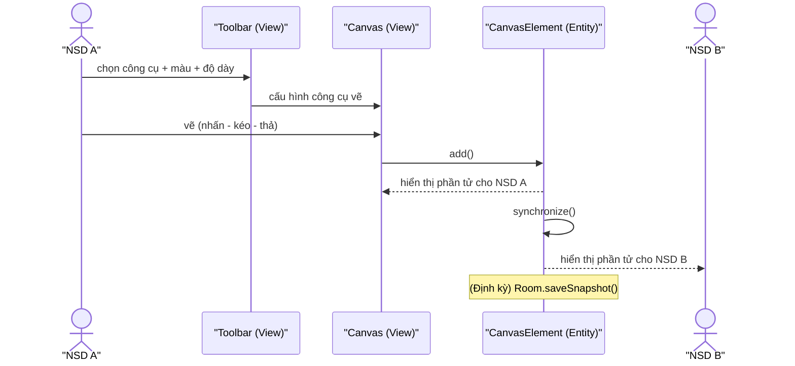

> *Hình 3.17: Sequence diagram phân tích — Vẽ tự do trên bảng trắng.*

---

#### Sequence diagram d — Chèn ảnh vào bảng trắng

**Lifelines:** `NSD A`, `Canvas` `«View»`, `File` `«Entity»`, `CanvasElement` `«Entity»`, `NSD B`.

1. `NSD A` → `Canvas`: dán ảnh (Ctrl+V).
2. `Canvas` → `File`: `validateFormat()` — kiểm tra dữ liệu dán có phải ảnh (định dạng `image/*`).
   - *Ngoại lệ:* dữ liệu dán không phải ảnh → `Canvas` bỏ qua thao tác.
3. `Canvas` → `CanvasElement`: `add()` — hiển thị ngay ảnh xem trước cục bộ tại vị trí con trỏ (mặc định tâm vùng nhìn) cho `NSD A`.
4. `Canvas` → `File`: `upload(file)` — tải ảnh lên kho lưu trữ.
   - *Ngoại lệ:* tải lên thất bại → `Canvas` gỡ ảnh xem trước và báo lỗi.
5. `File` → `Canvas`: trả URL công khai (`getURL()`); `CanvasElement` thay nguồn ảnh bằng URL công khai.
6. `CanvasElement`: `synchronize()` — đồng bộ phần tử ảnh tới các thành viên cùng phòng.
7. `CanvasElement` → `Canvas` (phía `NSD B`): tải ảnh từ URL và hiển thị cho `NSD B`.

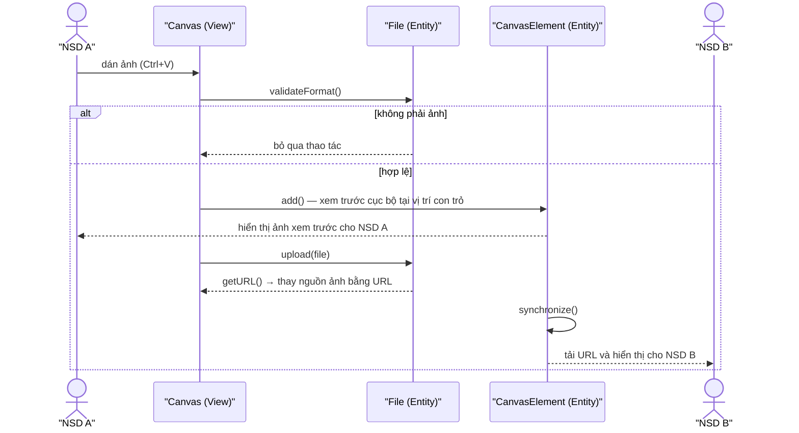

> *Hình 3.18: Sequence diagram phân tích — Chèn ảnh vào bảng trắng.*

---

#### Sequence diagram e — Chia sẻ màn hình

**Lifelines:** `NSD A` (người trình bày), `Toolbar` `«View»`, `Canvas` `«View»`, `ScreenShareSession` `«Entity»`, `NSD B`.

1. `NSD A` → `Toolbar`: click "Chia sẻ màn hình", chọn độ phân giải/FPS/âm thanh.
2. `Toolbar` → `ScreenShareSession`: `start(source, resolution, fps, withAudio)`.
3. `ScreenShareSession`: yêu cầu luồng màn hình từ thiết bị.
   - *Ngoại lệ:* NSD hủy hộp thoại chọn nguồn → kết thúc, không chia sẻ.
4. `ScreenShareSession`: `broadcast()` — phân phối luồng tới các thành viên cùng phòng.
5. `ScreenShareSession` → `Canvas` (phía `NSD B`): `subscribe()` — nhận luồng và hiển thị dưới dạng lớp phủ.
6. `Canvas` → `NSD B`: hiển thị luồng màn hình; `NSD B` có thể vẽ ghi chú đè lên.
7. *(Tùy chọn)* `NSD A` → `Toolbar` → `ScreenShareSession`: `changeResolution(res)` / `changeFrameRate(fps)`.
8. *(Dừng)* `NSD A` → `Toolbar` → `ScreenShareSession`: `stop()` → gỡ lớp phủ khỏi `Canvas` của các thành viên.

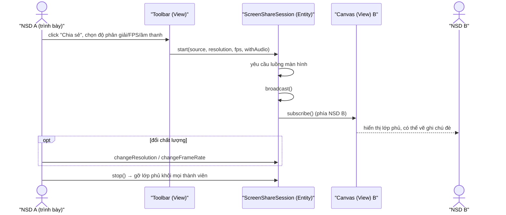

> *Hình 3.19: Sequence diagram phân tích — Chia sẻ màn hình.*

---

#### Sequence diagram f — Gọi thoại

**Lifelines:** `NSD A`, `Toolbar` `«View»`, `VoiceSession` `«Entity»`, `NSD B`.

1. `NSD A` → `Toolbar`: click "Bật micro".
2. `Toolbar` → `VoiceSession`: `enableMicrophone()`.
3. `VoiceSession`: yêu cầu quyền truy cập microphone.
   - *Ngoại lệ:* NSD từ chối quyền / không có thiết bị → báo lỗi, không kích hoạt.
4. `VoiceSession`: `broadcast()` — phân phối luồng âm thanh tới các thành viên cùng phòng.
5. `VoiceSession` → `NSD B`: `subscribe()` — `NSD B` nghe thấy giọng của `NSD A`.
6. *(Tắt)* `NSD A` → `Toolbar` → `VoiceSession`: `disableMicrophone()` → ngừng phân phối âm thanh.

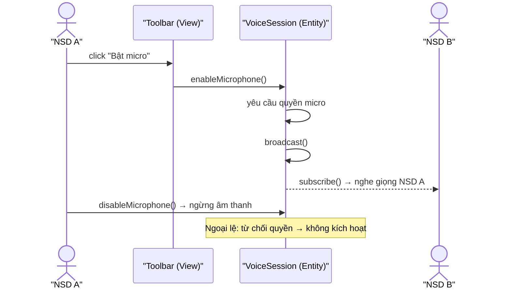

> *Hình 3.20: Sequence diagram phân tích — Gọi thoại.*

---

#### Sequence diagram g — Gửi tin nhắn chat

**Lifelines:** `NSD A`, `ChatPanel` `«View»` (A), `ChatMessage` `«Entity»`, `ChatPanel` `«View»` (B), `NSD B`.

1. `NSD A` → `ChatPanel (A)`: nhập nội dung + Enter.
2. `ChatPanel (A)` → `ChatMessage`: `send(text)`.
3. `ChatMessage` → `ChatPanel (A)`: hiển thị ngay tin nhắn cho `NSD A` (phản hồi tức thì).
4. `ChatMessage`: phân phối tới các thành viên còn lại trong phòng.
5. `ChatMessage` → `ChatPanel (B)`: `receive()` — đưa tin nhắn lên giao diện `NSD B`.
6. `ChatPanel (B)` → `NSD B`: hiển thị tin nhắn; nếu khung chat đang đóng → hiển thị thông báo nhỏ + badge tin chưa đọc.

```mermaid
sequenceDiagram
    actor A as "NSD A"
    participant CPA as "ChatPanel (View) A"
    participant CM as "ChatMessage (Entity)"
    participant CPB as "ChatPanel (View) B"
    actor B as "NSD B"
    A->>CPA: nhập nội dung + Enter
    CPA->>CM: send(text)
    CM-->>CPA: hiển thị ngay cho NSD A
    CM->>CM: phân phối tới thành viên còn lại
    CM->>CPB: receive()
    CPB-->>B: hiển thị tin; nếu khung đóng → badge chưa đọc
```

> *Hình 3.21: Sequence diagram phân tích — Gửi tin nhắn chat.*

---

#### Sequence diagram h — Rời phòng

**Lifelines:** `NSD A`, `RoomPage` `«View»` (A), `Member` `«Entity»`, `RoomPage` `«View»` (B), `LandingPage` `«View»`.

1. `NSD A` → `RoomPage (A)`: mở bảng cài đặt, click "Rời phòng".
2. `RoomPage (A)` → `LandingPage`: đưa `NSD A` về trang chủ ngay (không có hộp thoại xác nhận).
3. `RoomPage (A)` → `Member`: `leave(room)` — khi rời phòng.
4. `Member`: `notifyOthers()` — thông báo tới các thành viên còn lại.
5. `Member` → `RoomPage (B)`: cập nhật danh sách thành viên (không còn `NSD A`).
- *Ngoại lệ:* `NSD A` đóng tab trình duyệt → mất kết nối cũng kích hoạt `leave(room)`.

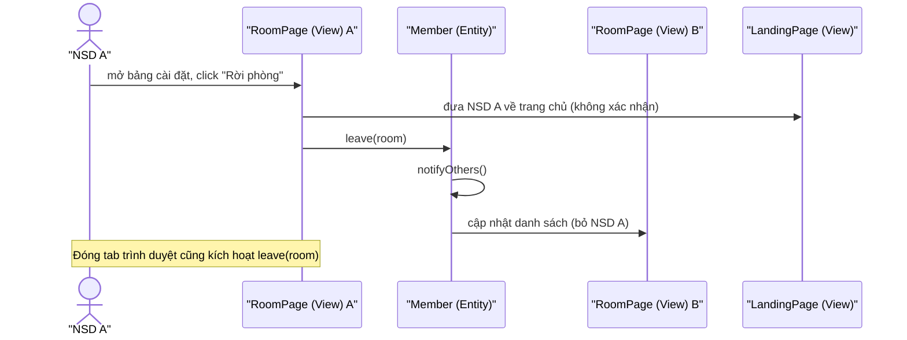

> *Hình 3.22: Sequence diagram phân tích — Rời phòng.*

---

#### Sequence diagram i — Ghi chú đè màn hình chia sẻ bằng Desktop Overlay

**Lifelines:** `NSD A` (người trình bày), `RoomPage` `«View»` (web), `OverlayPage` `«View»` (desktop), `ScreenShareSession` `«Entity»`, `OverlayStroke` `«Entity»`, `Canvas` `«View»` (phía `NSD B`).

1. `NSD A` (đang chia sẻ màn hình) → `RoomPage`: click banner "Mở trong ứng dụng".
2. `RoomPage` → `ScreenShareSession`: `launchOverlay()` — khởi động lớp phủ desktop qua deep link với quyền truy cập phòng.
3. `ScreenShareSession` → `OverlayPage`: mở lớp phủ toàn màn hình trong suốt — mở thẳng ở chế độ Vẽ, khóa vùng nhìn theo vùng màn hình chia sẻ.
4. `NSD A` → `OverlayPage`: vẽ nét ghi chú.
5. `OverlayPage` → `OverlayStroke`: `create(points, style, shareSession)` — tạo nét ghi chú gắn với phiên chia sẻ.
6. `OverlayStroke`: `synchronize()` — đồng bộ nét ghi chú tới các thành viên cùng phòng.
7. `OverlayStroke` → `Canvas (B)`: hiển thị nét ghi chú đè lên luồng màn hình chia sẻ cho `NSD B`.
8. *(Tùy chọn)* `NSD A` → `OverlayPage`: xóa nét ghi chú (công cụ tẩy / "Clear All") → đồng bộ thao tác xóa → `Canvas (B)` gỡ nét; hoặc chuyển sang chế độ Làm việc.

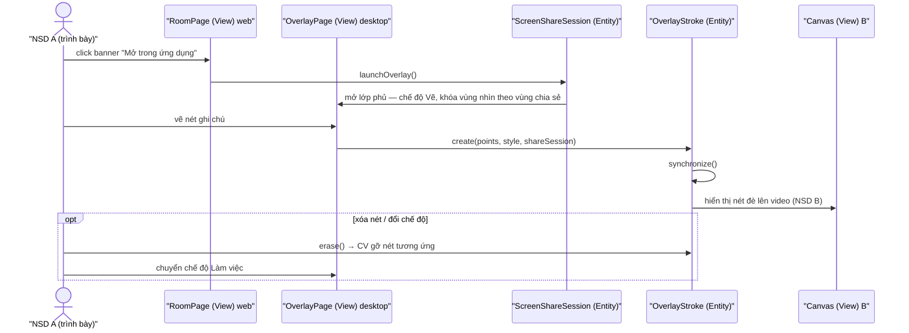

> *Hình 3.23: Sequence diagram phân tích — Desktop Overlay.*

---

#### Sequence diagram j — Hoàn tác / Làm lại (Undo/Redo)

**Lifelines:** `NSD A`, `Toolbar` `«View»`, `Canvas` `«View»`, `CanvasElement` `«Entity»`, `NSD B`.

1. `NSD A` → `Toolbar`: click "Hoàn tác" (hoặc Ctrl+Z).
   - *Ngoại lệ:* chưa có thao tác nào để hoàn tác → không làm gì.
2. `Toolbar` → `CanvasElement`: `undo()` — tính thao tác đảo của thao tác cuối.
3. `CanvasElement` → `Canvas`: áp dụng thao tác đảo, hiển thị trạng thái mới cho `NSD A`.
4. `CanvasElement`: `synchronize()` — đồng bộ thao tác đảo tới các thành viên cùng phòng.
5. `CanvasElement` → `Canvas` (phía `NSD B`): cập nhật trạng thái cho `NSD B`.
6. *(Làm lại)* `NSD A` → `Toolbar` → `CanvasElement`: `redo()` — thực hiện ngược lại bước 2–5.

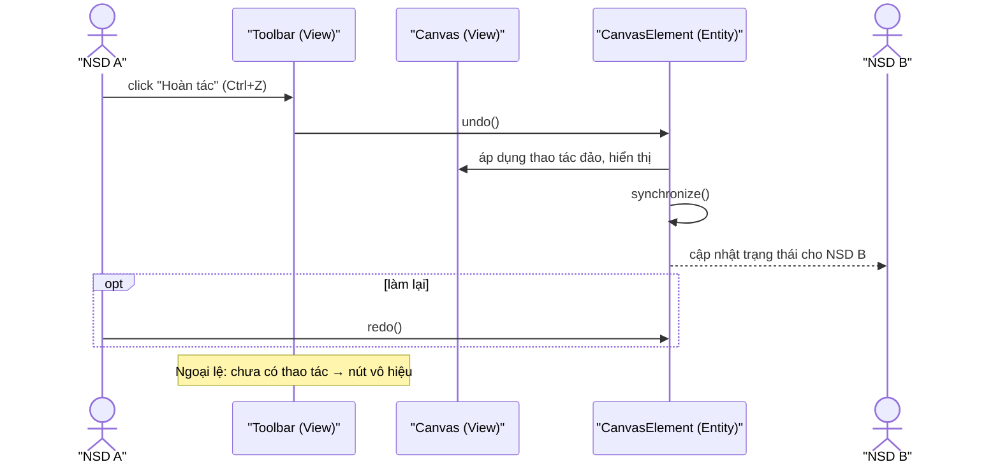

> *Hình 3.24: Sequence diagram phân tích — Undo/Redo.*

---

#### Sequence diagram k — Di chuyển và Phóng to/Thu nhỏ vùng nhìn (Pan/Zoom)

**Lifelines:** `NSD A`, `Canvas` `«View»`.

1. `NSD A` → `Canvas`: lăn chuột (phóng to/thu nhỏ) hoặc giữ Space + kéo (di chuyển).
2. `Canvas`: cập nhật vùng nhìn cục bộ và vẽ lại các phần tử theo vùng nhìn mới.
3. `Canvas` → `NSD A`: hiển thị bảng trắng theo vùng nhìn mới.
   - *Ngoại lệ:* phóng to/thu nhỏ vượt ngưỡng → giữ ở mức tối đa/tối thiểu.

*(Không có `«Entity»` và không phân phối ra các thành viên khác — Pan/Zoom là thao tác cục bộ; mỗi thành viên có vùng nhìn riêng.)*

```mermaid
sequenceDiagram
    actor A as "NSD A"
    participant CV as "Canvas (View)"
    A->>CV: lăn chuột (zoom) / Space + kéo (pan)
    CV->>CV: cập nhật vùng nhìn cục bộ, vẽ lại
    CV-->>A: hiển thị theo vùng nhìn mới
    Note over CV: Không phân phối ra ngoài; mỗi NSD có vùng nhìn riêng
```

> *Hình 3.25: Sequence diagram phân tích — Pan/Zoom.*

---

#### Sequence diagram l — Hiển thị con trỏ thành viên khác (Remote Cursors)

**Lifelines:** `NSD A`, `Canvas` `«View»` (A), `Cursor` `«Entity»`, `Canvas` `«View»` (B), `NSD B`.

1. `NSD A` → `Canvas (A)`: di chuyển chuột trên bảng trắng.
2. `Canvas (A)` → `Cursor`: `update(x, y)` — cập nhật vị trí con trỏ.
3. `Cursor`: `broadcast()` — phân phối vị trí tới các thành viên cùng phòng (giới hạn tần suất để giảm tải mạng).
4. `Cursor` → `Canvas (B)`: `receiveRemote(member, position)` — đưa con trỏ của `NSD A` lên giao diện.
5. `Canvas (B)` → `NSD B`: hiển thị con trỏ kèm tên hiển thị và màu đại diện của `NSD A`.
6. *(Cleanup)* Khi `NSD A` ngừng di chuyển quá lâu hoặc rời phòng → `Cursor.cleanupStale()` → `Canvas (B)` gỡ con trỏ tương ứng.

```mermaid
sequenceDiagram
    actor A as "NSD A"
    participant CVA as "Canvas (View) A"
    participant CU as "Cursor (Entity)"
    participant CVB as "Canvas (View) B"
    actor B as "NSD B"
    A->>CVA: di chuyển chuột
    CVA->>CU: update(x, y)
    CU->>CU: broadcast() (giới hạn tần suất)
    CU->>CVB: receiveRemote(member, position)
    CVB-->>B: hiển thị con trỏ + tên + màu của NSD A
    opt cleanup
        CU->>CVB: cleanupStale() → gỡ con trỏ cũ
    end
```

> *Hình 3.26: Sequence diagram phân tích — Remote Cursors.*

---

#### Sequence diagram m — Đổi tên hiển thị

**Lifelines:** `NSD A`, `SettingsPanel` `«View»` (A), `Member` `«Entity»`, `MembersPanel` `«View»` (B), `NSD B`.

> *Lưu ý:* trong bản hiện tại, ô tên trong `SettingsPanel` ở chế độ chỉ-đọc nên bước 1 chưa được kích hoạt từ giao diện; sơ đồ dưới mô tả luồng đổi tên **đã thiết kế** ở tầng xử lý, sẽ chạy khi giao diện nối thao tác này.

1. `NSD A` → `SettingsPanel (A)`: nhập tên hiển thị mới + xác nhận.
2. `SettingsPanel (A)` → `Member`: `updateName(newName)`.
   - *Ngoại lệ:* tên rỗng → không cập nhật.
3. `Member`: `broadcast()` — thông báo tên mới qua danh sách thành viên.
4. `Member` → `MembersPanel (B)`: cập nhật tên trong danh sách thành viên.
5. `MembersPanel (B)` → `NSD B`: hiển thị tên mới trên danh sách thành viên.

```mermaid
sequenceDiagram
    actor A as "NSD A"
    participant SP as "SettingsPanel (View) A"
    participant M as "Member (Entity)"
    participant MP as "MembersPanel (View) B"
    actor B as "NSD B"
    A->>SP: nhập tên hiển thị mới + xác nhận
    SP->>M: updateName(newName)
    M->>M: broadcast()
    M->>MP: cập nhật tên trong danh sách
    MP-->>B: hiển thị tên mới trên danh sách thành viên
    Note over SP: Bản hiện tại ô tên chỉ-đọc; tên rỗng → không cập nhật
```

> *Hình 3.27: Sequence diagram phân tích — Đổi tên hiển thị.*

---

#### Biểu đồ trạng thái (State Machine Diagram) — Phân tích động EDAD

Năm biểu đồ trạng thái dưới đây mô tả **vòng đời của các Entity/Aggregate có trạng thái thay đổi theo sự kiện**, bổ sung cho Sequence Diagram phía trên.

**State Diagram 1 — `Room`:**

```mermaid
stateDiagram-v2
    [*] --> Created : POST /api/rooms OK
    Created --> Active : Socket join_room đầu tiên
    Active --> Active : làm tươi hoạt động (canvas_op, cursor_move, chat)
    Active --> Idle : 24h không activity (updatedAt không refresh)
    Idle --> [*] : MongoDB TTL daemon xóa document
```

**State Diagram 2 — `ScreenShareSession`:**

```mermaid
stateDiagram-v2
    [*] --> Idle
    Idle --> Starting : User click "Share"
    Starting --> Sharing : track published + screen started
    Sharing --> Sharing : changeResolution / changeFrameRate
    Sharing --> Stopping : User click "Stop" / browser stop
    Stopping --> Idle : track unpublished + screen stopped
    Sharing --> Idle : disconnect bất thường (server cleanup)
```

**State Diagram 3 — `OverlayMode` (Desktop App):**

```mermaid
stateDiagram-v2
    [*] --> Drawing : mở overlay cho phiên chia sẻ (khóa vùng nhìn)
    Drawing --> Working : Ctrl+Shift+D (chế độ xuyên chuột)
    Working --> Drawing : Ctrl+Shift+D
    Working --> [*] : đóng overlay từ tray / presenter dừng chia sẻ
    Drawing --> [*] : đóng overlay từ tray / presenter dừng chia sẻ
```

**State Diagram 4 — `CanvasElement`:**

```mermaid
stateDiagram-v2
    [*] --> Draft : người dùng bắt đầu vẽ (in-progress stroke)
    Draft --> PendingSync : thao tác hoàn thành (object:modified / object:added)
    PendingSync --> Committed : nhận canvas_op_received, LWW thắng (_evoVersion cao hơn hoặc nonce nhỏ hơn)
    PendingSync --> Rejected : nhận canvas_op_received với _evoVersion cao hơn từ peer (LWW thua)
    Rejected --> Draft : người dùng thao tác lại
    Committed --> PendingSync : thao tác tiếp theo
    Committed --> [*] : xóa (eraser / undo)
```

**State Diagram 5 — `Member`:**

```mermaid
stateDiagram-v2
    [*] --> Connected : join_room thành công
    Connected --> Active : thao tác vẽ / gửi cursor / chat
    Active --> Idle : không có hoạt động > 30s
    Idle --> Active : bắt đầu thao tác trở lại
    Active --> Drawing : đang vẽ nét (in-progress stroke)
    Drawing --> Active : kết thúc nét vẽ (object:added)
    Connected --> [*] : leave_room / mất kết nối
    Active --> [*] : leave_room / mất kết nối
    Idle --> [*] : leave_room / timeout / mất kết nối
```

> *Hình 3.5–3.9: Biểu đồ trạng thái — Room, ScreenShareSession, OverlayMode, CanvasElement, Member.*

---

## 3.2. Pha Thiết kế

Pha Thiết kế trả lời câu hỏi *"hệ thống làm bằng cách nào"*. Nó kế thừa các lớp `«View»` và `«Entity»` từ pha Phân tích rồi **bổ sung ba tầng kỹ thuật** mà pha Phân tích cố ý chưa nhắc tới:

1. **Tầng `«Controller / Event Handler»`** — hiện thân của bộ điều phối sự kiện. Ở Web là các React **custom hook**; ở Desktop là **hook renderer + IPC handler ở main process**; ở Server là các **socket handler** và **REST controller**.
2. **Tầng `«Broker»`** — **Socket.IO Server** (kênh sự kiện) và **LiveKit SFU** (kênh media), nơi mọi giao tiếp xuyên máy đi qua.
3. **Tầng `«DAO»`** — **Mongoose model** (Room, File) trên MongoDB và **Firebase Storage** cho tệp tin.

Pha Thiết kế **đặc tả** tên hook, tên file, tên hàm và tên event sẽ dùng; pha Cài đặt (mục 3.3) **hiện thực hóa đúng** các đặc tả này, nhờ đó tài liệu và sản phẩm nhất quán. *Lưu ý trình tự:* Thiết kế đi trước, Cài đặt tuân theo Thiết kế — việc tên gọi ở đây trùng với mã nguồn là vì khâu lập trình bám sát thiết kế, không phải báo cáo chép ngược từ code. Cấu trúc trình bày theo đúng 5 việc của pha thiết kế.

### 3.2.1. Việc 1 — Thiết kế biểu đồ lớp thực thể (Entity Class Diagram chi tiết)

Biểu đồ lớp thực thể ở pha thiết kế bổ sung đầy đủ kiểu dữ liệu, ràng buộc, khóa và đánh dấu các trường transient. Dưới đây là bảng đặc tả tương đương biểu đồ UML (sẽ render bằng Lucidchart).

#### Lớp `Room` *(persist: MongoDB, collection `rooms`)*

| Thuộc tính | Kiểu | Ràng buộc | Ghi chú |
| :--- | :--- | :--- | :--- |
| `_id` | ObjectId | PK auto (Mongoose) | |
| `code` | String | required, **unique**, uppercase, trim, length 6 | Mã phòng — định danh nghiệp vụ. Là "Socket.IO room name". |
| `passcode` | String | required | bcrypt hash của PIN 4 chữ số (chiều dài chuỗi ≥ 60). |
| `roomVersion` | Number | default 0 | Tăng dần theo `_evoSceneVersion` mỗi lần `save_snapshot`. |
| `elements` | Array<Object> | default [] | Mảng các `CanvasElement` đã serialize qua `toObject(CUSTOM_PROPS)`. |
| `appState` | Object | default {} | Theme, zoom level, bgColor… |
| `status` | String | default 'active' | 'active' / 'inactive' (dự phòng). |
| `createdAt` | Date | auto (timestamps) | |
| `updatedAt` | Date | auto, **TTL index** | `expireAfterSeconds: 86400` → tự xóa sau 24h không hoạt động. |

#### Lớp `File` *(persist: MongoDB, collection `files`)*

| Thuộc tính | Kiểu | Ràng buộc | Ghi chú |
| :--- | :--- | :--- | :--- |
| `_id` | ObjectId | PK auto | |
| `fileId` | String | required, **index** | UUID logic do server sinh. |
| `roomId` | String | required, **index** (composite unique với fileId) | FK tới `Room.code`. |
| `mimeType` | String | required | image/png, image/jpeg… |
| `dataURL` | String | required | URL công khai Firebase Storage. |
| `size` | Number | required | bytes. |
| `created` | Date | auto (`createdAt`) | Multer middleware nhận file. |
| `lastRetrieved` | Date | default Date.now | Có thể dùng cho cleanup tương lai. |

#### Lớp `CanvasElement` *(embed trong `Room.elements`, không có collection riêng)*

| Thuộc tính | Kiểu | Ràng buộc | Ghi chú |
| :--- | :--- | :--- | :--- |
| `_evoId` | String | bắt buộc, **logical PK** | Sinh client-side: `${Date.now()}-${counter}-${random5}`. |
| `_evoVersion` | Number | default 0, bump on mutation | Tử số LWW. |
| `_evoNonce` | Number | random 30-bit | Tiebreaker khi cùng version. |
| `type` | String | bắt buộc | Fabric type: path/rect/circle/line/text/image. |
| `left`, `top`, `width`, `height`, `scaleX`, `scaleY`, `angle` | Number | | Hình học Fabric. |
| `path`, `points` | Array | (cho path/polyline) | |
| `fill`, `stroke`, `strokeWidth`, `opacity` | String/Number | | Style. |
| `src` | String | (cho image) | URL từ `File.dataURL`. |
| `_evoImage` | Boolean | optional | True nếu là ảnh — immune to eraser. |
| `_evoScreenShare` | Boolean | optional | True nếu là proxy Rect của video share hoặc nét ghi chú overlay. |
| `_evoShareId`, `_evoShareUser`, `_evoShareColor` | String | optional | Liên kết với phiên share tương ứng. |

#### Lớp `Member` *(transient: RAM Socket.IO)*

| Thuộc tính | Kiểu | Ghi chú |
| :--- | :--- | :--- |
| `socketId` | String | ID kết nối Socket.IO. |
| `username` | String | Tên hiển thị (cập nhật qua `update_username`). |
| `roomId` | String | Phòng đang tham gia. |
| `isOverlay` | Boolean | True nếu là kết nối từ Desktop Overlay (không hiển thị trong danh sách user thường). |

#### Lớp `Cursor` *(transient: RAM client)*

| Thuộc tính | Kiểu | Ghi chú |
| :--- | :--- | :--- |
| `socketId` / `username` | String | Khóa map. |
| `x`, `y` | Number | Tọa độ Fabric world. |
| `color` | String | Sinh deterministic từ username. |
| `lastSeen` | Number (ms) | Để cleanup khi không cập nhật. |

#### Lớp `ChatMessage` *(transient: RAM client)*

| Thuộc tính | Kiểu | Ghi chú |
| :--- | :--- | :--- |
| `sender` | String | Username hoặc 'Anonymous'. |
| `text` | String | Nội dung. |
| `timestamp` | Number (ms) | Set bởi server. |

```mermaid
classDiagram
    class Room {
        <<Entity>>
        +ObjectId _id
        +String code
        +String passcode
        +Number roomVersion
        +Array~Object~ elements
        +Object appState
        +String status
        +Date createdAt
        +Date updatedAt
    }
    class File {
        <<Entity>>
        +ObjectId _id
        +String fileId
        +String roomId
        +String mimeType
        +String dataURL
        +Number size
        +Date created
        +Date lastRetrieved
    }
    class CanvasElement {
        <<Entity>>
        +String _evoId
        +Number _evoVersion
        +Number _evoNonce
        +String type
        +Number left
        +Number top
        +Number width
        +Number height
        +String fill
        +String stroke
        +String src
        +Boolean _evoImage
        +Boolean _evoScreenShare
    }
    class Member {
        <<transient>>
        +String socketId
        +String username
        +String roomId
        +Boolean isOverlay
    }
    class Cursor {
        <<transient>>
        +String socketId
        +Number x
        +Number y
        +String color
        +Number lastSeen
    }
    class ChatMessage {
        <<transient>>
        +String sender
        +String text
        +Number timestamp
    }
    Room "1" *-- "n" CanvasElement : elements
    Room "1" --> "n" File : roomId
    Room "1" o-- "n" Member : online
    Member "1" --> "1" Cursor : con_tro
    Member "1" --> "n" ChatMessage : gui
    note for Room "persist: rooms; PK _id; unique code(6); TTL updatedAt=24h"
    note for File "persist: files; FK roomId to Room.code"
    note for CanvasElement "embed trong Room.elements; LWW _evoId/_evoVersion/_evoNonce"
```

> *Hình 3.28: Entity Class Diagram chi tiết — Pha Thiết kế.* (Lớp `<<transient>>` không persist; chú thích nêu rõ khóa và ràng buộc.)

### 3.2.2. Việc 2 — Thiết kế Cơ sở dữ liệu

#### Mô hình dữ liệu

EvoDraw dùng **MongoDB** (NoSQL, document-oriented) với 2 collection:

- `rooms` — lưu Aggregate `Room` cùng với `elements` (CanvasElement) embed bên trong.
- `files` — lưu metadata `File`. Bytes ảnh thực tế nằm ở Firebase Storage.

Lý do embed `CanvasElement` thay vì tách collection riêng:
1. **Atomic write** — một `save_snapshot` chỉ là một `updateOne` duy nhất.
2. **Single round-trip read** — `request_snapshot` chỉ cần 1 query thay vì n+1.
3. **Locality** — toàn bộ trạng thái phòng ở cùng 1 document, phù hợp với access pattern "tải toàn bộ snapshot mỗi khi tham gia".
4. **Giới hạn 16MB của MongoDB document đủ** — với 1000 nét vẽ × ~200 bytes serialized = 200KB, còn rất xa giới hạn.

#### Bảng index

| Collection | Index | Loại | Mục đích |
| :--- | :--- | :--- | :--- |
| `rooms` | `{code: 1}` | unique | Tra cứu phòng theo mã. |
| `rooms` | `{updatedAt: 1}` | **TTL `expireAfterSeconds: 86400`** | Tự động xóa phòng sau 24h không hoạt động. |
| `files` | `{fileId: 1}` | non-unique | Tra cứu file theo fileId. |
| `files` | `{roomId: 1}` | non-unique | Liệt kê file theo phòng. |
| `files` | `{roomId: 1, fileId: 1}` | unique composite | Đảm bảo fileId duy nhất trong phòng. |

#### Ước tính kích thước

- Document `Room` trung bình: code (6B) + passcode (60B hash) + roomVersion (8B) + elements (~50 KB cho bảng trắng 250 phần tử) + appState (~200B) + status (~10B) + timestamps (16B) ≈ **~50KB**.
- Document `File` trung bình: fileId (36B) + roomId (6B) + mimeType (~10B) + dataURL (~250B URL Firebase) + size (8B) + timestamps (16B) ≈ **~350B**.
- Một phòng đang hoạt động sôi nổi 1h: ~360 lần `save_snapshot` × 50KB = ~18MB ghi qua mạng (write trùng key); thực tế chỉ giữ 1 phiên bản cuối → MongoDB ghi đè.

#### Quan hệ cross-collection
`File.roomId` (String) là khóa ngoại tham chiếu `Room.code` (String). MongoDB không enforce; bộ ràng buộc này được đảm bảo ở tầng Service.

```mermaid
erDiagram
    ROOMS ||--o{ FILES : "roomId to code"
    ROOMS ||--|{ CANVAS_ELEMENTS : "embed elements"
    ROOMS {
        ObjectId _id PK
        string code UK
        string passcode
        number roomVersion
        object appState
        string status
        date createdAt
        date updatedAt
    }
    FILES {
        ObjectId _id PK
        string fileId
        string roomId FK
        string mimeType
        string dataURL
        number size
    }
    CANVAS_ELEMENTS {
        string _evoId PK
        number _evoVersion
        number _evoNonce
        string type
        string src
    }
```

> *Hình 3.28b: Mô hình ER hai collection `rooms` / `files` — `CANVAS_ELEMENTS` là tài liệu nhúng trong `rooms.elements` (không phải collection riêng); `updatedAt` mang TTL index 24h.*

### 3.2.3. Việc 3 — Thiết kế Giao diện

Phần này tổng hợp các màn hình của Web App và Desktop App, đặc tả mỗi màn hình thành một React Component (được hiện thực ở pha Cài đặt).

#### Web App

| Màn hình | Mockup (báo cáo gốc) | React component (`apps/web/src/`) |
| :--- | :--- | :--- |
| Trang chủ — tạo phòng | Hình 1.6 | `pages/LandingPage/LandingPage.jsx` |
| Trang tham gia bằng link | (mới) | `pages/JoinPage/JoinPage.jsx` |
| Phòng làm việc — bảng trắng + thanh công cụ | Hình 1.7 | `pages/RoomPage/RoomPage.jsx` với các con: `components/Canvas/Canvas.jsx`, `components/Toolbar/Toolbar.jsx` (+ `PenOptionsPopup.jsx`, `ScreenShareOptions.jsx`, `toolDefinitions.jsx`), `components/ChatPanel/ChatPanel.jsx`, `components/MembersPanel/MembersPanel.jsx`, `components/SettingsPanel/SettingsPanel.jsx`, `components/BottomBar/BottomBar.jsx` |
| Chia sẻ màn hình | Hình 1.8 | (overlay video DOM + proxy Rect Fabric — do `Canvas.jsx` + `screenShareObject.js` xử lý) |
| Cài đặt / Tùy chỉnh phòng | Hình 1.9 | `components/SettingsPanel/SettingsPanel.jsx` |
| Banner gợi mở Desktop App | (mới) | `components/OpenInAppBanner/OpenInAppBanner.jsx` |

#### Desktop App

| Màn hình | Mockup | React component (`apps/desktop/src/renderer/`) |
| :--- | :--- | :--- |
| Overlay toàn màn hình | *(cần bổ sung — không có trong báo cáo gốc; vẽ mới)* | `pages/OverlayPage.jsx` với các con: `components/Canvas/Canvas.jsx`, `components/SettingsPanel/SettingsPanel.jsx`, `components/ChatPanel/ChatPanel.jsx` |
| Toolbar nhỏ ở góc khi vào chế độ Vẽ | *(bổ sung)* | (mini toolbar trong `OverlayPage.jsx`) |
| Tray icon menu | *(bổ sung)* | (Electron main — `main.js`, không có React) |

Link Figma tổng: [EvoDraw on Figma](https://www.figma.com/design/SwQgcQYCGH0rmBbq7p4IRa/EvoDraw)

### 3.2.4. Việc 4 — Thiết kế tĩnh (Static Design)

Pha Phân tích (mục 3.1.2) mới chỉ trình bày hai tầng lớp `«View»` và `«Entity»`. Pha Thiết kế tĩnh tiếp tục **tinh chỉnh (refine)** chính các biểu đồ lớp đó theo ba bước (đúng tinh thần báo cáo mẫu HRM):

1. **Bổ sung tầng `«Controller / Event Handler»`** — hiện thân kỹ thuật của bộ điều phối sự kiện đã chốt ở Chương 2: phía Web/Desktop là các **hook giao diện**, phía Server là các **trình xử lý sự kiện realtime / REST Controller / Service**. Mỗi Controller được đặc tả bằng ba thành phần theo quy ước mục 2.4.5: `_subscribesTo` (event lắng nghe), `_emits` (event phát ra), và tập method chính ứng với method nghiệp vụ ở Phân tích.
2. **Bổ sung tầng `«Broker»`** (Event Broker — Socket.IO / Media Broker — LiveKit SFU / REST API) làm trung gian cho mọi giao tiếp xuyên máy, và tầng `«DAO»` (Mongoose model Room/File + kho lưu trữ tệp tĩnh) cho dữ liệu bền.
3. **Giữ nguyên tên và phương thức nghiệp vụ của `«Entity»`** từ Phân tích để bảo đảm truy vết. Các *hàm phụ trợ thuần kỹ thuật* (serializer nội bộ, sinh mã/băm PIN, làm tươi TTL, cấp/kiểm JWT, adapter lưu trữ, hàm phát danh sách thành viên…) là chi tiết của pha Cài đặt, **không đưa vào biểu đồ lớp thiết kế**.

Mỗi module a–m dưới đây được trình bày bằng: (i) dòng **truy vết** về method nghiệp vụ và kịch bản tương ứng; (ii) **liệt kê các lớp** theo bốn tầng View / Controller-EventHandler / Broker / Entity-DAO; (iii) **class diagram thiết kế** refine từ biểu đồ lớp phân tích cùng module. (Việc chốt tên hook/trình xử lý cụ thể cho từng vai trò — vốn được trừu tượng hóa ở Bảng 2.4.3 — được thực hiện tại đây.)

---

##### *Module a — Tạo phòng mới*

**Hiện thực hóa (Phân tích):** `Room.create()` — Kịch bản a. (Refine từ Hình 3.2.)

* **Tầng giao diện `«View»`:**
  * `LandingPage` — trang chủ với bảng trắng cục bộ + bảng chào; bắt thao tác tương tác đầu tiên với bảng để yêu cầu tạo phòng.
* **Tầng điều khiển `«Controller/EventHandler»`:**
  * `services/api.js` (client REST) — gọi `createRoom()`; `_emits`: `POST /api/rooms`.
  * `room.controller` → `room.service` (server) — `createRoom` nhận yêu cầu, gọi nghiệp vụ tạo phòng (sinh mã phòng + PIN, băm một chiều PIN, lưu phòng, cấp JWT).
* **Tầng Broker:** REST API (request–response, không qua Event Broker).
* **Tầng thực thể `«Entity»` / DAO:** `Room` (DAO: Mongoose model `Room`) — `create()`.

```mermaid
classDiagram
    class LandingPage {
        <<View>>
        +onBoardInteraction()
    }
    class apiCreateRoom {
        <<Controller>>
        +createRoom()
    }
    class RoomController {
        <<Controller>>
        +createRoom()
    }
    class RestApi {
        <<Broker>>
    }
    class Room {
        <<DAO>>
        +create()
    }
    LandingPage --> apiCreateRoom : tao phong
    apiCreateRoom --> RestApi : POST /api/rooms
    RestApi --> RoomController : dinh tuyen
    RoomController --> Room : luu phong + cap JWT
```

> *Hình 3.45: Class diagram thiết kế — Tạo phòng mới (refine từ Hình 3.2).*

---

##### *Module b — Tham gia phòng*

**Hiện thực hóa (Phân tích):** `Room.verifyPasscode()/findByCode()/loadSnapshot()`, `Member.join()/listAll()`, `CanvasElement.synchronize()` — Kịch bản b. (Refine từ Hình 3.2 — BCE M1.)

* **Tầng giao diện `«View»`:**
  * `LandingPage` / `JoinPage` — form nhập mã + PIN, hoặc tự động tham gia qua link mời.
  * `RoomPage` — khung phòng làm việc, hiển thị bảng trắng và danh sách thành viên.
* **Tầng điều khiển `«Controller/EventHandler»`:**
  * `services/api.js` (`joinRoom`) + `useRoom` (client) — `_emits`: `join_room`, `request_snapshot`; `_subscribesTo`: `room_users`, `snapshot_loaded`.
  * `room.controller` (REST `joinRoom`) + `room.handler` (server) — `_subscribesTo`: `join_room`; `_emits`: `user_joined`, `room_users`.
* **Tầng Broker:** REST API (xác thực mã + PIN) + Event Broker (Socket.IO).
* **Tầng thực thể `«Entity»` / DAO:** `Room` (DAO), `Member`, `CanvasElement`.

```mermaid
classDiagram
    class JoinView {
        <<View>>
        +onSubmitJoin()
        +autoJoinByLink()
    }
    class RoomPage {
        <<View>>
        +showBoardAndMembers()
    }
    class useRoom {
        <<Controller>>
        +joinRoom()
        +onRoomUsers()
    }
    class RoomHandler {
        <<Controller>>
        +onJoinRoom()
    }
    class Broker {
        <<Broker>>
    }
    class Room {
        <<DAO>>
        +verifyPasscode(code, pin)
        +findByCode(code)
        +loadSnapshot()
    }
    class Member {
        <<Entity>>
        +join(room)
        +listAll(room)
    }
    class CanvasElement {
        <<Entity>>
        +synchronize()
    }
    JoinView --> useRoom : nhap ma + PIN
    useRoom --> Broker : emit join_room
    Broker --> RoomHandler : on join_room
    RoomHandler --> Room : xac thuc + tra cuu
    RoomHandler --> Broker : emit room_users
    Broker --> useRoom : on room_users
    useRoom --> RoomPage : dung bang + danh sach
    RoomPage --> Member : join / listAll
    Room --> CanvasElement : dung lai snapshot
```

> *Hình 3.46: Class diagram thiết kế — Tham gia phòng (refine từ Hình 3.2 — BCE M1).*

---

##### *Module c — Vẽ tự do trên bảng trắng*

**Hiện thực hóa (Phân tích):** `CanvasElement.add()/modify()/remove()/synchronize()`, `Room.saveSnapshot()` — Kịch bản c. (Refine từ Hình 3.3 — BCE M2.)

* **Tầng giao diện `«View»`:**
  * `Canvas` — vùng vẽ tương tác; `Toolbar` — chọn công cụ, màu, độ dày.
* **Tầng điều khiển `«Controller/EventHandler»`:**
  * `useDrawingTools` + `useCanvasSync` (client) — `_emits`: `canvas_op`, `save_snapshot`; `_subscribesTo`: `canvas_op_received`. Method chính: `onLocalChange()`, `onCanvasOpReceived()` (đối chiếu LWW khi áp dụng).
  * `draw.handler` (server) — `_subscribesTo`: `canvas_op`; `_emits`: `canvas_op_received`.
* **Tầng Broker:** Event Broker (Socket.IO).
* **Tầng thực thể `«Entity»` / DAO:** `CanvasElement`, `Room` (DAO — lưu snapshot định kỳ).

```mermaid
classDiagram
    class Canvas {
        <<View>>
        +onPointerDraw()
        +render()
    }
    class Toolbar {
        <<View>>
        +selectTool()
    }
    class useCanvasSync {
        <<Controller>>
        +onLocalChange()
        +onCanvasOpReceived()
    }
    class DrawHandler {
        <<Controller>>
        +onCanvasOp()
    }
    class Broker {
        <<Broker>>
    }
    class CanvasElement {
        <<Entity>>
        +add()
        +modify()
        +remove()
        +synchronize()
    }
    class Room {
        <<DAO>>
        +saveSnapshot(elements)
    }
    Toolbar --> Canvas : cau hinh cong cu
    Canvas --> useCanvasSync : thao tac ve
    useCanvasSync --> CanvasElement : add/modify/remove
    useCanvasSync --> Broker : emit canvas_op
    Broker --> DrawHandler : on canvas_op
    DrawHandler --> Broker : broadcast canvas_op_received
    useCanvasSync --> Room : save_snapshot (10s)
```

> *Hình 3.47: Class diagram thiết kế — Vẽ tự do (refine từ Hình 3.3 — BCE M2).*

---

##### *Module d — Chèn ảnh vào bảng trắng*

**Hiện thực hóa (Phân tích):** `File.upload()/validateFormat()/getURL()`, `CanvasElement.add()/synchronize()` — Kịch bản d. (Refine từ Hình 3.3 — BCE M2.)

* **Tầng giao diện `«View»`:**
  * `Canvas` — bắt thao tác dán ảnh từ clipboard (Ctrl+V).
* **Tầng điều khiển `«Controller/EventHandler»`:**
  * `useImagePasting` + `services/api.js` (`uploadFile`) (client) — lọc nội dung `image/*`, hiển thị ảnh xem trước cục bộ, đẩy ảnh lên kho lưu trữ rồi để `useCanvasSync` đồng bộ; `_emits`: `POST /rooms/:id/files`, `canvas_op`.
  * `file.controller` (server) — `uploadFile` nhận multipart, đẩy lên kho lưu trữ tệp tĩnh, trả URL công khai.
* **Tầng Broker:** REST API (upload) + Event Broker (Socket.IO, đồng bộ phần tử ảnh).
* **Tầng thực thể `«Entity»` / DAO:** `File` (DAO: Mongoose `File` + kho lưu trữ tệp tĩnh), `CanvasElement`.

```mermaid
classDiagram
    class Canvas {
        <<View>>
        +onPasteImage()
    }
    class useImagePasting {
        <<Controller>>
        +handlePaste()
    }
    class FileController {
        <<Controller>>
        +uploadFile()
    }
    class RestApi {
        <<Broker>>
    }
    class Broker {
        <<Broker>>
    }
    class File {
        <<DAO>>
        +validateFormat()
        +upload(file)
        +getURL()
    }
    class CanvasElement {
        <<Entity>>
        +add()
        +synchronize()
    }
    Canvas --> useImagePasting : dan anh (Ctrl+V)
    useImagePasting --> CanvasElement : them anh xem truoc
    useImagePasting --> RestApi : POST files (multipart)
    RestApi --> FileController : dinh tuyen
    FileController --> File : day len kho + tra URL
    useImagePasting --> Broker : emit canvas_op (anh)
```

> *Hình 3.48: Class diagram thiết kế — Chèn ảnh (refine từ Hình 3.3 — BCE M2).*

---

##### *Module e — Chia sẻ màn hình*

**Hiện thực hóa (Phân tích):** `ScreenShareSession.start()/stop()/changeResolution()/changeFrameRate()/broadcast()/subscribe()` — Kịch bản e. (Refine từ Hình 3.4 — BCE M3.)

* **Tầng giao diện `«View»`:**
  * `Toolbar` — nút "Chia sẻ màn hình" + tùy chọn độ phân giải/FPS/âm thanh; `Canvas` — hiển thị lớp phủ video.
* **Tầng điều khiển `«Controller/EventHandler»`:**
  * `useScreenShare` + `useScreenShareControls` (client) — lấy màn hình từ thiết bị, xuất bản track lên Media Broker, phát metadata phiên; `_emits`: `screen:start`, `screen:stop`; `_subscribesTo`: `screen:started`, `screen:stopped`.
  * `screen.handler` (server) — chuyển tiếp metadata phiên chia sẻ.
* **Tầng Broker:** Media Broker (LiveKit SFU — luồng video) + Event Broker (Socket.IO — metadata).
* **Tầng thực thể `«Entity»`:** `ScreenShareSession`.

```mermaid
classDiagram
    class Toolbar {
        <<View>>
        +onClickShare()
    }
    class Canvas {
        <<View>>
        +showOverlayVideo()
    }
    class useScreenShare {
        <<Controller>>
        +startSharing()
        +stopSharing()
        +changeResolution()
        +changeFrameRate()
    }
    class ScreenHandler {
        <<Controller>>
        +onScreenStart()
    }
    class MediaBroker {
        <<Broker>>
    }
    class Broker {
        <<Broker>>
    }
    class ScreenShareSession {
        <<Entity>>
        +start(source, resolution, fps, withAudio)
        +stop()
        +changeResolution(res)
        +changeFrameRate(fps)
        +broadcast()
        +subscribe()
    }
    Toolbar --> useScreenShare : start/stop
    useScreenShare --> ScreenShareSession : khoi/dung phien
    useScreenShare --> MediaBroker : publish track
    useScreenShare --> Broker : emit metadata phien
    Broker --> ScreenHandler : on metadata
    MediaBroker --> Canvas : deliver track (viewer)
```

> *Hình 3.49: Class diagram thiết kế — Chia sẻ màn hình (refine từ Hình 3.4 — BCE M3).*

---

##### *Module f — Gọi thoại (Voice Chat)*

**Hiện thực hóa (Phân tích):** `VoiceSession.enableMicrophone()/disableMicrophone()/broadcast()/subscribe()` — Kịch bản f. (Refine từ Hình 3.4 — BCE M3.)

* **Tầng giao diện `«View»`:**
  * `Toolbar` — nút bật/tắt microphone kèm chỉ báo trạng thái.
* **Tầng điều khiển `«Controller/EventHandler»`:**
  * `useVoiceChat` (client) — `toggleVoice()` bật/tắt microphone qua Media Broker; token kết nối do `chat.handler` cấp qua event `livekit:get-token`.
* **Tầng Broker:** Media Broker (LiveKit SFU — luồng âm thanh, không qua Event Broker).
* **Tầng thực thể `«Entity»`:** `VoiceSession`.

```mermaid
classDiagram
    class Toolbar {
        <<View>>
        +onToggleMic()
    }
    class useVoiceChat {
        <<Controller>>
        +toggleVoice()
    }
    class MediaBroker {
        <<Broker>>
    }
    class VoiceSession {
        <<Entity>>
        +enableMicrophone()
        +disableMicrophone()
        +broadcast()
        +subscribe()
    }
    Toolbar --> useVoiceChat : bat/tat mic
    useVoiceChat --> VoiceSession : doi trang thai mic
    useVoiceChat --> MediaBroker : publish / subscribe audio
```

> *Hình 3.50: Class diagram thiết kế — Gọi thoại (refine từ Hình 3.4 — BCE M3).*

---

##### *Module g — Gửi tin nhắn chat*

**Hiện thực hóa (Phân tích):** `ChatMessage.send()/receive()` — Kịch bản g. (Refine từ Hình 3.4 — BCE M3.)

* **Tầng giao diện `«View»`:**
  * `ChatPanel` — ô nhập + nút gửi; hiển thị tin mới và badge chưa đọc.
* **Tầng điều khiển `«Controller/EventHandler»`:**
  * `useChat` (client) — `sendMessage()`; `_emits` / `_subscribesTo`: `chat:message` (vào/ra cùng tên).
  * `chat.handler` (server) — chuẩn hóa tin nhắn, broadcast tới các thành viên còn lại; không lưu bền.
* **Tầng Broker:** Event Broker (Socket.IO).
* **Tầng thực thể `«Entity»`:** `ChatMessage`.

```mermaid
classDiagram
    class ChatPanel {
        <<View>>
        +onSubmitMessage()
        +showMessage()
    }
    class useChat {
        <<Controller>>
        +sendMessage()
        +onChatMessage()
    }
    class ChatHandler {
        <<Controller>>
        +onChatMessage()
    }
    class Broker {
        <<Broker>>
    }
    class ChatMessage {
        <<Entity>>
        +send(text)
        +receive()
    }
    ChatPanel --> useChat : nhap + gui
    useChat --> ChatMessage : send / receive
    useChat --> Broker : emit tin nhan
    Broker --> ChatHandler : on tin nhan
    ChatHandler --> Broker : broadcast tin nhan
```

> *Hình 3.51: Class diagram thiết kế — Gửi tin nhắn chat (refine từ Hình 3.4 — BCE M3).*

---

##### *Module h — Rời phòng*

**Hiện thực hóa (Phân tích):** `Member.leave()/notifyOthers()/listAll()` — Kịch bản h. (Refine từ Hình 3.2 — BCE M1.)

* **Tầng giao diện `«View»`:**
  * `RoomPage` / `SettingsPanel` — nút "Rời phòng" trong bảng cài đặt (không có hộp thoại xác nhận); cập nhật khi thành viên khác rời.
* **Tầng điều khiển `«Controller/EventHandler»`:**
  * `useRoom` (client) — phần dọn dẹp (`useEffect cleanup`) phát `leave_room` khi rời; `_emits`: `leave_room`; `_subscribesTo`: `room_users`, `user_left`.
  * `room.handler` (server) — xử lý rời phòng / ngắt kết nối, phát lại danh sách thành viên.
* **Tầng Broker:** Event Broker (Socket.IO).
* **Tầng thực thể `«Entity»`:** `Member`.

```mermaid
classDiagram
    class RoomPage {
        <<View>>
        +onClickLeave()
        +refreshMembers()
    }
    class useRoom {
        <<Controller>>
        +onUnmountLeave()
        +onRoomUsers()
    }
    class RoomHandler {
        <<Controller>>
        +onLeaveRoom()
    }
    class Broker {
        <<Broker>>
    }
    class Member {
        <<Entity>>
        +leave(room)
        +notifyOthers()
        +listAll(room)
    }
    RoomPage --> useRoom : click Roi phong
    useRoom --> Broker : emit leave_room
    Broker --> RoomHandler : on leave_room
    RoomHandler --> Member : loai khoi phong
    RoomHandler --> Broker : broadcast user_left + room_users
    Broker --> useRoom : on room_users
```

> *Hình 3.52: Class diagram thiết kế — Rời phòng (refine từ Hình 3.2 — BCE M1).*

---

##### *Module i — Ghi chú đè màn hình chia sẻ bằng Desktop Overlay*

**Hiện thực hóa (Phân tích):** `ScreenShareSession.launchOverlay()`, `OverlayStroke.create()/erase()/synchronize()` — Kịch bản i. (Refine từ Hình 3.4 — BCE M3.)

* **Tầng giao diện `«View»`:**
  * `RoomPage` *(web)* — banner "Mở trong ứng dụng" (chỉ hiện khi đang chia sẻ màn hình).
  * `OverlayPage` *(desktop)* — lớp phủ toàn màn hình trong suốt + toolbar mini + chỉ báo chế độ Vẽ/Làm việc.
* **Tầng điều khiển `«Controller/EventHandler»`:**
  * `main.js` (tiến trình chính desktop) — xử lý deep link, single-instance, phím tắt toàn cục, IPC đổi chế độ.
  * `useOverlayCanvas` + `useRoom` (renderer desktop) — vẽ nét, mở thẳng chế độ Vẽ cho phiên chia sẻ; `_emits`: `join_room_overlay`, `canvas_op` (metadata `_evoScreenShare`).
  * `room.handler` (`join_room_overlay`) + `draw.handler` (`canvas_op`) (server).
* **Tầng Broker:** Deep link (web → desktop) + Event Broker (Socket.IO).
* **Tầng thực thể `«Entity»`:** `OverlayStroke`, `ScreenShareSession`.

```mermaid
classDiagram
    class RoomPageWeb {
        <<View>>
        +onClickOpenOverlay()
    }
    class OverlayPage {
        <<View>>
        +toggleMode()
        +drawStroke()
    }
    class OverlayMain {
        <<Controller>>
        +handleDeepLink()
        +toggleMode()
    }
    class useOverlayCanvas {
        <<Controller>>
        +onDrawStroke()
    }
    class DrawHandler {
        <<Controller>>
        +onCanvasOp()
    }
    class Broker {
        <<Broker>>
    }
    class ScreenShareSession {
        <<Entity>>
        +launchOverlay()
    }
    class OverlayStroke {
        <<Entity>>
        +create(points, style, shareSession)
        +erase()
        +synchronize()
    }
    RoomPageWeb --> OverlayMain : deep link evodraw://
    OverlayMain --> OverlayPage : mo lop phu (che do Ve)
    OverlayPage --> useOverlayCanvas : ve net ghi chu
    useOverlayCanvas --> OverlayStroke : create / erase
    useOverlayCanvas --> Broker : emit canvas_op
    Broker --> DrawHandler : on canvas_op
    RoomPageWeb --> ScreenShareSession : launchOverlay
```

> *Hình 3.53: Class diagram thiết kế — Desktop Overlay (refine từ Hình 3.4 — BCE M3).*

---

##### *Module j — Hoàn tác / Làm lại (Undo/Redo)*

**Hiện thực hóa (Phân tích):** `CanvasElement.undo()/redo()/synchronize()` — Kịch bản j. (Refine từ Hình 3.3 — BCE M2.)

* **Tầng giao diện `«View»`:**
  * `Toolbar` — nút Hoàn tác / Làm lại + phím tắt; `Canvas` — hiển thị trạng thái mới.
* **Tầng điều khiển `«Controller/EventHandler»`:**
  * `useHistory` + `useCanvasSync` (client) — tính thao tác đảo theo `sceneVersion`, áp dụng rồi phát lại để đồng bộ; `_emits`: `canvas_op`.
  * `draw.handler` (server) — chuyển tiếp thao tác đảo.
* **Tầng Broker:** Event Broker (Socket.IO).
* **Tầng thực thể `«Entity»`:** `CanvasElement`.

```mermaid
classDiagram
    class Toolbar {
        <<View>>
        +onClickUndo()
        +onClickRedo()
    }
    class Canvas {
        <<View>>
        +render()
    }
    class useHistory {
        <<Controller>>
        +undo()
        +redo()
    }
    class useCanvasSync {
        <<Controller>>
        +applyAndEmit()
    }
    class Broker {
        <<Broker>>
    }
    class CanvasElement {
        <<Entity>>
        +undo()
        +redo()
        +synchronize()
    }
    Toolbar --> useHistory : undo / redo
    useHistory --> CanvasElement : tinh thao tac dao
    useHistory --> useCanvasSync : ap dung
    useCanvasSync --> Broker : emit canvas_op (dao)
    useCanvasSync --> Canvas : cap nhat trang thai
```

> *Hình 3.54: Class diagram thiết kế — Undo/Redo (refine từ Hình 3.3 — BCE M2).*

---

##### *Module k — Di chuyển và Phóng to/Thu nhỏ vùng nhìn (Pan/Zoom)*

**Hiện thực hóa (Phân tích):** thao tác vùng nhìn cục bộ của `Canvas` — Kịch bản k. (Refine từ Hình 3.3 — BCE M2.)

* **Tầng giao diện `«View»`:**
  * `Canvas` — bắt lăn chuột (zoom) / Space + kéo (pan); vẽ lại theo vùng nhìn mới.
* **Tầng điều khiển `«Controller/EventHandler»`:**
  * `useInfiniteCanvas` (client) — biến đổi ma trận vùng nhìn và yêu cầu vẽ lại. **Cục bộ, không phát qua Broker.**
* **Tầng Broker:** — (không có).
* **Tầng thực thể `«Entity»`:** — (không có; Pan/Zoom không đổi vị trí tuyệt đối phần tử).

```mermaid
classDiagram
    class Canvas {
        <<View>>
        +onWheelZoom()
        +onSpaceDragPan()
        +render()
    }
    class useInfiniteCanvas {
        <<Controller>>
        +setViewportTransform()
        +requestRenderAll()
    }
    Canvas --> useInfiniteCanvas : wheel / Space+drag
    useInfiniteCanvas --> Canvas : ve lai vung nhin
    note for useInfiniteCanvas "Cuc bo - khong qua Broker, khong co Entity"
```

> *Hình 3.55: Class diagram thiết kế — Pan/Zoom (refine từ Hình 3.3 — BCE M2).*

---

##### *Module l — Hiển thị con trỏ thành viên khác (Remote Cursors)*

**Hiện thực hóa (Phân tích):** `Cursor.update()/broadcast()/receiveRemote()/cleanupStale()` — Kịch bản l. (Refine từ Hình 3.3 — BCE M2.)

* **Tầng giao diện `«View»`:**
  * `Canvas` — bắt di chuyển chuột; vẽ con trỏ remote kèm tên + màu.
* **Tầng điều khiển `«Controller/EventHandler»`:**
  * `useRemoteCursors` (client) — phát vị trí (giới hạn tần suất ~50ms), nhận và hiển thị con trỏ người khác, gỡ con trỏ quá hạn; `_emits`: `cursor_move`; `_subscribesTo`: `cursor_moved`.
  * `draw.handler` (server) — chuyển tiếp vị trí con trỏ.
* **Tầng Broker:** Event Broker (Socket.IO).
* **Tầng thực thể `«Entity»`:** `Cursor`.

```mermaid
classDiagram
    class Canvas {
        <<View>>
        +onMouseMove()
        +drawRemoteCursor()
    }
    class useRemoteCursors {
        <<Controller>>
        +emitCursor()
        +onCursorMoved()
        +cleanupStale()
    }
    class DrawHandler {
        <<Controller>>
        +onCursorMove()
    }
    class Broker {
        <<Broker>>
    }
    class Cursor {
        <<Entity>>
        +update(x, y)
        +broadcast()
        +receiveRemote(member, position)
        +cleanupStale()
    }
    Canvas --> useRemoteCursors : mousemove (throttle)
    useRemoteCursors --> Cursor : update / receiveRemote
    useRemoteCursors --> Broker : emit cursor_move
    Broker --> DrawHandler : on cursor_move
    DrawHandler --> Broker : broadcast cursor_moved
```

> *Hình 3.56: Class diagram thiết kế — Remote Cursors (refine từ Hình 3.3 — BCE M2).*

---

##### *Module m — Đổi tên hiển thị*

**Hiện thực hóa (Phân tích):** `Member.updateName()/broadcast()` — Kịch bản m. (Refine từ Hình 3.2 — BCE M1.)

* **Tầng giao diện `«View»`:**
  * `SettingsPanel` / `MembersPanel` — ô "Tên hiển thị". *Bản hiện tại ô tên ở chế độ chỉ-đọc ("đặt lúc tham gia"), giao diện chưa nối handler đổi tên.*
* **Tầng điều khiển `«Controller/EventHandler»`:**
  * `useRoom.updateUsername()` (client) — `_emits`: `update_username`; `_subscribesTo`: `user_name_changed`, `room_users`.
  * `room.handler` (server) — cập nhật tên trong dữ liệu phiên, phát lại danh sách thành viên.
* **Tầng Broker:** Event Broker (Socket.IO).
* **Tầng thực thể `«Entity»`:** `Member`.

```mermaid
classDiagram
    class SettingsPanel {
        <<View>>
        +onSubmitNewName()
    }
    class useRoom {
        <<Controller>>
        +updateUsername()
        +onUserNameChanged()
    }
    class RoomHandler {
        <<Controller>>
        +onUpdateUsername()
    }
    class Broker {
        <<Broker>>
    }
    class Member {
        <<Entity>>
        +updateName(newName)
        +broadcast()
    }
    SettingsPanel --> useRoom : nhap ten moi
    useRoom --> Broker : emit update_username
    Broker --> RoomHandler : on update_username
    RoomHandler --> Member : cap nhat ten
    RoomHandler --> Broker : broadcast room_users
    Broker --> useRoom : on user_name_changed
    note for SettingsPanel "Ban hien tai o ten chi-doc, chua noi handler"
```

> *Hình 3.57: Class diagram thiết kế — Đổi tên hiển thị (refine từ Hình 3.2 — BCE M1).*

### 3.2.5. Việc 5 — Thiết kế động (Dynamic Design)

Pha thiết kế động trình bày **sequence diagram thiết kế chi tiết theo từng module**: bổ sung tầng `«Controller / Event Handler»` và lifeline `«Broker»` (chưa có ở pha phân tích), ghi rõ **method thật, tên event và payload** đi qua Broker. Mọi giao tiếp xuyên máy tuân quy ước mục 2.4.4 — Producer `emit(event {payload})` đi *vào* Broker, Consumer `on(event)` đi *ra* Broker. Mỗi sequence kèm theo **danh sách bước tuần tự đánh số** (phong cách báo cáo mẫu HRM), trong đó payload chính của event được ghi ngay tại bước phát/nhận tương ứng. Cuối mục bổ sung **biểu đồ trạng thái** cho 3 đối tượng có vòng đời rõ rệt.

#### Sequence diagram thiết kế chi tiết

Mỗi module được đặc tả bằng một sequence diagram thiết kế có đủ lifeline `actor` → `«View»` → `«Controller/EventHandler»` → `«Broker»` → controller phía server → `«Entity»/«DAO»`, kèm danh sách bước tuần tự đánh số. Tên lớp/hook/trình xử lý lấy đúng từ biểu đồ lớp thiết kế ở mục 3.2.4; tên event tuân theo danh mục Event Channel ở mục 2.4.4.

##### *Sequence thiết kế a — Tạo phòng mới*

```mermaid
sequenceDiagram
    actor NSD as "NSD"
    participant LP as "LandingPage «View»"
    participant Ctrl as "ApiClient «Controller»"
    participant API as "RestApi «Broker»"
    participant RC as "RoomController «Controller»"
    participant DAO as "Room «DAO»"
    NSD->>LP: tương tác với bảng (chọn công cụ / click canvas)
    LP->>Ctrl: createRoom()
    Ctrl->>API: POST /api/rooms (body trống)
    API->>RC: định tuyến tạo phòng
    RC->>RC: sinh mã phòng + PIN, băm một chiều PIN
    RC->>DAO: lưu phòng mới
    DAO-->>RC: room
    RC-->>API: {code, passcode}
    API-->>Ctrl: 201 {code, passcode} + header Authorization Bearer JWT
    Ctrl-->>LP: lưu token, điều hướng RoomPage
    LP-->>NSD: hiển thị cặp mã phòng + PIN
```

> *Hình 3.32: Sequence diagram thiết kế — Tạo phòng mới (hiện thực hóa kịch bản a; REST request-response).*

**Các bước thiết kế:**

1. NSD tương tác với bảng trắng (chọn công cụ / click canvas) khi bảng chào đang hiện → `LandingPage`.
2. `LandingPage` gọi `createRoom()` trên `ApiClient`.
3. `ApiClient` gửi `POST /api/rooms` (body trống) qua `RestApi`.
4. `RestApi` định tuyến yêu cầu tới `RoomController`.
5. `RoomController` sinh mã phòng 6 ký tự + PIN 4 chữ số và băm một chiều PIN.
6. `RoomController` lưu phòng mới vào DAO `Room`.
7. `Room` trả về đối tượng phòng vừa lưu.
8. `RoomController` trả `{code, passcode}` cho `RestApi`.
9. `RestApi` trả `201 {code, passcode}` kèm JWT ở header `Authorization: Bearer` cho `ApiClient`.
10. `ApiClient` lưu token và điều hướng sang `RoomPage`.
11. `LandingPage` hiển thị cặp mã phòng + PIN để chia sẻ.

##### *Sequence thiết kế b — Tham gia phòng*

```mermaid
sequenceDiagram
    actor NSD as "NSD"
    participant V as "JoinView «View»"
    participant Ctrl as "useRoom «Controller»"
    participant API as "RestApi «Broker»"
    participant BK as "Broker «Broker»"
    participant SH as "RoomHandler «Controller»"
    participant DAO as "Room «DAO»"
    participant RP as "RoomPage «View»"
    NSD->>V: nhập code + PIN, submit
    V->>Ctrl: joinRoom(code, passcode)
    Ctrl->>API: POST /api/rooms/join {code, passcode}
    API->>DAO: tra cứu phòng + so khớp PIN (băm một chiều)
    alt sai code/PIN hoặc phòng không tồn tại
        API-->>Ctrl: 401 room_error
        Ctrl-->>NSD: "Mã phòng hoặc PIN không hợp lệ"
    else hợp lệ
        API-->>Ctrl: 200 + JWT (roomId, role)
        Ctrl->>BK: emit join_room {roomId, username, passcode}
        BK->>SH: on join_room (re-validate)
        SH->>DAO: tra cứu phòng + làm tươi hoạt động phòng
        SH->>BK: emit user_joined + room_users
        BK-->>Ctrl: on room_users {users[]}
        Ctrl->>BK: emit request_snapshot {roomId}
        BK->>SH: on request_snapshot
        SH-->>BK: emit snapshot_loaded {elements, sceneVersion}
        BK-->>Ctrl: on snapshot_loaded
        Ctrl-->>RP: dựng bảng trắng + danh sách thành viên
    end
```

> *Hình 3.33: Sequence diagram thiết kế — Tham gia phòng (hiện thực hóa kịch bản b; REST join + Socket join_room + snapshot). Link mời đi qua trang tham gia riêng nhưng dùng cùng luồng `joinRoom` này.*

**Các bước thiết kế:**

1. NSD nhập mã phòng + PIN rồi submit trên `JoinView` (hoặc mở link mời → trang tham gia riêng dùng cùng luồng).
2. `JoinView` gọi `joinRoom(code, passcode)` trên `useRoom`.
3. `useRoom` gửi `POST /api/rooms/join {code, passcode}` qua `RestApi`.
4. `RestApi` tra cứu phòng `Room` và so khớp PIN (băm một chiều).
5. *(Ngoại lệ)* Sai mã/PIN hoặc phòng không tồn tại: `RestApi` trả `401 room_error` cho `useRoom`.
6. *(Ngoại lệ)* `useRoom` hiển thị "Mã phòng hoặc PIN không hợp lệ" cho NSD.
7. *(Hợp lệ)* `RestApi` trả `200` + JWT (`roomId`, `role`) cho `useRoom`.
8. `useRoom` emit `join_room {roomId, username, passcode}` lên `Broker`.
9. `Broker` chuyển `join_room` tới `RoomHandler` (re-validate).
10. `RoomHandler` tra cứu phòng `Room` + làm tươi hoạt động phòng.
11. `RoomHandler` phát `user_joined` + `room_users` lên `Broker`.
12. `Broker` chuyển `room_users {users[]}` về `useRoom`.
13. `useRoom` emit `request_snapshot {roomId}` lên `Broker`.
14. `Broker` chuyển `request_snapshot` tới `RoomHandler`.
15. `RoomHandler` trả `snapshot_loaded {elements, sceneVersion}` lên `Broker`.
16. `Broker` chuyển `snapshot_loaded` về `useRoom`.
17. `useRoom` dựng lại bảng trắng + danh sách thành viên trên `RoomPage`.

##### *Sequence thiết kế c — Vẽ tự do trên bảng trắng*

```mermaid
sequenceDiagram
    actor A as "NSD A"
    participant CV as "Canvas «View»"
    participant Ctrl as "useCanvasSync «Controller»"
    participant BK as "Broker «Broker»"
    participant DH as "DrawHandler «Controller»"
    participant CtrlB as "useCanvasSync (NSD B) «Controller»"
    actor B as "NSD B"
    A->>CV: vẽ (object:added)
    CV->>Ctrl: bắt sự kiện vẽ (thêm/sửa/xóa)
    Ctrl->>Ctrl: gắn _evoId/_evoVersion/_evoNonce, đóng gói phần tử
    Ctrl->>BK: emit canvas_op {roomId, op}
    BK->>DH: on canvas_op
    DH->>BK: broadcast canvas_op_received {op}
    BK-->>CtrlB: on canvas_op_received
    CtrlB->>CtrlB: đối chiếu LWW (phiên bản / nonce)
    CtrlB-->>B: enliven + thêm phần tử, hiển thị
```

> *Hình 3.34: Sequence diagram thiết kế — Vẽ tự do (hiện thực hóa kịch bản c; canvas_op qua Broker + LWW + snapshot).*

**Các bước thiết kế:**

1. NSD A vẽ trên `Canvas` (object:added).
2. `Canvas` chuyển sự kiện vẽ (thêm/sửa/xóa) cho `useCanvasSync`.
3. `useCanvasSync` gắn `_evoId/_evoVersion/_evoNonce` và đóng gói phần tử.
4. `useCanvasSync` emit `canvas_op {roomId, op}` lên `Broker`.
5. `Broker` chuyển `canvas_op` tới `DrawHandler`.
6. `DrawHandler` broadcast `canvas_op_received {op}` lên `Broker`.
7. `Broker` chuyển `canvas_op_received` về `useCanvasSync` của NSD B.
8. `useCanvasSync` (NSD B) đối chiếu LWW (phiên bản lớn hơn thắng, hòa thì nonce nhỏ thắng).
9. `useCanvasSync` (NSD B) enliven + thêm phần tử và hiển thị cho NSD B.

> *Ghi chú:* định kỳ ~10s khi bảng trắng có thay đổi, `useCanvasSync` emit `save_snapshot {roomId, elements, sceneVersion}` để lưu bền.

##### *Sequence thiết kế d — Chèn ảnh vào bảng trắng*

```mermaid
sequenceDiagram
    actor A as "NSD A"
    participant CV as "Canvas «View»"
    participant Ctrl as "useImagePasting «Controller»"
    participant API as "RestApi «Broker»"
    participant FC as "FileController «Controller»"
    participant FB as "File «DAO»"
    participant Sync as "useCanvasSync «Controller»"
    participant BK as "Broker «Broker»"
    actor B as "NSD B"
    A->>CV: dán ảnh (Ctrl+V)
    CV->>Ctrl: kiểm tra là ảnh (image/*)
    Ctrl->>CV: thêm ảnh xem trước cục bộ (_evoImage, _evoUploading)
    Ctrl->>API: POST /rooms/:roomId/files (multipart, Bearer JWT)
    API->>FC: định tuyến upload
    FC->>FB: đẩy bytes lên kho lưu trữ
    FB-->>FC: URL công khai
    FC-->>API: {dataURL}
    API-->>Ctrl: {dataURL}
    Ctrl->>CV: thay nguồn ảnh bằng URL công khai
    CV->>Sync: object:added
    Sync->>BK: emit canvas_op {roomId, op(image)}
    BK-->>B: canvas_op_received → tải URL, hiển thị
```

> *Hình 3.35: Sequence diagram thiết kế — Chèn ảnh (hiện thực hóa kịch bản d; xem trước cục bộ → REST upload → canvas_op).*

**Các bước thiết kế:**

1. NSD A dán ảnh (Ctrl+V) trên `Canvas`.
2. `Canvas` chuyển cho `useImagePasting` kiểm tra nội dung là ảnh (`image/*`).
3. `useImagePasting` thêm ảnh xem trước cục bộ trên `Canvas` (`_evoImage`, `_evoUploading`).
4. `useImagePasting` gửi `POST /rooms/:roomId/files` (multipart, Bearer JWT) qua `RestApi`.
5. `RestApi` định tuyến yêu cầu upload tới `FileController`.
6. `FileController` đẩy bytes lên kho lưu trữ tệp tĩnh (`File`).
7. `File` trả URL công khai cho `FileController`.
8. `FileController` trả `{dataURL}` cho `RestApi`.
9. `RestApi` trả `{dataURL}` cho `useImagePasting`.
10. `useImagePasting` thay nguồn ảnh xem trước bằng URL công khai trên `Canvas`.
11. `Canvas` phát `object:added` cho `useCanvasSync`.
12. `useCanvasSync` emit `canvas_op {roomId, op(image)}` lên `Broker`.
13. `Broker` chuyển `canvas_op_received` → NSD B tải URL và hiển thị.

##### *Sequence thiết kế e — Chia sẻ màn hình*

```mermaid
sequenceDiagram
    actor A as "NSD A"
    participant TB as "Toolbar «View»"
    participant Ctrl as "useScreenShare «Controller»"
    participant LK as "MediaBroker «Broker»"
    participant BK as "Broker «Broker»"
    participant SH as "ScreenHandler «Controller»"
    actor B as "NSD B"
    A->>TB: click Share (res/fps/audio)
    TB->>Ctrl: startSharing(res, withAudio, fps)
    Ctrl->>Ctrl: lấy luồng màn hình (getDisplayMedia)
    Ctrl->>LK: đẩy track (source ScreenShare, name shareId)
    Ctrl->>BK: emit screen:start {roomId, shareId, displaySurface}
    BK->>SH: on screen:start
    SH->>BK: broadcast screen:started {socketId, shareId, username}
    BK-->>B: on screen:started
    LK-->>B: TrackSubscribed → tạo lớp phủ video
    B->>B: mount video + proxy Rect, hiển thị lớp phủ
    A->>BK: emit screen:stop {roomId, shareId} → screen:stopped
```

> *Hình 3.36: Sequence diagram thiết kế — Chia sẻ màn hình (hiện thực hóa kịch bản e; đẩy track lên Media Broker + screen:start qua Event Broker).*

**Các bước thiết kế:**

1. NSD A click "Chia sẻ màn hình" (res/fps/audio) trên `Toolbar`.
2. `Toolbar` gọi `startSharing(res, withAudio, fps)` trên `useScreenShare`.
3. `useScreenShare` lấy luồng màn hình từ thiết bị (getDisplayMedia).
4. `useScreenShare` đẩy track lên `MediaBroker` (source ScreenShare, name shareId).
5. `useScreenShare` emit `screen:start {roomId, shareId, displaySurface}` lên `Broker`.
6. `Broker` chuyển `screen:start` tới `ScreenHandler`.
7. `ScreenHandler` broadcast `screen:started {socketId, shareId, username}` lên `Broker`.
8. `Broker` chuyển `screen:started` cho NSD B.
9. `MediaBroker` chuyển track (TrackSubscribed) cho NSD B → tạo lớp phủ video.
10. NSD B mount video + proxy Rect và hiển thị lớp phủ.
11. Khi dừng: NSD A emit `screen:stop {roomId, shareId}` lên `Broker` → phát `screen:stopped`.

##### *Sequence thiết kế f — Gọi thoại (Voice Chat)*

```mermaid
sequenceDiagram
    actor A as "NSD A"
    participant TB as "Toolbar «View»"
    participant Ctrl as "useVoiceChat «Controller»"
    participant LK as "MediaBroker «Broker»"
    actor B as "NSD B"
    A->>TB: toggle mic
    TB->>Ctrl: toggleVoice()
    Ctrl->>LK: bật/tắt microphone (đảo trạng thái)
    LK->>LK: publish/unpublish audio track (signaling)
    LK-->>B: TrackSubscribed (audio) → nghe giọng NSD A
    Note over Ctrl: token kết nối Media Broker cấp qua livekit:get-token (ChatHandler)
```

> *Hình 3.37: Sequence diagram thiết kế — Gọi thoại (Media Broker/SFU, không qua Event Broker).*

**Các bước thiết kế:**

1. NSD A bật/tắt microphone trên `Toolbar`.
2. `Toolbar` gọi `toggleVoice()` trên `useVoiceChat`.
3. `useVoiceChat` bật/tắt microphone qua `MediaBroker` (đảo trạng thái).
4. `MediaBroker` publish/unpublish audio track (signaling nội bộ SFU).
5. `MediaBroker` chuyển audio track cho NSD B → nghe giọng NSD A.

> *Ghi chú:* token kết nối `MediaBroker` do `ChatHandler` cấp qua `livekit:get-token`; luồng âm thanh không đi qua Event Broker.

##### *Sequence thiết kế g — Gửi tin nhắn chat*

```mermaid
sequenceDiagram
    actor A as "NSD A"
    participant CP as "ChatPanel «View»"
    participant Ctrl as "useChat «Controller»"
    participant BK as "Broker «Broker»"
    participant CH as "ChatHandler «Controller»"
    actor B as "NSD B"
    A->>CP: nhập text + Enter
    CP->>Ctrl: sendMessage(text)
    Ctrl->>Ctrl: predictive append (UI cục bộ)
    Ctrl->>BK: emit chat:message {roomId, message, username}
    BK->>CH: on chat:message
    CH->>CH: chuẩn hóa {sender, text, timestamp}
    CH->>BK: broadcast chat:message {sender, text, timestamp}
    BK-->>B: on chat:message → hiển thị / badge chưa đọc
    Note over CH: không persist (chỉ RAM)
```

> *Hình 3.38: Sequence diagram thiết kế — Gửi tin nhắn chat (chat:message qua Broker, không persist).*

**Các bước thiết kế:**

1. NSD A nhập tin + Enter trên `ChatPanel`.
2. `ChatPanel` gọi `sendMessage(text)` trên `useChat`.
3. `useChat` predictive append tin nhắn vào UI cục bộ.
4. `useChat` emit `chat:message {roomId, message, username}` lên `Broker`.
5. `Broker` chuyển `chat:message` tới `ChatHandler`.
6. `ChatHandler` chuẩn hóa `{sender, text, timestamp}`.
7. `ChatHandler` broadcast `chat:message {sender, text, timestamp}` lên `Broker`.
8. `Broker` chuyển `chat:message` cho NSD B → hiển thị / badge chưa đọc.

> *Ghi chú:* tin nhắn không lưu bền (chỉ RAM).

##### *Sequence thiết kế h — Rời phòng*

```mermaid
sequenceDiagram
    actor A as "NSD A"
    participant RP as "RoomPage «View»"
    participant Ctrl as "useRoom «Controller»"
    participant BK as "Broker «Broker»"
    participant SH as "RoomHandler «Controller»"
    actor B as "NSD B"
    A->>RP: mở bảng cài đặt, click "Rời phòng"
    RP->>Ctrl: RoomPage unmount (useEffect cleanup)
    Ctrl->>BK: emit leave_room {roomId, username}
    Ctrl->>Ctrl: ngắt kết nối; component cha điều hướng LandingPage
    BK->>SH: on leave_room / disconnect
    SH->>BK: broadcast user_left + room_users
    BK-->>B: on room_users → cập nhật danh sách (bỏ NSD A)
    Note over Ctrl: đóng tab cũng kích hoạt cùng cleanup
```

> *Hình 3.39: Sequence diagram thiết kế — Rời phòng (hiện thực hóa kịch bản h; leave_room + room_users, không hộp thoại xác nhận).*

**Các bước thiết kế:**

1. NSD A mở bảng cài đặt và click "Rời phòng" trên `RoomPage` (không có hộp thoại xác nhận).
2. `RoomPage` unmount → kích hoạt phần dọn dẹp (`useEffect cleanup`) của `useRoom`.
3. `useRoom` emit `leave_room {roomId, username}` lên `Broker`.
4. `useRoom` ngắt kết nối socket; component cha điều hướng về `LandingPage`.
5. `Broker` chuyển `leave_room` / sự kiện ngắt kết nối tới `RoomHandler`.
6. `RoomHandler` broadcast `user_left` + `room_users` lên `Broker`.
7. `Broker` chuyển `room_users` cho NSD B → cập nhật danh sách (bỏ NSD A).

> *Ghi chú:* đóng tab trình duyệt cũng kích hoạt cùng cleanup → tự gọi `leave_room`.

##### *Sequence thiết kế i — Ghi chú đè màn hình chia sẻ bằng Desktop Overlay*

```mermaid
sequenceDiagram
    actor A as "NSD A"
    participant RP as "RoomPageWeb «View»"
    participant DL as "DeepLink «Broker»"
    participant Main as "OverlayMain «Controller»"
    participant OP as "OverlayPage «View»"
    participant OC as "useOverlayCanvas «Controller»"
    participant BK as "Broker «Broker»"
    participant DH as "DrawHandler «Controller»"
    actor B as "NSD B"
    A->>RP: click banner "Mở trong ứng dụng"
    RP->>DL: evodraw://overlay?room&token&shareId&username
    DL->>Main: open (single-instance lock)
    Main->>OP: mở cửa sổ trong suốt toàn màn hình
    OP->>OC: khởi tạo canvas overlay
    OC->>BK: emit join_room_overlay {roomId, username} (JWT handshake)
    BK->>DH: on join_room_overlay
    OC->>OP: có shareId → mở chế độ Vẽ, khóa vùng nhìn
    A->>OP: vẽ nét ghi chú
    OP->>OC: bắt nét vẽ
    OC->>BK: emit canvas_op {roomId, op(_evoScreenShare)}
    BK->>DH: on canvas_op
    DH->>BK: broadcast canvas_op_received
    BK-->>B: hiển thị nét đè lên video chia sẻ
    opt đổi chế độ
        A->>Main: Ctrl+Shift+D → chuyển chế độ Làm việc (xuyên chuột)
    end
```

> *Hình 3.40: Sequence diagram thiết kế — Desktop Overlay (hiện thực hóa kịch bản i; deep link + join_room_overlay + canvas_op, mở thẳng chế độ Vẽ).*

**Các bước thiết kế:**

1. NSD A (đang chia sẻ màn hình) click banner "Mở trong ứng dụng" trên `RoomPageWeb`.
2. `RoomPageWeb` mở deep link `evodraw://overlay?room&token&shareId&username` qua `DeepLink`.
3. `DeepLink` kích hoạt `OverlayMain` (single-instance lock).
4. `OverlayMain` mở cửa sổ overlay trong suốt toàn màn hình (`OverlayPage`).
5. `OverlayPage` khởi tạo canvas overlay qua `useOverlayCanvas`.
6. `useOverlayCanvas` emit `join_room_overlay {roomId, username}` (JWT handshake) lên `Broker`.
7. `Broker` chuyển `join_room_overlay` tới `DrawHandler`.
8. `useOverlayCanvas` mở thẳng chế độ Vẽ và khóa vùng nhìn theo vùng chia sẻ trên `OverlayPage` (có shareId).
9. NSD A vẽ nét ghi chú trên `OverlayPage`.
10. `OverlayPage` chuyển nét vẽ cho `useOverlayCanvas`.
11. `useOverlayCanvas` emit `canvas_op {roomId, op(_evoScreenShare)}` lên `Broker`.
12. `Broker` chuyển `canvas_op` tới `DrawHandler`.
13. `DrawHandler` broadcast `canvas_op_received` lên `Broker`.
14. `Broker` chuyển cho NSD B → hiển thị nét đè lên video chia sẻ.
15. *(Tùy chọn)* NSD A nhấn Ctrl+Shift+D → `OverlayMain` chuyển chế độ Làm việc (xuyên chuột).

##### *Sequence thiết kế j — Hoàn tác / Làm lại (Undo/Redo)*

```mermaid
sequenceDiagram
    actor A as "NSD A"
    participant TB as "Toolbar «View»"
    participant H as "useHistory «Controller»"
    participant Sync as "useCanvasSync «Controller»"
    participant BK as "Broker «Broker»"
    participant DH as "DrawHandler «Controller»"
    actor B as "NSD B"
    A->>TB: Ctrl+Z (undo)
    TB->>H: undo()
    H->>H: tính thao tác đảo (sceneVersion)
    H->>Sync: áp dụng vào canvas (add/remove/replace)
    Sync->>BK: emit canvas_op {roomId, op đảo}
    BK->>DH: on canvas_op
    DH->>BK: broadcast canvas_op_received
    BK-->>B: cập nhật trạng thái cho NSD B
    opt redo
        A->>H: Ctrl+Y → redo()
    end
```

> *Hình 3.41: Sequence diagram thiết kế — Undo/Redo (history → canvas_op).*

**Các bước thiết kế:**

1. NSD A nhấn Ctrl+Z (undo) trên `Toolbar`.
2. `Toolbar` gọi `undo()` trên `useHistory`.
3. `useHistory` tính thao tác đảo theo `sceneVersion`.
4. `useHistory` áp dụng thao tác đảo (add/remove/replace) qua `useCanvasSync`.
5. `useCanvasSync` emit `canvas_op {roomId, op đảo}` lên `Broker`.
6. `Broker` chuyển `canvas_op` tới `DrawHandler`.
7. `DrawHandler` broadcast `canvas_op_received` lên `Broker`.
8. `Broker` chuyển cho NSD B → cập nhật trạng thái.
9. *(Tùy chọn)* NSD A nhấn Ctrl+Y → `redo()` trên `useHistory` (cùng luồng).

##### *Sequence thiết kế k — Di chuyển và Phóng to/Thu nhỏ vùng nhìn (Pan/Zoom)*

```mermaid
sequenceDiagram
    actor A as "NSD A"
    participant CV as "Canvas «View»"
    participant Ctrl as "useInfiniteCanvas «Controller»"
    A->>CV: wheel (zoom) / Space+drag (pan)
    CV->>Ctrl: setViewportTransform(...)
    Ctrl->>CV: requestRenderAll()
    CV-->>A: hiển thị theo vùng nhìn mới
    Note over Ctrl: cục bộ - KHÔNG emit qua Broker
```

> *Hình 3.42: Sequence diagram thiết kế — Pan/Zoom (cục bộ, không qua Broker).*

**Các bước thiết kế:**

1. NSD lăn chuột (zoom) hoặc giữ Space + kéo (pan) trên `Canvas`.
2. `Canvas` gọi `setViewportTransform(...)` trên `useInfiniteCanvas`.
3. `useInfiniteCanvas` yêu cầu `Canvas` vẽ lại (`requestRenderAll`).
4. `Canvas` hiển thị theo vùng nhìn mới cho NSD.

> *Ghi chú:* thao tác **cục bộ** — KHÔNG emit qua Broker, không đổi vị trí tuyệt đối của phần tử.

##### *Sequence thiết kế l — Hiển thị con trỏ thành viên khác (Remote Cursors)*

```mermaid
sequenceDiagram
    actor A as "NSD A"
    participant CV as "Canvas «View»"
    participant Ctrl as "useRemoteCursors «Controller»"
    participant BK as "Broker «Broker»"
    participant DH as "DrawHandler «Controller»"
    participant CtrlB as "useRemoteCursors (NSD B) «Controller»"
    actor B as "NSD B"
    A->>CV: mousemove
    CV->>Ctrl: onMouseMove (throttle 50ms ~20/s)
    Ctrl->>BK: emit cursor_move {roomId, position, username}
    BK->>DH: on cursor_move
    DH->>BK: broadcast cursor_moved {position, username}
    BK-->>CtrlB: on cursor_moved
    CtrlB-->>B: vẽ con trỏ + tên + màu của NSD A
    Note over CtrlB: stale timeout 3s (setTimeout)
```

> *Hình 3.43: Sequence diagram thiết kế — Remote Cursors (cursor_move throttled).*

**Các bước thiết kế:**

1. NSD A di chuyển chuột trên `Canvas`.
2. `Canvas` gọi `onMouseMove` trên `useRemoteCursors` (throttle ~50ms).
3. `useRemoteCursors` emit `cursor_move {roomId, position, username}` lên `Broker`.
4. `Broker` chuyển `cursor_move` tới `DrawHandler`.
5. `DrawHandler` broadcast `cursor_moved {position, username}` lên `Broker`.
6. `Broker` chuyển `cursor_moved` về `useRemoteCursors` của NSD B.
7. `useRemoteCursors` (NSD B) vẽ con trỏ + tên + màu của NSD A cho NSD B.

> *Ghi chú:* con trỏ tự gỡ sau ~3s nếu không cập nhật (stale timeout).

##### *Sequence thiết kế m — Đổi tên hiển thị*

```mermaid
sequenceDiagram
    actor A as "NSD A"
    participant SP as "SettingsPanel «View»"
    participant Ctrl as "useRoom (A) «Controller»"
    participant BK as "Broker «Broker»"
    participant SH as "RoomHandler «Controller»"
    participant CtrlB as "useRoom (NSD B) «Controller»"
    actor B as "NSD B"
    A->>SP: nhập tên mới + xác nhận
    SP->>Ctrl: updateUsername(newUsername)
    Ctrl->>Ctrl: validate; cập nhật optimistic
    Ctrl->>BK: emit update_username {roomId, newUsername}
    BK->>SH: on update_username → cập nhật tên trong dữ liệu phiên
    SH->>BK: emit user_name_changed {socketId, oldUsername, newUsername} + room_users
    BK-->>CtrlB: on user_name_changed / room_users
    CtrlB-->>B: cập nhật danh sách thành viên
    Note over SP: Bản hiện tại ô tên ở chế độ chỉ-đọc — luồng này là thiết kế, chưa nối UI
```

> *Hình 3.44: Sequence diagram thiết kế — Đổi tên hiển thị (hiện thực hóa kịch bản m; update_username → user_name_changed/room_users; UI hiện chỉ-đọc).*

**Các bước thiết kế:**

1. NSD A nhập tên mới + xác nhận trên `SettingsPanel`.
2. `SettingsPanel` gọi `updateUsername(newUsername)` trên `useRoom` (A).
3. `useRoom` (A) validate và cập nhật optimistic.
4. `useRoom` (A) emit `update_username {roomId, newUsername}` lên `Broker`.
5. `Broker` chuyển `update_username` tới `RoomHandler` → cập nhật tên trong dữ liệu phiên.
6. `RoomHandler` phát `user_name_changed {socketId, oldUsername, newUsername}` + `room_users` lên `Broker`.
7. `Broker` chuyển `user_name_changed` / `room_users` về `useRoom` của NSD B.
8. `useRoom` (NSD B) cập nhật danh sách thành viên cho NSD B.

> *Ghi chú:* bản hiện tại ô tên ở chế độ chỉ-đọc — luồng này là thiết kế, chưa nối UI.

> *Ghi chú:* Biểu đồ trạng thái (State Machine Diagram) cho Room, ScreenShareSession, OverlayMode, CanvasElement, và Member đã được trình bày ở **mục 3.1.3 — Phân tích động** (Hình 3.5–3.9), đúng vị trí pha Phân tích theo phương pháp OOAD+EDAD kết hợp.

---

### 3.2.6. Việc 6 — Communication Diagram (Bổ sung EDAD)

Communication Diagram (Biểu đồ cộng tác) mô tả **cách các đối tượng phối hợp khi sự kiện xảy ra** — khác Sequence Diagram (trục thời gian) ở chỗ nhấn mạnh **quan hệ giữa đối tượng** và đánh số thứ tự message. Vẽ theo **cấp module**, mỗi module một biểu đồ.

#### Communication Diagram M1 — Quản lý phòng

```mermaid
graph LR
    LP["LandingPage/JoinPage (View)"] -->|"1: onSubmitJoin()"| RH["RoomHandler (Controller)"]
    RH -->|"2: POST /api/rooms/join"| RC["RoomController (REST)"]
    RC -->|"3: bcrypt.compare(PIN)"| R["Room (Entity/DAO)"]
    R -->|"4: jwt.sign() → token"| RC
    RC -->|"5: emit join_room"| B["Socket Broker"]
    B -->|"6: room_users → cập nhật danh sách"| RP["RoomPage (View)"]
    RP -->|"7: onLeaveRoom()"| RH
    RH -->|"8: emit leave_room"| B
    B -->|"9: room_users (updated)"| RP
```

> *Hình 3.58: Communication Diagram — Module M1 Quản lý phòng.*

#### Communication Diagram M2 — Cộng tác bảng trắng

```mermaid
graph LR
    CV["Canvas (View)"] -->|"1: onPointerDraw() / onObjectModified()"| DH["DrawHandler (Controller)"]
    DH -->|"2: emit canvas_op"| B["Socket Broker"]
    B -->|"3: broadcast canvas_op_received"| DH2["DrawHandler (clients khác)"]
    DH2 -->|"4: LWW merge (_evoVersion)"| CE["CanvasElement (Entity)"]
    DH -->|"5: emit save_snapshot (mỗi ~10s)"| SRV["Room (Entity/MongoDB)"]
    CV -->|"6: onPasteImage()"| DH
    DH -->|"7: POST /api/files (multipart)"| FC["FileController (REST)"]
    FC -->|"8: upload → Firebase Storage"| F["File (Entity/DAO)"]
```

> *Hình 3.59: Communication Diagram — Module M2 Cộng tác bảng trắng.*

#### Communication Diagram M3 — Chia sẻ & Truyền thông

```mermaid
graph LR
    RP["RoomPage (View)"] -->|"1: onClickShare()"| SH["ScreenHandler (Controller)"]
    SH -->|"2: emit screen:start"| B["Socket Broker"]
    B -->|"3: mở deep link evodraw://overlay"| DA["Desktop App"]
    DA -->|"4: emit join_room_overlay"| B
    OP["OverlayPage (View)"] -->|"5: onPointerDraw()"| OH["OverlayHandler (Controller)"]
    OH -->|"6: emit overlay:stroke:add"| B
    B -->|"7: overlay:stroke:added → render trên video"| RP
    RP -->|"8: onToggleMic()"| CH["ChatHandler (Controller)"]
    CH -->|"9: livekit:get-token → JWT"| LK["LiveKit SFU"]
    RP -->|"10: onSendChat()"| CH
    CH -->|"11: emit chat:message"| B
```

> *Hình 3.60: Communication Diagram — Module M3 Chia sẻ & Truyền thông.*

---

### 3.2.7. Việc 7 — Component Diagram (Bổ sung EDAD)

Component Diagram mô tả **các thành phần phần mềm chính và quan hệ phụ thuộc** giữa chúng — cấp cao hơn Class Diagram, thấp hơn Deployment Diagram.

```mermaid
graph TB
    subgraph WEB["Web App (React 19 + Vite + Fabric.js)"]
        WP["Pages\n(LandingPage, JoinPage, RoomPage)"]
        WH["Hooks/Controllers\n(useRoom, useCanvasSync, useDrawingTools, useScreenShare, useLiveKitRoom, ...)"]
        WC["Components\n(Canvas, Toolbar, ChatPanel, MembersPanel, SettingsPanel)"]
        WU["Utils\n(canvasSerializer, nameGenerator)"]
        WS["Services\n(api.js, socket.js)"]
    end
    subgraph DESK["Desktop App (Electron + Fabric.js)"]
        DM["Main Process\n(deep link, global hotkey, tray)"]
        DP["Preload\n(IPC bridge context-isolation)"]
        DR["Renderer\n(OverlayPage, hooks, components)"]
        DM --- DP --- DR
    end
    subgraph SRV["Server App (Express 5 + Socket.IO)"]
        SR["Routes\n(room.routes, file.routes)"]
        SC["Controllers\n(room.controller, file.controller)"]
        SS["Services\n(room.service, token.service)"]
        SHA["Socket Handlers\n(room.handler, draw.handler, chat.handler, screen.handler)"]
        SD["DAO / Models\n(Room.js, File.js — Mongoose)"]
        SR --> SC --> SS --> SD
    end
    subgraph EXT["Dịch vụ bên ngoài"]
        DB[("MongoDB Atlas")]
        FS[("Firebase Storage")]
        LK["LiveKit SFU"]
    end
    WS -->|"WebSocket (Socket.IO)"| SHA
    WS -->|"REST HTTP"| SR
    WH -->|"LiveKit Client SDK"| LK
    DM -->|"WebSocket (Socket.IO)"| SHA
    SD --> DB
    SC --> FS
```

> *Hình 3.61: Component Diagram — Thành phần phần mềm EvoDraw và quan hệ phụ thuộc.*

---

### 3.2.8. Việc 8 — Deployment Diagram (Bổ sung EDAD)

Deployment Diagram mô tả cách các thành phần phần mềm được **triển khai lên hạ tầng vật lý**.

```mermaid
graph TB
    subgraph BROWSER["Máy người dùng — Trình duyệt (Chrome/Firefox/Edge)"]
        WA["Web App\n(Vite build / static hosting)"]
    end
    subgraph DESKTOP["Máy người dùng — Windows Desktop"]
        DA["Electron App\n(.exe — Squirrel installer)"]
        DL["evodraw:// deep link\n(Windows Registry → Electron)"]
        DL --> DA
    end
    subgraph CLOUD_SRV["Máy chủ đám mây (VPS / PaaS)"]
        NS["Node.js + Express 5 + Socket.IO\n(PORT=4000)"]
    end
    subgraph MONGO["MongoDB Atlas (Cloud)"]
        MDB[("collections: rooms, files\nTTL index: 24h auto-delete")"]
    end
    subgraph FB["Firebase Storage (Cloud)"]
        FBS[("Ảnh bảng trắng\npublic URL")]
    end
    subgraph LK_CLOUD["LiveKit Cloud"]
        SFU["SFU Media Server\n(audio/video routing)"]
    end
    WA -->|"WebSocket + REST"| NS
    DA -->|"WebSocket"| NS
    NS --> MDB
    NS --> FBS
    WA -->|"LiveKit Client SDK (WebRTC)"| SFU
```

> *Hình 3.62: Deployment Diagram — Triển khai vật lý hệ thống EvoDraw.*

---

## 3.3. Cài đặt

Pha Cài đặt hiện thực hóa thiết kế thành mã nguồn chạy được. Phần này mô tả cấu trúc dự án, các lệnh build/run và quy trình triển khai — đúng theo cách tổ chức thực tế của EvoDraw.

### 3.3.1. Cấu trúc monorepo

Dự án được tổ chức theo **npm workspaces** với 3 ứng dụng độc lập trong một kho mã nguồn duy nhất:

```
evodraw/
├── package.json                 # workspaces: apps/*
├── apps/
│   ├── web/                     # Web client (React 19 + Vite + Fabric.js)
│   │   └── src/
│   │       ├── pages/           # LandingPage, JoinPage, RoomPage
│   │       ├── components/      # Canvas, Toolbar, ChatPanel, MembersPanel,
│   │       │                    #   SettingsPanel, BottomBar, OpenInAppBanner
│   │       ├── hooks/           # useRoom, useCanvasSync, useDrawingTools,
│   │       │                    #   useHistory, useChat, useImagePasting,
│   │       │                    #   useRemoteCursors, useInfiniteCanvas,
│   │       │                    #   useScreenShare, useScreenShareControls,
│   │       │                    #   useVoiceChat, useLiveKitRoom
│   │       ├── utils/           # canvasSerializer, nameGenerator, screenShareObject
│   │       └── services/        # api, socket
│   │
│   ├── desktop/                 # Desktop overlay (Electron + Fabric.js)
│   │   └── src/
│   │       ├── main.js          # main process: deep link, hotkey, tray, overlay window
│   │       ├── preload.js       # context-isolation IPC bridge
│   │       └── renderer/
│   │           ├── pages/       # OverlayPage
│   │           ├── components/  # Canvas, Toolbar, ChatPanel, SettingsPanel
│   │           ├── hooks/       # useRoom, useCanvasSync, useChat, useDrawingTools,
│   │           │                #   useHistory, useOverlayCanvas, useOverlayPanZoom
│   │           └── utils/       # canvasSerializer
│   │
│   └── server/                  # Backend (Express 5 + Socket.IO + MongoDB)
│       └── src/
│           ├── server.js        # entry: Express + Socket.IO chung 1 HTTP server
│           ├── config/          # db.js (connectDB), firebase.js (initFirebase/getBucket)
│           ├── routes/          # room.routes.js, file.routes.js
│           ├── controllers/     # room.controller.js, file.controller.js
│           ├── services/        # room.service.js, token.service.js
│           ├── sockets/         # index.js, room.handler.js, draw.handler.js,
│           │                    #   chat.handler.js, screen.handler.js
│           ├── middlewares/     # auth.middleware.js, room.middleware.js
│           ├── models/          # Room.js, File.js
│           └── utils/           # codeGenerator.js, guard.js, roomActivity.js
```

### 3.3.2. Các lệnh build và chạy

```bash
# Chạy đồng thời cả 3 ứng dụng (web + server + desktop)
npm run dev

# Chạy riêng từng ứng dụng
npm run dev:web        # Vite dev server → http://localhost:5173
npm run dev:server     # nodemon → http://localhost:4000
npm run dev:desktop    # Electron Forge

# Build / lint web
npm run build -w apps/web
npm run lint  -w apps/web

# Đóng gói Desktop App thành .exe (Windows installer)
npm run make  -w apps/desktop
```

### 3.3.3. Cấu hình môi trường

File `.env` đặt trong `apps/server/`:

```
PORT=4000
MONGODB_URI=<chuỗi kết nối MongoDB Atlas>
TOKEN_SECRET=<khóa bí mật ký JWT>
ALLOWED_ORIGINS=http://localhost:5173
LIVEKIT_API_KEY=<khóa LiveKit>
LIVEKIT_API_SECRET=<bí mật LiveKit>
LIVEKIT_URL=<wss URL của LiveKit SFU>
FIREBASE_SERVICE_ACCOUNT_PATH=./firebase-service-account.json
FIREBASE_STORAGE_BUCKET=<tên bucket Firebase Storage>
```

Web App dùng biến môi trường tiền tố `VITE_`: `VITE_SERVER_URL`, `VITE_API_URL`. Desktop App đọc cấu hình runtime (server URL, hotkey, màu mặc định) qua **electron-store**, không cần `.env`.

### 3.3.4. Triển khai

- **MongoDB Atlas** — CSDL đám mây; TTL index trên `updatedAt` tự dọn phòng sau 24h.
- **LiveKit Cloud** — máy chủ SFU cho luồng video/audio.
- **Firebase Storage** — kho lưu trữ ảnh; server cấp quyền công khai và trả URL.
- **Desktop App** — đóng gói bằng Electron Forge + Squirrel maker thành Windows installer (`.exe`); đăng ký giao thức deep link `evodraw://` khi cài đặt.

## 3.4. Kiểm thử

### 3.4.1. Môi trường kiểm thử

- **Máy chủ:** Node.js v20.x, MongoDB 7.x (Atlas free tier), LiveKit Cloud (free tier).
- **Trình duyệt:** Google Chrome 130+, Mozilla Firefox 130+, Microsoft Edge 130+.
- **Hệ điều hành:** Windows 11 (Desktop App build), macOS 14 + Windows 11 (Web client).
- **Mạng:** kết nối nội bộ 1Gbps + kết nối Internet residential 100/100 Mbps để mô phỏng người dùng thật.

### 3.4.2. Kịch bản kiểm thử

| ID | Kịch bản | Mục tiêu đo |
| :--- | :--- | :--- |
| TN1 | 2 client cùng vẽ liên tục trong 5 phút | Độ trễ p50 / p95 của `canvas_op` end-to-end. |
| TN2 | 5 client cùng vào 1 phòng và vẽ song song | Đảm bảo LWW không mất nét, không có race condition. |
| TN3 | 1 publisher chia sẻ màn hình ở 1080p/30fps; 4 viewer; viewer vẽ ghi chú đè | Đo độ trễ giữa video frame và stroke render đè; đảm bảo proxy Rect bám đúng video. |
| TN4 | Mất mạng 30s rồi reconnect khi 2 client đang vẽ | Đảm bảo state reconciliation (peer + server snapshot) không mất nét; không có hiển thị "ma". |
| TN5 | Để phòng inactive 24h+ | Xác nhận TTL MongoDB tự xóa document, lần `join_room` sau đó trả `room_error`. |
| TN6 | Desktop Overlay vẽ trên video share | Đảm bảo nét vẽ overlay xuất hiện đúng vị trí trên `<video>` ở web các viewer. |
| TN7 | 100 chat message/phút (2 client) | Đo throughput chat; xác nhận không có message rớt. |
| TN8 | Load test: 10 client × 50 phòng (= 500 socket) | Đo CPU/RAM server, đảm bảo Socket.IO scale ổn định. |

### 3.3.3. Phương pháp đo

- **Độ trễ** đo bằng cách gán `timestamp` client-side khi emit và khi nhận; tính `dt = receivedAt - emittedAt` (lưu ý: chỉ chính xác trong cùng một máy hoặc với NTP-synced clock; kết quả là chỉ báo định tính).
- **Mất nét** đếm bằng cách so sánh `Set<_evoId>` của tất cả client sau khi kết thúc kịch bản — kỳ vọng tất cả set giống nhau.
- **CPU/RAM server** đo bằng `top`/Task Manager + `process.memoryUsage()` của Node.

### 3.3.4. Kết quả kỳ vọng

| Chỉ số | Yêu cầu (Chương 1) | Kết quả kỳ vọng |
| :--- | :--- | :--- |
| Độ trễ `canvas_op` p95 | < 200ms | ~80–150ms trên cùng khu vực địa lý |
| Mất nét sau TN2 | 0 | 0 (đã thiết kế LWW + state reconciliation) |
| RAM server (TN8) | < 1GB | ~300–500MB |
| Hoạt động đa trình duyệt | Chrome/Firefox/Edge/Safari | OK trên Chromium-based + Firefox; Safari hạn chế screen share (browser API khác biệt) |

*Kết quả thực tế sẽ được cập nhật sau khi chạy đầy đủ bộ kịch bản trên máy chủ deployed.*

## 3.4. Bảng phân chia công việc

Bảng dưới đây tổng hợp phân chia công việc giữa hai sinh viên thực hiện đề tài. Phân chia dựa trên thực tế đóng góp được phản ánh qua lịch sử cam kết mã nguồn (`git log`) trên branch `main` và các branch tính năng:

| Hạng mục | Đào Văn Khang (B23DCVT218) | Vũ Minh Sáng (B23DCCE082) |
| :--- | :--- | :--- |
| **Phân tích yêu cầu & khảo sát** | Khảo sát Miro, Google Meet, Zoom; xác định yêu cầu chức năng | Xác định yêu cầu phi chức năng; phỏng vấn người dùng |
| **Thiết kế kiến trúc** | Phối hợp xác định kiến trúc EDA-MVC, vẽ sơ đồ tổng quát | Phối hợp xác định kiến trúc, vẽ sơ đồ luồng dữ liệu |
| **Thiết kế giao diện (Figma)** | Trang chủ, Trang tham gia, Settings/Members Panel | Phòng làm việc, Chia sẻ màn hình, Desktop Overlay |
| **Backend** | | |
| — Express REST: `room.routes`, `file.routes`, JWT, bcrypt | ✔ chính | hỗ trợ review |
| — Socket.IO: `room.handler`, `chat.handler` | ✔ chính | |
| — Socket.IO: `draw.handler`, `screen.handler` | | ✔ chính |
| — Mongoose models, services, TTL index | ✔ | ✔ |
| **Web Frontend** | | |
| — `useRoom`, `useChat`, `useImagePasting`, `LandingPage`, `JoinPage` | ✔ chính | |
| — `useCanvasSync`, `useDrawingTools`, `useHistory`, `canvasSerializer` (LWW) | | ✔ chính |
| — `useScreenShare`, `useLiveKitRoom`, `useVoiceChat`, `useScreenShareControls` | hỗ trợ | ✔ chính |
| — `useRemoteCursors`, `useInfiniteCanvas` | ✔ | hỗ trợ |
| — Các component `Canvas`, `Toolbar`, `ChatPanel`, `MembersPanel`, `SettingsPanel`, `BottomBar`, `OpenInAppBanner` | ✔ | ✔ |
| **Desktop App (Electron)** | hỗ trợ | ✔ chính (main process, IPC, hotkey, overlay window, deep link, Squirrel installer) |
| — `useOverlayCanvas`, `useOverlayPanZoom`, `OverlayPage` | hỗ trợ | ✔ chính |
| **Kiểm thử** | TN1, TN2, TN7 (whiteboard + chat) | TN3, TN4, TN5, TN6, TN8 (media + overlay + scale + TTL) |
| **DevOps** | cấu hình `.env`, MongoDB Atlas | LiveKit Cloud, Firebase Storage, đóng gói Windows installer |
| **Viết báo cáo** | Chương 1, Chương 2 (mục 2.1–2.3), Chương 3 pha Phân tích | Chương 2 (mục 2.4–2.6), Chương 3 pha Thiết kế, Phụ lục |
| **Slide & video demo** | Chuẩn bị slide | Quay/dựng video demo |

##### *Bảng 3.13: Phân chia công việc giữa hai sinh viên thực hiện đề tài*

> *Ghi chú: bảng phản ánh phân chia thực tế dựa trên lịch sử `git log` (Vũ Minh Sáng có khoảng 65/100 commits với vai trò chủ chốt ở canvas sync, screen share và toàn bộ Desktop App; Đào Văn Khang có khoảng 33/100 commits với vai trò chủ chốt ở room lifecycle, chat, và REST/Mongoose). Hai bạn cùng tham gia thiết kế kiến trúc và viết báo cáo. Có thể tinh chỉnh thêm theo thực tế khi nộp bản cuối.*

---

# KẾT LUẬN, KIẾN NGHỊ

## Kết quả đạt được

Đề tài đã hoàn thành **các mục tiêu cốt lõi** đề ra ở Chương 1:

* Hệ thống EvoDraw đã được hiện thực hóa hoàn chỉnh với 3 ứng dụng (Web, Desktop, Backend) đóng gói trong monorepo, triển khai chạy được trên local + Cloud (MongoDB Atlas, LiveKit Cloud, Firebase Storage).
* **13/13 module nghiệp vụ** đã được phân tích, thiết kế và cài đặt: tạo phòng, tham gia phòng, vẽ tự do, chèn ảnh, chia sẻ màn hình, gọi thoại, chat, rời phòng, Desktop Overlay, Undo/Redo, Pan/Zoom, Remote Cursors, đổi tên hiển thị.
* **Kiến trúc Event-Driven Architecture với Broker Topology mở rộng từ MVC (EDA-MVC)** đã được áp dụng nhất quán từ pha phân tích (class/sequence diagram với `«Controller/EventHandler»` và lifeline `«Broker»`) đến pha thiết kế (hook + socket handler + Mongoose schema) đến cài đặt thực tế.
* **Cơ chế đồng bộ Last-Writer-Wins** (`_evoId/_evoVersion/_evoNonce`) cùng **State Reconciliation** (peer + server snapshot) đảm bảo tính nhất quán cuối cùng trong môi trường nhiều người vẽ đồng thời, có cả trường hợp mất mạng tạm thời.
* **Desktop App overlay** với cửa sổ trong suốt, click-through toggle, deep link `evodraw://` và đóng gói Windows installer mở ra khả năng vẽ ghi chú đè lên bất kỳ ứng dụng nào.

## Hạn chế và hướng phát triển

Một số hướng phát triển trong giai đoạn tiếp theo:

* **Xuất / Nhập bảng trắng dạng file:** Đã được thiết kế ý tưởng trong báo cáo gốc nhưng chưa hiện thực hóa. Cần bổ sung `DocumentController` đọc/ghi JSON tuân thủ schema `CanvasElement` đã thiết kế ở 3.2.1, hoặc xuất ra PNG/PDF bằng `canvas.toDataURL` / `jsPDF`.
* **Tìm kiếm và quay lại lịch sử phiên:** Hiện chỉ giữ trạng thái cuối; có thể bổ sung Event Sourcing đầy đủ (lưu mỗi `canvas_op` vào MongoDB) để cho phép tua thời gian.
* **Mã hóa đầu-cuối:** PIN hash bằng bcrypt chỉ bảo vệ truy cập phòng; nội dung bản vẽ và tin nhắn vẫn ở dạng plaintext qua broker. Có thể bổ sung E2EE.
* **Mở rộng quy mô:** Socket.IO hiện chạy 1 instance; cần Redis Adapter để scale theo chiều ngang khi vượt vài nghìn kết nối đồng thời.
* **Đa nền tảng cho Desktop App:** Hiện chỉ build cho Windows; mở rộng sang macOS/Linux qua Electron Forge với các maker tương ứng.

## Bài học rút ra

Đề tài đã giúp nhóm:

* Hiểu sâu **kiến trúc hướng sự kiện** với Broker topology — khác biệt căn bản so với MVC thuần đồng bộ ở việc tách bạch Producer và Consumer qua kênh trung gian.
* Vận dụng được **mô hình Custom Hooks của React** như một cách hiện thực hóa "Controller hướng sự kiện" sạch và có thể tái sử dụng.
* Nắm vững **cơ chế LWW và CRDT-lite** để giải quyết xung đột thời gian thực mà không cần coordination phức tạp như OT (Operational Transformation).
* Có kinh nghiệm tích hợp **SFU media broker (LiveKit)** thay vì WebRTC P2P thuần — hiểu được tradeoff giữa độ trễ thấp (P2P) và khả năng mở rộng (SFU).
* Có kinh nghiệm thực tế với **Electron, giao thức deep link và đóng gói Squirrel** cho ứng dụng desktop.

---

# TÀI LIỆU THAM KHẢO

(Giữ nguyên danh sách của báo cáo gốc, bổ sung 2 tài liệu chuyên về Event-Driven Architecture:)

1. Gregor Hohpe, Bobby Woolf. *Enterprise Integration Patterns: Designing, Building, and Deploying Messaging Solutions*. Addison-Wesley, 2003. (Tham chiếu chính cho mẫu Broker Topology và các loại Event Channel.)
2. Mark Richards. *Software Architecture Patterns* — Chapter 2: Event-Driven Architecture. O'Reilly, 2nd ed., 2022. (Tham chiếu cho Broker vs Mediator topology.)
3. *(Các tài liệu khác giữ nguyên từ báo cáo gốc.)*

---

# PHỤ LỤC CÀI ĐẶT VÀ TRIỂN KHAI

*(Giữ nguyên cấu trúc phụ lục của báo cáo gốc — cài đặt môi trường, các bước build, hình ảnh sản phẩm.)*

---

> **Hết file viết lại v2.**
>
> **Hành động kế tiếp dành cho nhóm:**
> 1. Vẽ lại các Hình 1.2, 1.3, 1.4 theo chiều `extend` đã sửa.
> 2. Vẽ các Hình 3.1–3.31 mới bằng Lucidchart/Draw.io theo nội dung phân tích/thiết kế trong file này.
> 3. Ghép nội dung file v2 này vào báo cáo gốc theo cấu trúc khung của cô; giữ nguyên Chương 1 ngoài phần Hình 1.2 đã sửa.
> 4. Cập nhật mục lục, danh mục bảng, danh mục hình vẽ.
> 5. Bổ sung phần "Bảng phân chia công việc" (mục 3.4) vào báo cáo cuối.


